# GeoTrack — Real-Time Geospatial Asset Tracking Platform

> A cloud-native, event-driven microservice platform for ingesting, processing, and visualising geospatial asset positions in real-time. Built with **Java 21**, **Quarkus**, **Angular**, **PostgreSQL/PostGIS**, **Apache Kafka**, and deployed on **Kubernetes/OpenShift**.

[](https://opensource.org/licenses/MIT)
[](https://openjdk.org/projects/jdk/21/)
[](https://quarkus.io/)
[](https://angular.dev/)
[](https://kubernetes.io/)

---

## Table of Contents

1. [Project Overview](#1-project-overview)
2. [Architecture](#2-architecture)
   - [High-Level System Architecture](#21-high-level-system-architecture)
   - [C4 Model — Context Diagram](#22-c4-model--context-diagram)
   - [C4 Model — Container Diagram](#23-c4-model--container-diagram)
   - [C4 Model — Component Diagram](#24-c4-model--component-diagram)
   - [Event-Driven Architecture](#25-event-driven-architecture)
   - [Data Flow](#26-data-flow)
3. [Technology Stack — Detailed Analysis](#3-technology-stack--detailed-analysis)
   - [Java 21](#31-java-21)
   - [Quarkus Framework](#32-quarkus-framework)
   - [Apache Kafka](#33-apache-kafka)
   - [PostgreSQL & PostGIS](#34-postgresql--postgis)
   - [Angular](#35-angular)
   - [Kubernetes & OpenShift](#36-kubernetes--openshift)
   - [DevSecOps Toolchain](#37-devsecops-toolchain)
4. [Java — Power & Limitations](#4-java--power--limitations)
   - [Strengths of Java](#41-strengths-of-java)
   - [Limitations of Java](#42-limitations-of-java)
   - [Java 21 Features in GeoTrack](#43-java-21-features-in-geotrack)
5. [Domain Model](#5-domain-model)
6. [API Design](#6-api-design)
   - [REST API Specification](#61-rest-api-specification)
   - [WebSocket API](#62-websocket-api)
   - [API Versioning Strategy](#63-api-versioning-strategy)
7. [Geospatial Engine](#7-geospatial-engine)
   - [Spatial Data Model](#71-spatial-data-model)
   - [Geofencing Engine](#72-geofencing-engine)
   - [Spatial Queries & Indexing](#73-spatial-queries--indexing)
   - [Coordinate Reference Systems](#74-coordinate-reference-systems)
8. [Event-Driven Messaging](#8-event-driven-messaging)
   - [Kafka Topics & Partitioning](#81-kafka-topics--partitioning)
   - [Event Schema Design](#82-event-schema-design)
   - [Dead Letter Queues & Error Handling](#83-dead-letter-queues--error-handling)
9. [Testing Strategy](#9-testing-strategy)
   - [Testing Pyramid](#91-testing-pyramid)
   - [Unit Testing](#92-unit-testing)
   - [Integration Testing](#93-integration-testing)
   - [Contract Testing](#94-contract-testing)
   - [End-to-End Testing](#95-end-to-end-testing)
   - [Performance Testing](#96-performance-testing)
10. [DevSecOps Pipeline](#10-devsecops-pipeline)
    - [CI/CD with Tekton](#101-cicd-with-tekton)
    - [GitOps with ArgoCD](#102-gitops-with-argocd)
    - [Code Quality with SonarQube](#103-code-quality-with-sonarqube)
    - [Container Security Scanning](#104-container-security-scanning)
11. [Cloud Deployment](#11-cloud-deployment)
    - [Kubernetes Manifests](#111-kubernetes-manifests)
    - [OpenShift Deployment](#112-openshift-deployment)
    - [Azure AKS Deployment](#113-azure-aks-deployment)
    - [Helm Charts](#114-helm-charts)
12. [Frontend — Angular Application](#12-frontend--angular-application)
    - [Component Architecture](#121-component-architecture)
    - [Map Visualisation](#122-map-visualisation)
    - [Real-Time Updates](#123-real-time-updates)
13. [Design Patterns & Principles](#13-design-patterns--principles)
14. [Security Considerations](#14-security-considerations)
15. [Observability](#15-observability)
16. [Project Structure](#16-project-structure)
17. [Technology Stack — Layers Diagram](#17-technology-stack--layers-diagram)
18. [Documentation](#18-documentation)
19. [Getting Started](#19-getting-started)
20. [Agile Delivery](#20-agile-delivery)

---

## 1. Project Overview

**GeoTrack** is a practical demonstration of building a production-grade, cloud-native geospatial platform using the Java ecosystem. It simulates a real-world asset tracking system — tracking vehicles, drones, vessels, or personnel across geographic space in real-time.

### What It Does

- **Ingests** position telemetry from multiple asset sources via REST and event streams
- **Processes** spatial data — proximity detection, geofence breach alerting, route calculation
- **Stores** geospatial data efficiently using PostGIS spatial indexing
- **Streams** real-time updates to connected clients via WebSocket
- **Visualises** assets, geofences, and alerts on an interactive map (Angular + Leaflet)
- **Deploys** as containerised microservices on Kubernetes/OpenShift

### Why This Project

This project is designed to demonstrate proficiency across the full software development lifecycle:

| Requirement | How GeoTrack Addresses It |
|---|---|
| Java & related technologies | Java 21, Quarkus, JTS Topology Suite, MapStruct, Hibernate Spatial |
| Cloud services development | Kubernetes-native, 12-factor app design, cloud-managed databases |
| Unit & automated testing | JUnit 5, Mockito, Testcontainers, REST Assured, Cypress |
| Code quality & reviews | SonarQube gates, Checkstyle, SpotBugs, architectural fitness functions |
| Reusable patterns | Repository pattern, CQRS, cache-aside, specification pattern |
| DevSecOps | Tekton pipelines, ArgoCD GitOps, container scanning, SAST/DAST |
| OpenShift/Kubernetes | Full deployment manifests, Helm charts, health probes, resource management |
| Quarkus Framework | Native-image builds, CDI, reactive messaging, Dev Services |
| Angular frontend | Component-based UI, RxJS, Leaflet maps, WebSocket integration |
| Agile/Scrum participation | Backlog structure, sprint planning artefacts, definition of done |

---

## Technology Stack Layers


---

## 2. Architecture

### 2.1 High-Level System Architecture


### 2.2 C4 Model — Context Diagram

The C4 model provides a hierarchical way to describe software architecture. Level 1 (Context) shows how the system fits into the world.


### 2.3 C4 Model — Container Diagram

Level 2 (Container) zooms into the system boundary, showing the major deployable units.


### 2.4 C4 Model — Component Diagram

Level 3 (Component) for the Processing Service — the heart of the platform.


### 2.5 Event-Driven Architecture

GeoTrack uses an event-driven architecture with Kafka as the central nervous system. Every position update flows through as an event, enabling loose coupling, scalability, and auditability.


### 2.6 Data Flow


---

## 3. Technology Stack — Detailed Analysis

### 3.1 Java 21

**Java** is the primary language for GeoTrack. We use **Java 21 LTS** — the latest long-term support release, bringing significant language and runtime improvements.

#### Why Java for Geospatial?

Java has the most mature geospatial ecosystem of any language:

- **JTS Topology Suite** — the reference implementation for 2D spatial operations (used by PostGIS, QGIS, and GeoServer internally)
- **GeoTools** — the most comprehensive open-source geospatial library in any language
- **Hibernate Spatial** — seamless ORM integration with PostGIS geometry types
- **Proj4J** — coordinate reference system transformations
- **GeoServer** — the dominant open-source geospatial server is Java

#### Java 21 LTS Features Used

| Feature | JEP | Usage in GeoTrack |
|---|---|---|
| Virtual Threads | JEP 444 | Handle thousands of concurrent WebSocket connections without thread pool exhaustion |
| Pattern Matching for `switch` | JEP 441 | Clean event type dispatch in Kafka consumers |
| Record Patterns | JEP 440 | Destructure position events in processing pipeline |
| Sequenced Collections | JEP 431 | Ordered route waypoint management |
| Sealed Classes | JEP 409 | Exhaustive event type hierarchies |
| Records | JEP 395 | Immutable DTOs for position data, events |
| Text Blocks | JEP 378 | SQL queries, JSON templates |

#### Virtual Threads — Game Changer for I/O

Virtual threads (Project Loom) are transformative for services like GeoTrack that handle thousands of concurrent connections:

```java
// Traditional approach: limited by platform thread pool
// 200 threads = 200 concurrent WebSocket connections before blocking
ExecutorService executor = Executors.newFixedThreadPool(200);

// Java 21: Virtual threads — millions of concurrent tasks, minimal memory
ExecutorService executor = Executors.newVirtualThreadPerTaskExecutor();

// In Quarkus, simply enable in application.properties:
// quarkus.thread-pool.type=virtual
```

**Memory comparison:**
- Platform thread: ~1MB stack allocation per thread
- Virtual thread: ~1KB initial allocation, grows as needed
- For 10,000 concurrent connections: ~10GB vs ~10MB

#### Records for Immutable Domain Objects

```java
/**
 * Represents a validated geographic position with metadata.
 * Records give us immutability, equals/hashCode, toString for free.
 */
public record Position(
    UUID id,
    String assetId,
    double latitude,
    double longitude,
    double altitude,
    double speed,
    double heading,
    Instant timestamp,
    PositionSource source
) {
    // Compact constructor for validation
    public Position {
        if (latitude < -90 || latitude > 90) {
            throw new IllegalArgumentException(
                "Latitude must be between -90 and 90, got: " + latitude
            );
        }
        if (longitude < -180 || longitude > 180) {
            throw new IllegalArgumentException(
                "Longitude must be between -180 and 180, got: " + longitude
            );
        }
        Objects.requireNonNull(assetId, "assetId must not be null");
        Objects.requireNonNull(timestamp, "timestamp must not be null");
    }
}
```

#### Sealed Classes for Event Hierarchies

```java
/**
 * Sealed interface ensures all event types are known at compile time.
 * The compiler can verify exhaustive pattern matching in switch expressions.
 */
public sealed interface TrackingEvent permits
    PositionUpdated,
    GeofenceBreached,
    GeofenceExited,
    AssetOffline,
    SpeedLimitExceeded {

    UUID eventId();
    String assetId();
    Instant occurredAt();
}

public record PositionUpdated(
    UUID eventId,
    String assetId,
    Instant occurredAt,
    Position position,
    Position previousPosition
) implements TrackingEvent {}

public record GeofenceBreached(
    UUID eventId,
    String assetId,
    Instant occurredAt,
    UUID geofenceId,
    String geofenceName,
    Position position
) implements TrackingEvent {}

// Pattern matching in the event processor:
public void processEvent(TrackingEvent event) {
    switch (event) {
        case PositionUpdated pu -> handlePositionUpdate(pu);
        case GeofenceBreached gb -> handleGeofenceBreach(gb);
        case GeofenceExited ge  -> handleGeofenceExit(ge);
        case AssetOffline ao    -> handleAssetOffline(ao);
        case SpeedLimitExceeded sle -> handleSpeedLimit(sle);
        // No default needed — compiler ensures exhaustiveness
    }
}
```

#### Text Blocks for Spatial SQL

```java
public List<Asset> findAssetsWithinRadius(double lat, double lon, double radiusMetres) {
    String sql = """
        SELECT a.*, p.latitude, p.longitude, p.timestamp
        FROM assets a
        JOIN LATERAL (
            SELECT latitude, longitude, timestamp
            FROM positions
            WHERE asset_id = a.id
            ORDER BY timestamp DESC
            LIMIT 1
        ) p ON true
        WHERE ST_DWithin(
            ST_SetSRID(ST_MakePoint(p.longitude, p.latitude), 4326)::geography,
            ST_SetSRID(ST_MakePoint(:lon, :lat), 4326)::geography,
            :radius
        )
        ORDER BY ST_Distance(
            ST_SetSRID(ST_MakePoint(p.longitude, p.latitude), 4326)::geography,
            ST_SetSRID(ST_MakePoint(:lon, :lat), 4326)::geography
        )
        """;

    return entityManager.createNativeQuery(sql, Asset.class)
        .setParameter("lat", lat)
        .setParameter("lon", lon)
        .setParameter("radius", radiusMetres)
        .getResultList();
}
```

---

### 3.2 Quarkus Framework

**Quarkus** is a Kubernetes-native Java framework designed for GraalVM and HotSpot, optimised for cloud and serverless deployments.

#### Why Quarkus over Spring Boot?

| Aspect | Quarkus | Spring Boot |
|---|---|---|
| Startup time (JVM) | ~0.5s | ~3-5s |
| Startup time (native) | ~0.02s | ~0.1s (Spring Native) |
| Memory (RSS, JVM) | ~70MB | ~200MB |
| Memory (RSS, native) | ~12MB | ~50MB |
| Build-time processing | Extensive (CDI, config, reflection) | Runtime reflection heavy |
| Dev experience | Live reload, Dev Services, continuous testing | Spring DevTools, less integrated |
| Kubernetes | First-class (generates manifests) | Via Spring Cloud Kubernetes |
| Reactive | Built-in Vert.x, Mutiny | WebFlux (separate programming model) |

#### Quarkus Architecture

```mermaid
graph TB
    subgraph "Build Time"
        ARC[ArC CDI Container<br/>Build-time bean discovery]
        CONF[Config Processing<br/>application.properties → bytecode]
        AUG[Augmentation<br/>Jandex indexing, reflection registration]
    end

    subgraph "Runtime"
        VERT[Eclipse Vert.x<br/>Event Loop + Worker Threads]
        REST_EASY[RESTEasy Reactive<br/>JAX-RS on Vert.x]
        PANACHE[Hibernate ORM + Panache<br/>Active Record / Repository]
        MESSAGING[SmallRye Reactive Messaging<br/>Kafka, AMQP]
        HEALTH[SmallRye Health<br/>Liveness + Readiness]
    end

    subgraph "Extensions"
        EXT_KAFKA[quarkus-smallrye-reactive-messaging-kafka]
        EXT_PG[quarkus-hibernate-orm-panache<br/>+ quarkus-jdbc-postgresql]
        EXT_REST[quarkus-resteasy-reactive-jackson]
        EXT_WS[quarkus-websockets]
        EXT_REDIS[quarkus-redis-client]
    end

    ARC --> VERT
    CONF --> VERT
    AUG --> VERT
    EXT_KAFKA --> MESSAGING
    EXT_PG --> PANACHE
    EXT_REST --> REST_EASY
    EXT_WS --> VERT
    EXT_REDIS --> VERT
```



#### Quarkus Dev Services

One of Quarkus' killer features — zero-config development databases and message brokers:

```properties
# application.properties — That's it. Quarkus auto-starts containers for dev/test.
# No Docker Compose needed for development!

# PostgreSQL + PostGIS — Quarkus starts a PostGIS container automatically
quarkus.datasource.db-kind=postgresql
quarkus.datasource.devservices.image-name=postgis/postgis:16-3.4
quarkus.datasource.devservices.port=5432

# Kafka — Quarkus starts Redpanda (Kafka-compatible) automatically
quarkus.kafka.devservices.enabled=true

# Redis — auto-started for caching
quarkus.redis.devservices.enabled=true
```

#### Key Quarkus Code Patterns

**CDI (Contexts and Dependency Injection) with ArC:**

```java
@ApplicationScoped
public class PositionService {

    private final PositionRepository positionRepository;
    private final GeofenceEngine geofenceEngine;
    private final EventPublisher eventPublisher;
    private final MeterRegistry meterRegistry;

    // Constructor injection — preferred, testable, explicit
    @Inject
    public PositionService(
            PositionRepository positionRepository,
            GeofenceEngine geofenceEngine,
            EventPublisher eventPublisher,
            MeterRegistry meterRegistry) {
        this.positionRepository = positionRepository;
        this.geofenceEngine = geofenceEngine;
        this.eventPublisher = eventPublisher;
        this.meterRegistry = meterRegistry;
    }

    @Transactional
    public ProcessingResult processPosition(PositionCommand command) {
        var timer = meterRegistry.timer("position.processing");
        return timer.record(() -> {
            // Validate
            var position = PositionMapper.toDomain(command);

            // Store
            var entity = positionRepository.persist(position);

            // Check geofences
            var breaches = geofenceEngine.checkPosition(position);

            // Publish events
            breaches.forEach(breach ->
                eventPublisher.publish(new GeofenceBreached(
                    UUID.randomUUID(),
                    position.assetId(),
                    Instant.now(),
                    breach.geofenceId(),
                    breach.geofenceName(),
                    position
                ))
            );

            return new ProcessingResult(entity.id, breaches.size());
        });
    }
}
```

**Reactive Messaging with Kafka:**

```java
@ApplicationScoped
public class PositionEventConsumer {

    private final PositionService positionService;

    @Inject
    public PositionEventConsumer(PositionService positionService) {
        this.positionService = positionService;
    }

    /**
     * Consumes raw position events from Kafka.
     * SmallRye Reactive Messaging handles offset commits,
     * deserialization, and back-pressure automatically.
     */
    @Incoming("position-raw")
    @Blocking // Runs on worker thread pool (or virtual thread)
    @Transactional
    public void consume(PositionEvent event) {
        Log.infof("Processing position for asset %s at [%f, %f]",
            event.assetId(), event.latitude(), event.longitude());

        positionService.processPosition(new PositionCommand(
            event.assetId(),
            event.latitude(),
            event.longitude(),
            event.altitude(),
            event.speed(),
            event.heading(),
            event.timestamp()
        ));
    }
}
```

**Panache Repository Pattern:**

```java
@ApplicationScoped
public class PositionRepository implements PanacheRepositoryBase<PositionEntity, UUID> {

    /**
     * Find the latest position for each asset within a bounding box.
     * Uses PostGIS spatial functions via Hibernate Spatial.
     */
    public List<PositionEntity> findLatestInBoundingBox(
            double minLon, double minLat, double maxLon, double maxLat) {

        return find("""
            SELECT p FROM PositionEntity p
            WHERE p.id IN (
                SELECT MAX(p2.id) FROM PositionEntity p2
                WHERE within(p2.location,
                    ST_MakeEnvelope(:minLon, :minLat, :maxLon, :maxLat, 4326)) = true
                GROUP BY p2.assetId
            )
            ORDER BY p.timestamp DESC
            """,
            Parameters.with("minLon", minLon)
                .and("minLat", minLat)
                .and("maxLon", maxLon)
                .and("maxLat", maxLat))
            .list();
    }

    /**
     * Find all positions for an asset within a time range — route reconstruction.
     */
    public List<PositionEntity> findRoute(String assetId, Instant from, Instant to) {
        return find("assetId = ?1 AND timestamp BETWEEN ?2 AND ?3 ORDER BY timestamp",
            assetId, from, to)
            .list();
    }
}
```

---

### 3.3 Apache Kafka

**Apache Kafka** is the event backbone of GeoTrack, enabling decoupled, scalable, fault-tolerant communication between services.

#### Why Kafka for Geospatial Streaming?

- **Throughput**: Handles millions of position events per second
- **Ordering**: Partition-level ordering guarantees (partition by `assetId` ensures position ordering per asset)
- **Durability**: Replicated log — no data loss even with broker failures
- **Replay**: Consumers can rewind and reprocess historical events
- **Back-pressure**: Built-in — slow consumers don't crash, they lag

#### Kafka Topic Design


#### Kafka Configuration in Quarkus

```properties
# Kafka connection
kafka.bootstrap.servers=${KAFKA_BOOTSTRAP:localhost:9092}

# Incoming channel — raw positions
mp.messaging.incoming.position-raw.connector=smallrye-kafka
mp.messaging.incoming.position-raw.topic=position.raw
mp.messaging.incoming.position-raw.group.id=processing-group
mp.messaging.incoming.position-raw.value.deserializer=org.apache.kafka.common.serialization.StringDeserializer
mp.messaging.incoming.position-raw.failure-strategy=dead-letter-queue
mp.messaging.incoming.position-raw.dead-letter-queue.topic=position.dlq

# Outgoing channel — processed positions
mp.messaging.outgoing.position-processed.connector=smallrye-kafka
mp.messaging.outgoing.position-processed.topic=position.processed
mp.messaging.outgoing.position-processed.value.serializer=org.apache.kafka.common.serialization.StringSerializer
mp.messaging.outgoing.position-processed.key.serializer=org.apache.kafka.common.serialization.StringSerializer
```

---

### 3.4 PostgreSQL & PostGIS

**PostgreSQL** is the relational database, extended with **PostGIS** for spatial data types and operations.

#### PostGIS Capabilities

PostGIS adds over 300 spatial functions to PostgreSQL:

| Function | Purpose | GeoTrack Usage |
|---|---|---|
| `ST_MakePoint(lon, lat)` | Create point geometry | Store asset positions |
| `ST_DWithin(a, b, dist)` | Distance threshold check | Proximity alerts |
| `ST_Contains(polygon, point)` | Point-in-polygon test | Geofence breach detection |
| `ST_Distance(a, b)` | Calculate distance | Nearest asset queries |
| `ST_MakeLine(points)` | Create linestring from points | Route reconstruction |
| `ST_Buffer(geom, dist)` | Create buffer zone | Dynamic geofence expansion |
| `ST_Intersection(a, b)` | Geometry intersection | Overlapping zone analysis |
| `ST_ConvexHull(geom)` | Convex hull | Fleet boundary calculation |
| `ST_Transform(geom, srid)` | CRS transformation | Coordinate system conversion |

#### Database Schema

```sql
-- Enable PostGIS extension
CREATE EXTENSION IF NOT EXISTS postgis;
CREATE EXTENSION IF NOT EXISTS postgis_topology;

-- Assets table
CREATE TABLE assets (
    id UUID PRIMARY KEY DEFAULT gen_random_uuid(),
    name VARCHAR(255) NOT NULL,
    asset_type VARCHAR(50) NOT NULL,  -- VEHICLE, DRONE, VESSEL, PERSONNEL
    status VARCHAR(20) DEFAULT 'ACTIVE',
    metadata JSONB,
    created_at TIMESTAMPTZ DEFAULT NOW(),
    updated_at TIMESTAMPTZ DEFAULT NOW()
);

-- Positions table with spatial indexing
CREATE TABLE positions (
    id UUID PRIMARY KEY DEFAULT gen_random_uuid(),
    asset_id UUID NOT NULL REFERENCES assets(id),
    location GEOMETRY(Point, 4326) NOT NULL,
    altitude DOUBLE PRECISION,
    speed DOUBLE PRECISION,
    heading DOUBLE PRECISION,
    accuracy DOUBLE PRECISION,
    source VARCHAR(50),
    timestamp TIMESTAMPTZ NOT NULL,
    received_at TIMESTAMPTZ DEFAULT NOW(),
    metadata JSONB
);

-- Spatial index on position geometry — critical for performance
CREATE INDEX idx_positions_location ON positions USING GIST (location);
-- BRIN index on timestamp for time-range queries
CREATE INDEX idx_positions_timestamp ON positions USING BRIN (timestamp);
-- Composite index for asset + time queries (route reconstruction)
CREATE INDEX idx_positions_asset_time ON positions (asset_id, timestamp DESC);

-- Geofences table — polygons and circles
CREATE TABLE geofences (
    id UUID PRIMARY KEY DEFAULT gen_random_uuid(),
    name VARCHAR(255) NOT NULL,
    description TEXT,
    fence_type VARCHAR(20) NOT NULL,  -- INCLUSION, EXCLUSION
    geometry GEOMETRY(Polygon, 4326) NOT NULL,
    buffer_metres DOUBLE PRECISION DEFAULT 0,
    active BOOLEAN DEFAULT true,
    alert_on_enter BOOLEAN DEFAULT true,
    alert_on_exit BOOLEAN DEFAULT true,
    metadata JSONB,
    created_at TIMESTAMPTZ DEFAULT NOW()
);

CREATE INDEX idx_geofences_geometry ON geofences USING GIST (geometry);

-- Alerts table
CREATE TABLE alerts (
    id UUID PRIMARY KEY DEFAULT gen_random_uuid(),
    asset_id UUID NOT NULL REFERENCES assets(id),
    geofence_id UUID REFERENCES geofences(id),
    alert_type VARCHAR(50) NOT NULL,
    severity VARCHAR(20) NOT NULL,  -- LOW, MEDIUM, HIGH, CRITICAL
    position GEOMETRY(Point, 4326),
    message TEXT,
    acknowledged BOOLEAN DEFAULT false,
    acknowledged_by VARCHAR(255),
    acknowledged_at TIMESTAMPTZ,
    created_at TIMESTAMPTZ DEFAULT NOW()
);

CREATE INDEX idx_alerts_asset ON alerts (asset_id, created_at DESC);
CREATE INDEX idx_alerts_unacknowledged ON alerts (acknowledged, created_at DESC)
    WHERE acknowledged = false;
```

#### Hibernate Spatial Entity Mapping

```java
@Entity
@Table(name = "positions")
public class PositionEntity {

    @Id
    @GeneratedValue
    private UUID id;

    @Column(name = "asset_id", nullable = false)
    private UUID assetId;

    /**
     * JTS Point geometry — Hibernate Spatial maps this to PostGIS GEOMETRY column.
     * SRID 4326 = WGS84 (standard GPS coordinate system).
     */
    @Column(name = "location", columnDefinition = "geometry(Point, 4326)")
    private Point location;

    private Double altitude;
    private Double speed;
    private Double heading;
    private Double accuracy;

    @Column(name = "timestamp", nullable = false)
    private Instant timestamp;

    @Column(name = "metadata", columnDefinition = "jsonb")
    private String metadata;

    // Factory method using JTS
    public static PositionEntity fromCoordinates(
            UUID assetId, double longitude, double latitude, Instant timestamp) {
        GeometryFactory factory = new GeometryFactory(new PrecisionModel(), 4326);
        Point point = factory.createPoint(new Coordinate(longitude, latitude));

        PositionEntity entity = new PositionEntity();
        entity.assetId = assetId;
        entity.location = point;
        entity.timestamp = timestamp;
        return entity;
    }
}
```

---

### 3.5 Angular

The **Angular** frontend provides an interactive map-based dashboard for monitoring assets, managing geofences, and viewing alerts.

#### Why Angular?

- **Enterprise-grade**: TypeScript-first, opinionated structure, dependency injection
- **RxJS**: Native reactive programming — perfect for real-time WebSocket data streams
- **Component architecture**: Reusable, testable UI components
- **Angular CLI**: Standardised project scaffolding, build, and test tooling
- **Strong typing**: TypeScript catches errors at compile time

#### Frontend Architecture


#### Real-Time Map Component (TypeScript)

```typescript
@Component({
  selector: 'app-tracking-map',
  template: `
    <div id="map" class="tracking-map"></div>
    <app-asset-panel
      [selectedAsset]="selectedAsset$ | async"
      (onZoomTo)="zoomToAsset($event)">
    </app-asset-panel>
  `,
  changeDetection: ChangeDetectionStrategy.OnPush
})
export class TrackingMapComponent implements OnInit, OnDestroy {
  private map!: L.Map;
  private markers = new Map<string, L.Marker>();
  private geofenceLayers = new Map<string, L.Polygon>();
  private destroy$ = new Subject<void>();

  selectedAsset$ = this.store.select(selectSelectedAsset);

  constructor(
    private store: Store<AppState>,
    private wsService: WebSocketService
  ) {}

  ngOnInit(): void {
    this.initMap();
    this.subscribeToPositionUpdates();
    this.loadGeofences();
  }

  private initMap(): void {
    this.map = L.map('map').setView([54.9783, -1.6178], 12); // Newcastle
    L.tileLayer('https://{s}.tile.openstreetmap.org/{z}/{x}/{y}.png', {
      attribution: '© OpenStreetMap contributors'
    }).addTo(this.map);
  }

  private subscribeToPositionUpdates(): void {
    this.wsService.positionUpdates$
      .pipe(takeUntil(this.destroy$))
      .subscribe(position => {
        this.updateMarker(position);
      });
  }

  private updateMarker(position: AssetPosition): void {
    const existing = this.markers.get(position.assetId);
    if (existing) {
      // Smooth animation to new position
      existing.setLatLng([position.latitude, position.longitude]);
    } else {
      const marker = L.marker([position.latitude, position.longitude], {
        icon: this.getAssetIcon(position.assetType),
        rotationAngle: position.heading
      });
      marker.bindPopup(this.createPopupContent(position));
      marker.addTo(this.map);
      this.markers.set(position.assetId, marker);
    }
  }

  ngOnDestroy(): void {
    this.destroy$.next();
    this.destroy$.complete();
  }
}
```

#### WebSocket Service (TypeScript)

```typescript
@Injectable({ providedIn: 'root' })
export class WebSocketService {
  private socket$!: WebSocketSubject<TrackingEvent>;

  /** Observable stream of position updates — components subscribe to this */
  positionUpdates$: Observable<AssetPosition>;

  /** Observable stream of alert events */
  alerts$: Observable<AlertEvent>;

  constructor(private config: ConfigService) {
    this.connect();

    // Split the single WebSocket stream into typed observables
    this.positionUpdates$ = this.socket$.pipe(
      filter(event => event.type === 'POSITION_UPDATED'),
      map(event => event.payload as AssetPosition),
      retry({ delay: 3000 }),       // Auto-reconnect on failure
      share()                        // Share single subscription across components
    );

    this.alerts$ = this.socket$.pipe(
      filter(event => event.type === 'GEOFENCE_BREACHED' || event.type === 'SPEED_EXCEEDED'),
      map(event => event.payload as AlertEvent),
      share()
    );
  }

  private connect(): void {
    this.socket$ = webSocket({
      url: this.config.wsUrl,
      openObserver: { next: () => console.log('WebSocket connected') },
      closeObserver: { next: () => console.log('WebSocket disconnected') }
    });
  }
}
```

---

### 3.6 Kubernetes & OpenShift

GeoTrack is designed from the ground up to run on **Kubernetes** and **Red Hat OpenShift**.

#### Kubernetes vs OpenShift

| Feature | Kubernetes | OpenShift |
|---|---|---|
| Base | CNCF open-source | Red Hat commercial (includes K8s) |
| Security | Permissive by default | Restricted by default (SCCs) |
| Routing | Ingress controller (manual) | Built-in HAProxy Router |
| CI/CD | External (Tekton, Jenkins, etc.) | Integrated (Builds, Pipelines) |
| Image Registry | External | Integrated OpenShift Registry |
| Developer Console | Dashboard (basic) | Rich web console with topology view |
| `oc` CLI | `kubectl` | `oc` (superset of `kubectl`) |
| Operators | OperatorHub | Certified + Community Operators |

#### Deployment Architecture


#### Kubernetes Deployment Manifest

```yaml
# k8s/base/api-service/deployment.yaml
apiVersion: apps/v1
kind: Deployment
metadata:
  name: geotrack-api
  labels:
    app: geotrack
    component: api
    version: v1
spec:
  replicas: 3
  selector:
    matchLabels:
      app: geotrack
      component: api
  template:
    metadata:
      labels:
        app: geotrack
        component: api
        version: v1
      annotations:
        prometheus.io/scrape: "true"
        prometheus.io/port: "8080"
        prometheus.io/path: "/q/metrics"
    spec:
      serviceAccountName: geotrack-api
      securityContext:
        runAsNonRoot: true
        runAsUser: 1001
        fsGroup: 1001
      containers:
        - name: api
          image: ghcr.io/SolidRegardless/geotrack-api:latest
          ports:
            - containerPort: 8080
              name: http
              protocol: TCP
          env:
            - name: QUARKUS_DATASOURCE_JDBC_URL
              valueFrom:
                secretKeyRef:
                  name: geotrack-db-credentials
                  key: jdbc-url
            - name: KAFKA_BOOTSTRAP_SERVERS
              valueFrom:
                configMapKeyRef:
                  name: geotrack-config
                  key: kafka.bootstrap.servers
          resources:
            requests:
              cpu: 250m
              memory: 256Mi
            limits:
              cpu: 500m
              memory: 512Mi
          # Quarkus health check endpoints
          livenessProbe:
            httpGet:
              path: /q/health/live
              port: 8080
            initialDelaySeconds: 5
            periodSeconds: 10
          readinessProbe:
            httpGet:
              path: /q/health/ready
              port: 8080
            initialDelaySeconds: 10
            periodSeconds: 5
          startupProbe:
            httpGet:
              path: /q/health/started
              port: 8080
            failureThreshold: 30
            periodSeconds: 2
```

#### OpenShift-Specific: Route & SecurityContextConstraint

```yaml
# openshift/route.yaml
apiVersion: route.openshift.io/v1
kind: Route
metadata:
  name: geotrack-api
  labels:
    app: geotrack
spec:
  host: geotrack-api.apps.cluster.example.com
  to:
    kind: Service
    name: geotrack-api
  port:
    targetPort: http
  tls:
    termination: edge
    insecureEdgeTerminationPolicy: Redirect
---
# openshift/scc.yaml — OpenShift Security Context Constraint
apiVersion: security.openshift.io/v1
kind: SecurityContextConstraints
metadata:
  name: geotrack-restricted
allowHostDirVolumePlugin: false
allowHostNetwork: false
allowHostPorts: false
allowPrivilegedContainer: false
readOnlyRootFilesystem: true
runAsUser:
  type: MustRunAsRange
seLinuxContext:
  type: MustRunAs
volumes:
  - configMap
  - downwardAPI
  - emptyDir
  - persistentVolumeClaim
  - projected
  - secret
```

---

### 3.7 DevSecOps Toolchain

#### Tekton — Cloud-Native CI/CD

**Tekton** is a Kubernetes-native framework for creating CI/CD pipelines. Unlike Jenkins, Tekton pipelines run as Kubernetes resources (CRDs).


#### Tekton Pipeline Definition

```yaml
# tekton/pipeline.yaml
apiVersion: tekton.dev/v1
kind: Pipeline
metadata:
  name: geotrack-build
spec:
  params:
    - name: git-url
      type: string
    - name: git-revision
      type: string
      default: main
    - name: image-name
      type: string
      default: ghcr.io/SolidRegardless/geotrack-api
  workspaces:
    - name: shared-workspace
    - name: maven-settings

  tasks:
    - name: clone
      taskRef:
        name: git-clone
      params:
        - name: url
          value: $(params.git-url)
        - name: revision
          value: $(params.git-revision)
      workspaces:
        - name: output
          workspace: shared-workspace

    - name: build-and-test
      runAfter: [clone]
      taskRef:
        name: maven
      params:
        - name: GOALS
          value: ["clean", "verify", "-Pnative"]
      workspaces:
        - name: source
          workspace: shared-workspace
        - name: maven-settings
          workspace: maven-settings

    - name: sonar-scan
      runAfter: [build-and-test]
      taskRef:
        name: sonarqube-scanner
      params:
        - name: SONAR_HOST_URL
          value: https://sonarqube.example.com
        - name: SONAR_PROJECT_KEY
          value: geotrack
      workspaces:
        - name: source
          workspace: shared-workspace

    - name: build-image
      runAfter: [sonar-scan]
      taskRef:
        name: buildah
      params:
        - name: IMAGE
          value: $(params.image-name):$(params.git-revision)
        - name: DOCKERFILE
          value: src/main/docker/Dockerfile.jvm
      workspaces:
        - name: source
          workspace: shared-workspace

    - name: scan-image
      runAfter: [build-image]
      taskRef:
        name: trivy-scanner
      params:
        - name: IMAGE
          value: $(params.image-name):$(params.git-revision)
        - name: SEVERITY
          value: "HIGH,CRITICAL"
```

#### ArgoCD — GitOps Deployment

**ArgoCD** watches a Git repository for Kubernetes manifest changes and automatically reconciles the cluster state. This is the **GitOps** model: Git is the single source of truth.

```yaml
# argocd/application.yaml
apiVersion: argoproj.io/v1alpha1
kind: Application
metadata:
  name: geotrack
  namespace: argocd
spec:
  project: default
  source:
    repoURL: https://github.com/SolidRegardless/geotrack.git
    targetRevision: main
    path: k8s/overlays/production
  destination:
    server: https://kubernetes.default.svc
    namespace: geotrack
  syncPolicy:
    automated:
      prune: true        # Remove resources no longer in Git
      selfHeal: true     # Revert manual cluster changes
    syncOptions:
      - CreateNamespace=true
    retry:
      limit: 5
      backoff:
        duration: 5s
        factor: 2
        maxDuration: 3m
```

#### SonarQube — Quality Gate

**SonarQube** enforces code quality standards through static analysis. Our quality gate requires:

| Metric | Threshold | Rationale |
|---|---|---|
| Code Coverage | ≥ 80% | Comprehensive testing |
| Duplicated Lines | ≤ 3% | DRY principle |
| Maintainability Rating | A | Clean, readable code |
| Reliability Rating | A | No bugs |
| Security Rating | A | No vulnerabilities |
| Security Hotspots Reviewed | 100% | All flagged areas reviewed |
| Technical Debt Ratio | ≤ 5% | Sustainable codebase |

```properties
# sonar-project.properties
sonar.projectKey=geotrack
sonar.projectName=GeoTrack Platform
sonar.sources=src/main/java
sonar.tests=src/test/java
sonar.java.binaries=target/classes
sonar.java.test.binaries=target/test-classes
sonar.coverage.jacoco.xmlReportPaths=target/jacoco-report/jacoco.xml
sonar.java.checkstyle.reportPaths=target/checkstyle-result.xml
sonar.java.spotbugs.reportPaths=target/spotbugsXml.xml
```

#### Skaffold — Local Kubernetes Development

**Skaffold** handles the build-tag-deploy workflow for local Kubernetes development. The `skaffold.yaml` at the project root orchestrates:

1. **Pre-build hook** — Maven multi-module build
2. **Docker builds** — 4 images (api, processing, simulator, frontend)
3. **Image tagging** — Git SHA-based tags (not `latest`)
4. **Helm deploy** — Deploys the Helm chart to the local cluster

```bash
# One-command build and deploy
skaffold run

# Watch mode — rebuilds and redeploys on code changes
skaffold dev
```

---

## 4. Java — Power & Limitations

### 4.1 Strengths of Java

#### 1. Mature Ecosystem & Libraries

Java has the richest ecosystem for enterprise and geospatial development:

```java
// JTS Topology Suite — industry-standard spatial operations
// One line to check if a point is inside a polygon:
GeometryFactory factory = new GeometryFactory(new PrecisionModel(), 4326);
Point point = factory.createPoint(new Coordinate(-1.6178, 54.9783));
boolean inside = geofencePolygon.contains(point);

// Calculate distance between two GPS coordinates (metres):
double distance = point1.distance(point2); // Euclidean (fast, approximate)

// For geodesic accuracy, use GeodeticCalculator:
GeodeticCalculator calc = new GeodeticCalculator(DefaultEllipsoid.WGS84);
calc.setStartingGeographicPoint(-1.6178, 54.9783); // Newcastle
calc.setDestinationGeographicPoint(-0.1276, 51.5074); // London
double distanceMetres = calc.getOrthodromicDistance(); // ~394km
```

#### 2. Type Safety & Compile-Time Guarantees

Java's strong type system catches errors before runtime:

```java
// Sealed types + pattern matching = compile-time exhaustiveness checking
public sealed interface GeofenceAction permits Enter, Exit, DwellTimeout {}
public record Enter(Instant at, Position position) implements GeofenceAction {}
public record Exit(Instant at, Position position) implements GeofenceAction {}
public record DwellTimeout(Instant at, Duration dwellTime) implements GeofenceAction {}

// If you add a new GeofenceAction and forget to handle it here,
// the compiler will refuse to build:
String describe(GeofenceAction action) {
    return switch (action) {
        case Enter e -> "Entered at " + e.at();
        case Exit e -> "Exited at " + e.at();
        case DwellTimeout d -> "Dwelled for " + d.dwellTime();
    };
}
```

#### 3. JVM Performance & Garbage Collection

The JVM is one of the most optimised runtimes in existence:

```java
// ZGC — sub-millisecond pause times, critical for real-time position tracking
// JVM flags for GeoTrack Processing Service:
// -XX:+UseZGC -XX:+ZGenerational -Xmx2g -Xms2g

// GraalVM Native Image — compiled ahead-of-time:
// Startup: 20ms (vs 500ms JVM mode)
// Memory: 50MB RSS (vs 200MB JVM mode)
// Trade-off: lower peak throughput, longer build times
```

#### 4. Concurrency Model

Java provides multiple concurrency models to suit different needs:

```java
// 1. Virtual Threads (Java 21) — simple, blocking-style code that scales
try (var executor = Executors.newVirtualThreadPerTaskExecutor()) {
    List<Future<Position>> futures = assets.stream()
        .map(asset -> executor.submit(() -> fetchLatestPosition(asset)))
        .toList();

    List<Position> positions = futures.stream()
        .map(f -> {
            try { return f.get(); }
            catch (Exception e) { throw new RuntimeException(e); }
        })
        .toList();
}

// 2. Structured Concurrency (Preview) — parent-child task relationships
try (var scope = new StructuredTaskScope.ShutdownOnFailure()) {
    Subtask<Position> positionTask = scope.fork(() -> fetchPosition(assetId));
    Subtask<Route> routeTask = scope.fork(() -> fetchRoute(assetId));
    Subtask<List<Alert>> alertsTask = scope.fork(() -> fetchAlerts(assetId));

    scope.join().throwIfFailed();

    return new AssetDetail(
        positionTask.get(),
        routeTask.get(),
        alertsTask.get()
    );
}

// 3. CompletableFuture — functional-style async composition
CompletableFuture<ProcessingResult> result = positionService
    .validateAsync(rawPosition)
    .thenCompose(valid -> enrichmentService.enrichAsync(valid))
    .thenCompose(enriched -> geofenceService.checkAsync(enriched))
    .thenApply(checked -> new ProcessingResult(checked))
    .exceptionally(ex -> {
        log.error("Processing failed", ex);
        return ProcessingResult.failed(ex.getMessage());
    });
```

#### 5. Backward Compatibility

Java's commitment to backward compatibility is unmatched:

- Code written in Java 8 (2014) still compiles and runs on Java 21
- Libraries rarely break between versions
- Enterprises can adopt new JDK versions incrementally
- This is a massive advantage for long-lived government/defence projects

### 4.2 Limitations of Java

#### 1. Verbosity (Improving but Still Present)

Despite records and var, Java remains more verbose than alternatives:

```java
// Java — creating a simple DTO with builder pattern
public class PositionCommand {
    private final String assetId;
    private final double latitude;
    private final double longitude;
    private final Instant timestamp;

    private PositionCommand(Builder builder) {
        this.assetId = builder.assetId;
        this.latitude = builder.latitude;
        this.longitude = builder.longitude;
        this.timestamp = builder.timestamp;
    }

    public static class Builder {
        private String assetId;
        private double latitude;
        private double longitude;
        private Instant timestamp;

        public Builder assetId(String val) { assetId = val; return this; }
        public Builder latitude(double val) { latitude = val; return this; }
        public Builder longitude(double val) { longitude = val; return this; }
        public Builder timestamp(Instant val) { timestamp = val; return this; }
        public PositionCommand build() { return new PositionCommand(this); }
    }
}

// Kotlin equivalent — 1 line:
// data class PositionCommand(val assetId: String, val lat: Double, val lon: Double, val timestamp: Instant)

// Mitigation: Java Records eliminate this for simple cases:
public record PositionCommand(String assetId, double lat, double lon, Instant timestamp) {}
```

#### 2. Null Safety (or Lack Thereof)

Java has no built-in null safety — NullPointerException remains the most common runtime error:

```java
// The problem:
String city = asset.getLastPosition().getAddress().getCity(); // NPE if any is null

// Defensive approach — verbose:
String city = Optional.ofNullable(asset)
    .map(Asset::getLastPosition)
    .map(Position::getAddress)
    .map(Address::getCity)
    .orElse("Unknown");

// Compare to Kotlin:
// val city = asset?.lastPosition?.address?.city ?: "Unknown"

// GeoTrack mitigation: Use @Nullable/@NonNull annotations + NullAway static analysis
// These catch null issues at compile time:
@NonNull
public Position getLatestPosition(@NonNull String assetId) {
    return positionRepository.findLatestByAssetId(assetId)
        .orElseThrow(() -> new AssetNotFoundException(assetId));
}
```

#### 3. No Value Types (Yet)

Java objects always live on the heap, wrapped in object headers. For geospatial workloads processing millions of coordinates, this means:

```java
// Each Point object: 16 bytes header + 16 bytes (2 doubles) = 32 bytes minimum
// Plus object reference: 4-8 bytes
// For 10 million points: ~380MB just for coordinates

// In C/Rust, 10 million (x, y) pairs: ~160MB (just raw doubles, no headers)

// Mitigation: Project Valhalla (value types) will eventually fix this
// For now, use primitive arrays for bulk processing:
double[] latitudes = new double[10_000_000];
double[] longitudes = new double[10_000_000];
// ~160MB, cache-friendly, no GC pressure
```

#### 4. Startup Time & Memory Footprint

Even with Quarkus, JVM applications consume more memory than Go/Rust equivalents:

```
┌─────────────────┬──────────────┬─────────────┬─────────────┐
│ Runtime          │ Startup Time │ Memory (RSS) │ Image Size  │
├─────────────────┼──────────────┼─────────────┼─────────────┤
│ Go binary        │ ~5ms         │ ~15MB        │ ~15MB       │
│ Rust binary      │ ~2ms         │ ~10MB        │ ~8MB        │
│ Quarkus Native   │ ~20ms        │ ~50MB        │ ~80MB       │
│ Quarkus JVM      │ ~500ms       │ ~200MB       │ ~350MB      │
│ Spring Boot JVM  │ ~3000ms      │ ~400MB       │ ~400MB      │
└─────────────────┴──────────────┴─────────────┴─────────────┘
```

**GeoTrack mitigation:** Native image builds for services that need fast scaling; JVM mode for services needing peak throughput (processing service).

#### 5. Checked Exceptions

Java's checked exception system adds friction to functional-style code:

```java
// Checked exceptions don't work with lambdas:
// This won't compile:
positions.stream()
    .map(p -> parsePosition(p))  // parsePosition throws IOException — won't compile
    .toList();

// Workaround — wrap in unchecked:
positions.stream()
    .map(p -> {
        try {
            return parsePosition(p);
        } catch (IOException e) {
            throw new UncheckedIOException(e);
        }
    })
    .toList();

// GeoTrack mitigation: Use Quarkus/MicroProfile Fault Tolerance:
@Retry(maxRetries = 3, delay = 200)
@Fallback(fallbackMethod = "fallbackPosition")
public Position fetchPosition(String assetId) {
    // No try/catch clutter — annotation handles it
    return externalService.getPosition(assetId);
}
```

#### 6. No Unsigned Types

Java lacks unsigned integer types, which can be awkward for binary protocols:

```java
// GPS NMEA sentences use unsigned values
// Java workaround for unsigned operations:
int unsignedValue = Integer.toUnsignedInt(signedByte);
long unsignedLong = Integer.toUnsignedLong(signedInt);

// Comparison must use specific methods:
int result = Integer.compareUnsigned(a, b); // NOT a < b
```

### 4.3 Java 21 Features in GeoTrack

Summary of every Java 21 feature we leverage:


---

## 5. Domain Model


---

## 6. API Design

### 6.1 REST API Specification

#### Asset Endpoints

| Method | Path | Description |
|---|---|---|
| `GET` | `/api/v1/assets` | List all assets (paginated, filterable) |
| `GET` | `/api/v1/assets/{id}` | Get asset detail |
| `POST` | `/api/v1/assets` | Create new asset |
| `PUT` | `/api/v1/assets/{id}` | Update asset |
| `DELETE` | `/api/v1/assets/{id}` | Deactivate asset |
| `GET` | `/api/v1/assets/{id}/positions` | Get position history |
| `GET` | `/api/v1/assets/{id}/route` | Get route for time range |
| `GET` | `/api/v1/assets/{id}/alerts` | Get alerts for asset |

#### Position Endpoints

| Method | Path | Description |
|---|---|---|
| `POST` | `/api/v1/positions` | Submit single position |
| `POST` | `/api/v1/positions/batch` | Submit batch of positions |
| `GET` | `/api/v1/positions/latest` | Get latest position per asset |
| `GET` | `/api/v1/positions/within` | Positions within bounding box |
| `GET` | `/api/v1/positions/nearby` | Positions near a point + radius |
| `GET` | `/api/v1/positions/history?assetId=...` | Position history by asset ID (supports IDs with special characters) |

#### Geofence Endpoints

| Method | Path | Description |
|---|---|---|
| `GET` | `/api/v1/geofences` | List all geofences |
| `POST` | `/api/v1/geofences` | Create geofence |
| `PUT` | `/api/v1/geofences/{id}` | Update geofence geometry |
| `DELETE` | `/api/v1/geofences/{id}` | Delete geofence |
| `GET` | `/api/v1/geofences/{id}/assets` | Assets currently within |
| `POST` | `/api/v1/geofences/{id}/check` | Check if point is inside |

#### JAX-RS Resource Implementation

```java
@Path("/api/v1/assets")
@Produces(MediaType.APPLICATION_JSON)
@Consumes(MediaType.APPLICATION_JSON)
@Tag(name = "Assets", description = "Asset management and tracking")
public class AssetResource {

    private final AssetService assetService;

    @Inject
    public AssetResource(AssetService assetService) {
        this.assetService = assetService;
    }

    @GET
    @Operation(summary = "List assets", description = "Returns paginated list of assets with optional filtering")
    @APIResponse(responseCode = "200", description = "Asset list retrieved successfully")
    public Response listAssets(
            @QueryParam("type") AssetType type,
            @QueryParam("status") AssetStatus status,
            @QueryParam("page") @DefaultValue("0") int page,
            @QueryParam("size") @DefaultValue("20") int size,
            @QueryParam("sort") @DefaultValue("name") String sort) {

        var result = assetService.findAll(type, status, page, size, sort);

        return Response.ok(result.items())
            .header("X-Total-Count", result.totalCount())
            .header("X-Page", result.page())
            .header("X-Page-Size", result.pageSize())
            .build();
    }

    @POST
    @Operation(summary = "Create asset")
    @APIResponse(responseCode = "201", description = "Asset created")
    @Transactional
    public Response createAsset(@Valid CreateAssetRequest request) {
        var asset = assetService.create(request);
        URI location = URI.create("/api/v1/assets/" + asset.id());
        return Response.created(location).entity(asset).build();
    }

    @GET
    @Path("/{id}/positions")
    @Operation(summary = "Get position history for an asset")
    public List<PositionResponse> getPositionHistory(
            @PathParam("id") UUID assetId,
            @QueryParam("from") Instant from,
            @QueryParam("to") Instant to,
            @QueryParam("limit") @DefaultValue("1000") int limit) {

        return assetService.getPositionHistory(assetId, from, to, limit);
    }
}
```

### 6.2 WebSocket API

```java
@ServerEndpoint("/ws/tracking")
@ApplicationScoped
public class TrackingWebSocket {

    private final Set<Session> sessions = ConcurrentHashMap.newKeySet();
    private final ObjectMapper mapper;

    @Inject
    public TrackingWebSocket(ObjectMapper mapper) {
        this.mapper = mapper;
    }

    @OnOpen
    public void onOpen(Session session) {
        sessions.add(session);
        Log.infof("WebSocket client connected: %s (total: %d)",
            session.getId(), sessions.size());
    }

    @OnClose
    public void onClose(Session session) {
        sessions.remove(session);
        Log.infof("WebSocket client disconnected: %s (total: %d)",
            session.getId(), sessions.size());
    }

    @OnError
    public void onError(Session session, Throwable throwable) {
        sessions.remove(session);
        Log.errorf("WebSocket error for %s: %s",
            session.getId(), throwable.getMessage());
    }

    /**
     * Called by the Kafka consumer when a processed position arrives.
     * Broadcasts to all connected WebSocket clients.
     */
    public void broadcastPosition(PositionUpdated event) {
        String json = mapper.writeValueAsString(new WebSocketMessage("POSITION_UPDATED", event));
        sessions.forEach(session -> {
            if (session.isOpen()) {
                session.getAsyncRemote().sendText(json, result -> {
                    if (!result.isOK()) {
                        Log.warnf("Failed to send to %s: %s",
                            session.getId(), result.getException().getMessage());
                    }
                });
            }
        });
    }
}
```

### 6.3 API Versioning Strategy

```mermaid
graph LR
    subgraph "URL-Based Versioning"
        V1[/api/v1/assets] --> H1[Current - Full support]
        V2[/api/v2/assets] --> H2[Next - New features]
    end

    subgraph "Deprecation Policy"
        D1[v1 released] --> D2[v2 released<br/>v1 deprecated]
        D2 --> D3[6 months grace]
        D3 --> D4[v1 sunset<br/>410 Gone]
    end
```

---

## 7. Geospatial Engine

### 7.1 Spatial Data Model

GeoTrack uses **WGS84 (EPSG:4326)** as the primary coordinate reference system — this is the standard GPS coordinate system used globally.

```java
/**
 * Spatial utility class wrapping JTS operations.
 * Centralises geometry creation and spatial calculations.
 */
@ApplicationScoped
public class SpatialEngine {

    private static final int SRID_WGS84 = 4326;
    private final GeometryFactory geometryFactory;

    public SpatialEngine() {
        this.geometryFactory = new GeometryFactory(new PrecisionModel(), SRID_WGS84);
    }

    /** Create a JTS Point from WGS84 coordinates */
    public Point createPoint(double longitude, double latitude) {
        // Note: JTS uses (x, y) = (longitude, latitude) ordering
        return geometryFactory.createPoint(new Coordinate(longitude, latitude));
    }

    /** Create a polygon from a list of coordinate pairs (for geofences) */
    public Polygon createPolygon(List<double[]> coordinates) {
        // Close the ring (first point == last point)
        Coordinate[] coords = new Coordinate[coordinates.size() + 1];
        for (int i = 0; i < coordinates.size(); i++) {
            coords[i] = new Coordinate(coordinates.get(i)[0], coordinates.get(i)[1]);
        }
        coords[coords.length - 1] = coords[0]; // Close the ring

        LinearRing ring = geometryFactory.createLinearRing(coords);
        return geometryFactory.createPolygon(ring);
    }

    /** Create a circular geofence (approximated as polygon) */
    public Polygon createCircularFence(double centreLon, double centreLat, double radiusMetres) {
        Point centre = createPoint(centreLon, centreLat);
        // Buffer creates a circle approximation around the point
        // Note: For WGS84, we must transform to a projected CRS for accurate metre-based buffer
        return (Polygon) centre.buffer(radiusMetres / 111_320.0); // Approximate degrees-to-metres
    }

    /**
     * Calculate geodesic distance between two points in metres.
     * Uses the Vincenty formula for accuracy on an ellipsoid.
     */
    public double distanceMetres(Point a, Point b) {
        return vincentyDistance(
            a.getY(), a.getX(),  // lat, lon
            b.getY(), b.getX()   // lat, lon
        );
    }

    private double vincentyDistance(double lat1, double lon1, double lat2, double lon2) {
        double a = 6378137.0;           // WGS84 semi-major axis
        double f = 1 / 298.257223563;   // WGS84 flattening
        double b = a * (1 - f);

        double phi1 = Math.toRadians(lat1);
        double phi2 = Math.toRadians(lat2);
        double deltaLambda = Math.toRadians(lon2 - lon1);

        double U1 = Math.atan((1 - f) * Math.tan(phi1));
        double U2 = Math.atan((1 - f) * Math.tan(phi2));
        double sinU1 = Math.sin(U1), cosU1 = Math.cos(U1);
        double sinU2 = Math.sin(U2), cosU2 = Math.cos(U2);

        double lambda = deltaLambda;
        double lambdaPrev;
        int iterations = 0;

        double sinSigma, cosSigma, sigma, sinAlpha, cos2Alpha, cos2SigmaM;

        do {
            double sinLambda = Math.sin(lambda);
            double cosLambda = Math.cos(lambda);
            sinSigma = Math.sqrt(
                Math.pow(cosU2 * sinLambda, 2) +
                Math.pow(cosU1 * sinU2 - sinU1 * cosU2 * cosLambda, 2)
            );
            cosSigma = sinU1 * sinU2 + cosU1 * cosU2 * cosLambda;
            sigma = Math.atan2(sinSigma, cosSigma);
            sinAlpha = cosU1 * cosU2 * sinLambda / sinSigma;
            cos2Alpha = 1 - sinAlpha * sinAlpha;
            cos2SigmaM = cosSigma - 2 * sinU1 * sinU2 / cos2Alpha;

            double C = f / 16 * cos2Alpha * (4 + f * (4 - 3 * cos2Alpha));
            lambdaPrev = lambda;
            lambda = deltaLambda + (1 - C) * f * sinAlpha *
                (sigma + C * sinSigma * (cos2SigmaM + C * cosSigma * (-1 + 2 * cos2SigmaM * cos2SigmaM)));
        } while (Math.abs(lambda - lambdaPrev) > 1e-12 && ++iterations < 200);

        double uSquared = cos2Alpha * (a * a - b * b) / (b * b);
        double A2 = 1 + uSquared / 16384 * (4096 + uSquared * (-768 + uSquared * (320 - 175 * uSquared)));
        double B2 = uSquared / 1024 * (256 + uSquared * (-128 + uSquared * (74 - 47 * uSquared)));
        double deltaSigma = B2 * sinSigma * (cos2SigmaM + B2 / 4 *
            (cosSigma * (-1 + 2 * cos2SigmaM * cos2SigmaM) -
             B2 / 6 * cos2SigmaM * (-3 + 4 * sinSigma * sinSigma) * (-3 + 4 * cos2SigmaM * cos2SigmaM)));

        return b * A2 * (sigma - deltaSigma);
    }
}
```

### 7.2 Geofencing Engine

```mermaid
sequenceDiagram
    participant Pos as New Position
    participant Engine as GeofenceEngine
    participant Cache as Redis Cache
    participant DB as PostGIS
    participant Publisher as EventPublisher

    Pos->>Engine: checkPosition(position)
    Engine->>Cache: Get active geofences (cached)
    alt Cache hit
        Cache-->>Engine: Geofence geometries
    else Cache miss
        Engine->>DB: SELECT * FROM geofences WHERE active = true
        DB-->>Engine: Geofence list
        Engine->>Cache: Cache geofences (TTL: 5min)
    end

    loop For each geofence
        Engine->>Engine: ST_Contains(fence, position)?
        alt Inside geofence
            Engine->>Cache: Get previous state for asset+fence
            alt Was OUTSIDE → now INSIDE
                Engine->>Publisher: GeofenceBreached event
                Engine->>Cache: Update state → INSIDE
            end
        else Outside geofence
            Engine->>Cache: Get previous state
            alt Was INSIDE → now OUTSIDE
                Engine->>Publisher: GeofenceExited event
                Engine->>Cache: Update state → OUTSIDE
            end
        end
    end
```



```java
@ApplicationScoped
public class GeofenceEngine {

    private final GeofenceRepository geofenceRepository;
    private final ReactiveRedisClient redis;
    private final SpatialEngine spatialEngine;

    @Inject
    public GeofenceEngine(
            GeofenceRepository geofenceRepository,
            ReactiveRedisClient redis,
            SpatialEngine spatialEngine) {
        this.geofenceRepository = geofenceRepository;
        this.redis = redis;
        this.spatialEngine = spatialEngine;
    }

    /**
     * Check a position against all active geofences.
     * Returns list of geofence state transitions (enter/exit events).
     */
    public List<GeofenceTransition> checkPosition(Position position) {
        List<GeofenceEntity> fences = getActiveGeofences();
        Point point = spatialEngine.createPoint(position.longitude(), position.latitude());

        List<GeofenceTransition> transitions = new ArrayList<>();

        for (GeofenceEntity fence : fences) {
            boolean inside = fence.getGeometry().contains(point);
            String stateKey = "geofence:state:" + position.assetId() + ":" + fence.getId();

            GeofenceState previousState = getPreviousState(stateKey);
            GeofenceState currentState = inside ? GeofenceState.INSIDE : GeofenceState.OUTSIDE;

            if (previousState != currentState) {
                transitions.add(new GeofenceTransition(
                    fence.getId(),
                    fence.getName(),
                    position.assetId(),
                    previousState,
                    currentState,
                    position,
                    Instant.now()
                ));

                // Update state in Redis
                redis.set(List.of(stateKey, currentState.name())).await().indefinitely();
            }
        }

        return transitions;
    }
}
```

### 7.3 Spatial Queries & Indexing

PostGIS uses **R-tree** indices (via GiST) for spatial data, enabling sub-millisecond lookups on millions of geometries:

```sql
-- Query 1: Find all assets within 5km of Newcastle city centre
-- Uses GIST index on positions.location
EXPLAIN ANALYZE
SELECT a.name, p.location, p.timestamp
FROM positions p
JOIN assets a ON a.id = p.asset_id
WHERE ST_DWithin(
    p.location::geography,
    ST_SetSRID(ST_MakePoint(-1.6178, 54.9783), 4326)::geography,
    5000  -- 5km in metres
)
AND p.timestamp > NOW() - INTERVAL '1 hour';

-- Query 2: Find assets whose routes intersect a geofence polygon
SELECT DISTINCT a.id, a.name
FROM assets a
JOIN positions p ON p.asset_id = a.id
WHERE ST_Intersects(
    ST_MakeLine(ARRAY(
        SELECT p2.location
        FROM positions p2
        WHERE p2.asset_id = a.id
        AND p2.timestamp > NOW() - INTERVAL '24 hours'
        ORDER BY p2.timestamp
    )),
    (SELECT geometry FROM geofences WHERE id = :fenceId)
);

-- Query 3: Heatmap — count positions per grid cell
SELECT
    ST_SnapToGrid(location, 0.01) as grid_cell,
    COUNT(*) as position_count
FROM positions
WHERE timestamp > NOW() - INTERVAL '24 hours'
GROUP BY grid_cell
ORDER BY position_count DESC;
```

### 7.4 Coordinate Reference Systems


---

## 8. Event-Driven Messaging

### 8.1 Kafka Topics & Partitioning

```mermaid
graph TB
    subgraph "Topic: position.raw (12 partitions)"
        P0[Partition 0<br/>Assets A-C]
        P1[Partition 1<br/>Assets D-F]
        P2[Partition 2<br/>Assets G-I]
        P3[...]
    end

    subgraph "Partitioning Strategy"
        KEY[Partition Key = assetId<br/>Ensures ordering per asset<br/>hash(assetId) % numPartitions]
    end

    subgraph "Consumer Group: processing-group"
        C0[Consumer 0<br/>→ Partitions 0-3]
        C1[Consumer 1<br/>→ Partitions 4-7]
        C2[Consumer 2<br/>→ Partitions 8-11]
    end

    KEY --> P0
    P0 --> C0
    P1 --> C0

    style KEY fill:#F9A825,stroke:#333,color:#333
```

**Why partition by assetId?** Position events for the same asset must be processed in order (you can't process a "moved to B" before "moved to A"). Kafka guarantees ordering within a partition, so partitioning by assetId ensures per-asset ordering while distributing load across consumers.

### 8.2 Event Schema Design

```java
/**
 * CloudEvents-compatible event envelope.
 * CloudEvents is a CNCF specification for describing events in a common way.
 */
public record CloudEvent<T>(
    String id,                    // Unique event ID
    String source,                // e.g., "/geotrack/ingestion-service"
    String type,                  // e.g., "com.geotrack.position.updated.v1"
    String specversion,           // "1.0"
    Instant time,                 // When the event occurred
    String datacontenttype,       // "application/json"
    T data                        // The actual event payload
) {
    public static <T> CloudEvent<T> create(String source, String type, T data) {
        return new CloudEvent<>(
            UUID.randomUUID().toString(),
            source,
            type,
            "1.0",
            Instant.now(),
            "application/json",
            data
        );
    }
}

// Position event payload
public record PositionEventData(
    String assetId,
    double latitude,
    double longitude,
    double altitude,
    double speed,
    double heading,
    Instant timestamp,
    String source
) {}

// Usage:
CloudEvent<PositionEventData> event = CloudEvent.create(
    "/geotrack/ingestion",
    "com.geotrack.position.raw.v1",
    new PositionEventData("ASSET-001", 54.9783, -1.6178, 50.0, 45.0, 180.0,
        Instant.now(), "GPS")
);
```

### 8.3 Dead Letter Queues & Error Handling

```mermaid
flowchart TB
    MSG[Incoming Message] --> PROCESS{Process<br/>successfully?}
    PROCESS -->|Yes| COMMIT[Commit offset]
    PROCESS -->|No| RETRY{Retries<br/>exhausted?}
    RETRY -->|No| BACKOFF[Exponential backoff<br/>200ms → 400ms → 800ms]
    BACKOFF --> PROCESS
    RETRY -->|Yes| DLQ[Dead Letter Queue<br/>position.dlq]
    DLQ --> ALERT_DLQ[Alert Operations Team]
    DLQ --> INSPECT[Manual Inspection<br/>& Replay Tool]
    INSPECT --> REPLAY[Republish to<br/>original topic]
```



---

## 9. Testing Strategy

### 9.1 Testing Pyramid


### 9.2 Unit Testing

Unit tests are the foundation. They test individual classes and methods in isolation.

```java
@ExtendWith(MockitoExtension.class)
class PositionServiceTest {

    @Mock
    PositionRepository positionRepository;

    @Mock
    GeofenceEngine geofenceEngine;

    @Mock
    EventPublisher eventPublisher;

    @Mock
    MeterRegistry meterRegistry;

    @InjectMocks
    PositionService positionService;

    @BeforeEach
    void setUp() {
        // Stub the meter registry to return a no-op timer
        when(meterRegistry.timer(anyString())).thenReturn(new SimpleMeterRegistry().timer("test"));
    }

    @Test
    @DisplayName("Should process valid position and store it")
    void shouldProcessValidPosition() {
        // Given
        var command = new PositionCommand("ASSET-001", 54.9783, -1.6178, Instant.now());
        var entity = PositionEntity.fromCoordinates(
            UUID.randomUUID(), command.longitude(), command.latitude(), command.timestamp());
        entity.setId(UUID.randomUUID());

        when(positionRepository.persist(any(PositionEntity.class))).thenReturn(entity);
        when(geofenceEngine.checkPosition(any())).thenReturn(List.of());

        // When
        var result = positionService.processPosition(command);

        // Then
        assertNotNull(result);
        assertEquals(0, result.breachCount());
        verify(positionRepository).persist(any(PositionEntity.class));
        verify(geofenceEngine).checkPosition(any());
        verifyNoInteractions(eventPublisher); // No breaches = no events
    }

    @Test
    @DisplayName("Should publish geofence breach events when detected")
    void shouldPublishGeofenceBreachEvents() {
        // Given
        var command = new PositionCommand("ASSET-001", 54.9783, -1.6178, Instant.now());
        var entity = PositionEntity.fromCoordinates(
            UUID.randomUUID(), command.longitude(), command.latitude(), command.timestamp());
        entity.setId(UUID.randomUUID());

        var breach = new GeofenceTransition(
            UUID.randomUUID(), "Restricted Zone A", "ASSET-001",
            GeofenceState.OUTSIDE, GeofenceState.INSIDE, null, Instant.now());

        when(positionRepository.persist(any())).thenReturn(entity);
        when(geofenceEngine.checkPosition(any())).thenReturn(List.of(breach));

        // When
        var result = positionService.processPosition(command);

        // Then
        assertEquals(1, result.breachCount());
        verify(eventPublisher).publish(any(GeofenceBreached.class));
    }

    @Test
    @DisplayName("Should reject position with invalid latitude")
    void shouldRejectInvalidLatitude() {
        // Given — latitude 91 is out of bounds
        var command = new PositionCommand("ASSET-001", 91.0, -1.6178, Instant.now());

        // When/Then
        assertThrows(IllegalArgumentException.class,
            () -> positionService.processPosition(command));

        verifyNoInteractions(positionRepository);
    }
}

/**
 * Test the SpatialEngine pure geometry operations.
 * These are pure functions — no mocks needed.
 */
class SpatialEngineTest {

    private final SpatialEngine engine = new SpatialEngine();

    @Test
    @DisplayName("Should create valid WGS84 point from coordinates")
    void shouldCreatePoint() {
        Point point = engine.createPoint(-1.6178, 54.9783);

        assertEquals(-1.6178, point.getX(), 0.0001);
        assertEquals(54.9783, point.getY(), 0.0001);
        assertEquals(4326, point.getSRID());
    }

    @Test
    @DisplayName("Should detect point inside polygon")
    void shouldDetectPointInsidePolygon() {
        // Create a square polygon around Newcastle city centre
        Polygon fence = engine.createPolygon(List.of(
            new double[]{-1.65, 54.96},   // SW
            new double[]{-1.58, 54.96},   // SE
            new double[]{-1.58, 55.00},   // NE
            new double[]{-1.65, 55.00}    // NW
        ));

        Point inside = engine.createPoint(-1.6178, 54.9783);  // Newcastle
        Point outside = engine.createPoint(-0.1276, 51.5074);  // London

        assertTrue(fence.contains(inside));
        assertFalse(fence.contains(outside));
    }

    @Test
    @DisplayName("Should calculate distance between Newcastle and London accurately")
    void shouldCalculateDistanceAccurately() {
        Point newcastle = engine.createPoint(-1.6178, 54.9783);
        Point london = engine.createPoint(-0.1276, 51.5074);

        double distance = engine.distanceMetres(newcastle, london);

        // Actual geodesic distance: ~394km
        assertEquals(394_000, distance, 5_000); // Within 5km tolerance
    }

    @ParameterizedTest
    @CsvSource({
        "-1.6178, 54.9783, true",   // Newcastle — inside
        "-0.1276, 51.5074, false",  // London — outside
        "-1.58, 54.96, true",       // On boundary — inside (JTS convention)
        "0.0, 0.0, false"           // Origin — outside
    })
    @DisplayName("Should correctly determine containment for various points")
    void shouldCheckContainment(double lon, double lat, boolean expectedInside) {
        Polygon fence = engine.createPolygon(List.of(
            new double[]{-2.0, 54.5},
            new double[]{-1.0, 54.5},
            new double[]{-1.0, 55.5},
            new double[]{-2.0, 55.5}
        ));

        Point point = engine.createPoint(lon, lat);
        assertEquals(expectedInside, fence.contains(point));
    }
}
```

### 9.3 Integration Testing

Integration tests use **Testcontainers** to spin up real PostgreSQL/PostGIS, Kafka, and Redis containers:

```java
@QuarkusTest
@TestProfile(IntegrationTestProfile.class)
class PositionResourceIntegrationTest {

    @Test
    @DisplayName("Should submit position and retrieve it via API")
    void shouldSubmitAndRetrievePosition() {
        // Create an asset first
        String assetId = given()
            .contentType(ContentType.JSON)
            .body("""
                {
                    "name": "Test Vehicle",
                    "type": "VEHICLE"
                }
                """)
            .when()
                .post("/api/v1/assets")
            .then()
                .statusCode(201)
            .extract()
                .path("id");

        // Submit a position
        given()
            .contentType(ContentType.JSON)
            .body("""
                {
                    "assetId": "%s",
                    "latitude": 54.9783,
                    "longitude": -1.6178,
                    "speed": 45.0,
                    "heading": 180.0,
                    "timestamp": "%s"
                }
                """.formatted(assetId, Instant.now().toString()))
            .when()
                .post("/api/v1/positions")
            .then()
                .statusCode(201);

        // Verify position is stored and retrievable
        given()
            .queryParam("limit", 10)
        .when()
            .get("/api/v1/assets/{id}/positions", assetId)
        .then()
            .statusCode(200)
            .body("$.size()", greaterThanOrEqualTo(1))
            .body("[0].latitude", closeTo(54.9783, 0.001))
            .body("[0].longitude", closeTo(-1.6178, 0.001));
    }

    @Test
    @DisplayName("Should find positions within bounding box")
    void shouldFindPositionsWithinBoundingBox() {
        // Submit positions in Newcastle and London
        submitPosition("ASSET-NC", 54.9783, -1.6178);
        submitPosition("ASSET-LDN", 51.5074, -0.1276);

        // Query bounding box around Newcastle only
        given()
            .queryParam("minLat", 54.5)
            .queryParam("maxLat", 55.5)
            .queryParam("minLon", -2.0)
            .queryParam("maxLon", -1.0)
        .when()
            .get("/api/v1/positions/within")
        .then()
            .statusCode(200)
            .body("$.size()", equalTo(1))
            .body("[0].assetId", equalTo("ASSET-NC"));
    }
}
```

### 9.4 Contract Testing

Contract tests ensure API compatibility between services using **Pact**:

```java
@ExtendWith(PactConsumerTestExt.class)
@PactTestFor(providerName = "geotrack-api", port = "8080")
class PositionApiContractTest {

    @Pact(consumer = "geotrack-frontend")
    public V4Pact createPact(PactDslWithProvider builder) {
        return builder
            .given("asset ASSET-001 exists with positions")
            .uponReceiving("a request for latest positions")
                .path("/api/v1/positions/latest")
                .method("GET")
            .willRespondWith()
                .status(200)
                .headers(Map.of("Content-Type", "application/json"))
                .body(newJsonArrayMinLike(1, item -> item
                    .stringType("assetId", "ASSET-001")
                    .decimalType("latitude", 54.9783)
                    .decimalType("longitude", -1.6178)
                    .decimalType("speed", 45.0)
                    .stringType("timestamp")
                ).build())
            .toPact(V4Pact.class);
    }

    @Test
    @PactTestFor(pactMethod = "createPact")
    void shouldGetLatestPositions(MockServer mockServer) {
        var response = given()
            .baseUri(mockServer.getUrl())
        .when()
            .get("/api/v1/positions/latest")
        .then()
            .statusCode(200)
        .extract()
            .body().as(PositionResponse[].class);

        assertTrue(response.length >= 1);
        assertEquals("ASSET-001", response[0].assetId());
    }
}
```

### 9.5 End-to-End Testing

E2E tests use Cypress to test the full stack through the Angular UI:

```typescript
// cypress/e2e/tracking-map.cy.ts
describe('Tracking Map', () => {
  beforeEach(() => {
    cy.intercept('GET', '/api/v1/assets', { fixture: 'assets.json' }).as('getAssets');
    cy.intercept('GET', '/api/v1/positions/latest', { fixture: 'positions.json' }).as('getPositions');
    cy.visit('/map');
    cy.wait(['@getAssets', '@getPositions']);
  });

  it('should display asset markers on the map', () => {
    cy.get('.leaflet-marker-icon').should('have.length.at.least', 1);
  });

  it('should show asset details when clicking a marker', () => {
    cy.get('.leaflet-marker-icon').first().click();
    cy.get('.asset-popup').should('be.visible');
    cy.get('.asset-popup .asset-name').should('not.be.empty');
    cy.get('.asset-popup .asset-speed').should('contain', 'km/h');
  });

  it('should draw a geofence polygon', () => {
    cy.get('[data-testid="draw-geofence-btn"]').click();
    // Simulate drawing on the map
    cy.get('#map').click(300, 300);
    cy.get('#map').click(400, 300);
    cy.get('#map').click(400, 400);
    cy.get('#map').click(300, 400);
    cy.get('#map').dblclick(300, 300); // Close polygon
    cy.get('[data-testid="save-geofence-btn"]').click();
    cy.get('.geofence-layer').should('have.length.at.least', 1);
  });

  it('should display alert notification on geofence breach', () => {
    // Simulate WebSocket alert event
    cy.window().then(win => {
      const event = new MessageEvent('message', {
        data: JSON.stringify({
          type: 'GEOFENCE_BREACHED',
          payload: {
            assetId: 'ASSET-001',
            geofenceName: 'Restricted Zone',
            severity: 'HIGH'
          }
        })
      });
      win.dispatchEvent(event);
    });
    cy.get('.alert-notification').should('be.visible');
    cy.get('.alert-notification').should('contain', 'Restricted Zone');
  });
});
```

### 9.6 Performance Testing

```java
/**
 * JMH benchmark for spatial operations — validates performance assumptions.
 */
@BenchmarkMode(Mode.Throughput)
@OutputTimeUnit(TimeUnit.SECONDS)
@State(Scope.Benchmark)
@Warmup(iterations = 3, time = 1)
@Measurement(iterations = 5, time = 1)
@Fork(1)
public class SpatialBenchmark {

    private SpatialEngine engine;
    private Polygon geofence;
    private List<Point> testPoints;

    @Setup
    public void setup() {
        engine = new SpatialEngine();
        geofence = engine.createPolygon(List.of(
            new double[]{-2.0, 54.0},
            new double[]{-1.0, 54.0},
            new double[]{-1.0, 56.0},
            new double[]{-2.0, 56.0}
        ));

        // Pre-generate 10,000 random points
        var random = new Random(42);
        testPoints = IntStream.range(0, 10_000)
            .mapToObj(i -> engine.createPoint(
                -3.0 + random.nextDouble() * 4.0,
                50.0 + random.nextDouble() * 10.0))
            .toList();
    }

    @Benchmark
    public long containmentCheck() {
        return testPoints.stream()
            .filter(geofence::contains)
            .count();
    }

    @Benchmark
    public double distanceCalculation() {
        return engine.distanceMetres(testPoints.get(0), testPoints.get(1));
    }
}
```

---

## 10. DevSecOps Pipeline

### 10.1 CI/CD with Tekton

```mermaid
graph TB
    subgraph "Tekton Pipeline Stages"
        direction LR
        subgraph "Build"
            CLONE[git-clone] --> COMPILE[maven-compile]
        end
        subgraph "Quality"
            COMPILE --> TEST[maven-test<br/>JUnit 5 + JaCoCo]
            TEST --> SONAR[SonarQube<br/>Analysis]
            SONAR --> GATE{Quality<br/>Gate?}
        end
        subgraph "Security"
            GATE -->|Pass| SAST[SAST Scan<br/>SpotBugs + PMD]
            SAST --> DEPS[Dependency Check<br/>OWASP]
        end
        subgraph "Package"
            DEPS --> BUILD_IMG[Build Image<br/>Buildah]
            BUILD_IMG --> SCAN_IMG[Trivy Scan<br/>Container CVEs]
            SCAN_IMG --> PUSH[Push to<br/>Registry]
        end
        subgraph "Deploy"
            PUSH --> UPDATE[Update K8s<br/>manifests in Git]
            UPDATE --> ARGOCD[ArgoCD<br/>auto-sync]
        end
    end

    GATE -->|Fail| ABORT[❌ Pipeline Failed<br/>Notify Team]

    style ABORT fill:#FF6B6B,stroke:#333,color:#fff
    style ARGOCD fill:#EF7B4D,stroke:#333,color:#fff
```

### 10.2 GitOps with ArgoCD

The GitOps workflow:

```mermaid
sequenceDiagram
    participant Dev as Developer
    participant Git as Git Repository
    participant Tekton as Tekton Pipeline
    participant Registry as Container Registry
    participant ArgoCD as ArgoCD
    participant K8s as Kubernetes Cluster

    Dev->>Git: Push code change
    Git->>Tekton: Webhook trigger
    Tekton->>Tekton: Build, test, scan
    Tekton->>Registry: Push container image
    Tekton->>Git: Update image tag in k8s/manifests
    Git->>ArgoCD: Detect manifest change (polling/webhook)
    ArgoCD->>ArgoCD: Compare desired vs actual state
    ArgoCD->>K8s: Apply changes (kubectl apply)
    K8s->>K8s: Rolling update pods
    ArgoCD->>ArgoCD: Verify health checks pass
    ArgoCD-->>Dev: Sync status notification
```

### 10.3 Code Quality with SonarQube

```mermaid
graph LR
    subgraph "SonarQube Analysis"
        CODE[Source Code] --> SCAN[SonarScanner]
        SCAN --> RULES[Rule Engine<br/>600+ Java rules]
        RULES --> BUGS[Bugs<br/>Reliability]
        RULES --> VULNS[Vulnerabilities<br/>Security]
        RULES --> SMELLS[Code Smells<br/>Maintainability]
        RULES --> DUP[Duplications]
        RULES --> COV[Coverage<br/>JaCoCo report]
    end

    subgraph "Quality Gate"
        BUGS --> GATE{Pass?}
        VULNS --> GATE
        SMELLS --> GATE
        DUP --> GATE
        COV --> GATE
    end

    GATE -->|Yes| PROCEED[✅ Continue Pipeline]
    GATE -->|No| BLOCK[❌ Block Deployment]
```

### 10.4 Container Security Scanning

```yaml
# Trivy scan integrated into Tekton pipeline
# Scans for:
# - OS package vulnerabilities (CVEs)
# - Application dependency vulnerabilities
# - Misconfigurations (Dockerfile best practices)
# - Secrets accidentally baked into images

# Example Trivy output:
# geotrack-api:latest (debian 12.4)
# ═══════════════════════════════════
# Total: 0 (HIGH: 0, CRITICAL: 0)
#
# Java (jar)
# ═══════════════════════════════════
# Total: 0 (HIGH: 0, CRITICAL: 0)
#
# ✅ No HIGH or CRITICAL vulnerabilities found
```

---

## 11. Cloud Deployment

### 11.1 Kubernetes Manifests

The project uses **Kustomize** for environment-specific overlays:

```
k8s/
├── base/                          # Shared base manifests
│   ├── kustomization.yaml
│   ├── namespace.yaml
│   ├── api-service/
│   │   ├── deployment.yaml
│   │   ├── service.yaml
│   │   └── hpa.yaml              # Horizontal Pod Autoscaler
│   ├── processing-service/
│   │   ├── deployment.yaml
│   │   └── service.yaml
│   ├── websocket-gateway/
│   │   ├── deployment.yaml
│   │   └── service.yaml
│   ├── angular-frontend/
│   │   ├── deployment.yaml
│   │   └── service.yaml
│   ├── postgres/
│   │   ├── statefulset.yaml
│   │   ├── service.yaml
│   │   └── pvc.yaml
│   └── kafka/
│       ├── statefulset.yaml
│       └── service.yaml
├── overlays/
│   ├── dev/                       # Development overrides
│   │   ├── kustomization.yaml
│   │   └── patches/
│   │       └── reduce-replicas.yaml
│   ├── staging/
│   │   ├── kustomization.yaml
│   │   └── patches/
│   └── production/
│       ├── kustomization.yaml
│       ├── patches/
│       │   ├── increase-resources.yaml
│       │   └── enable-hpa.yaml
│       └── secrets/               # Sealed secrets
└── helm/                          # Helm chart alternative
    └── geotrack/
        ├── Chart.yaml
        ├── values.yaml
        └── templates/
```

#### Horizontal Pod Autoscaler

```yaml
# k8s/base/api-service/hpa.yaml
apiVersion: autoscaling/v2
kind: HorizontalPodAutoscaler
metadata:
  name: geotrack-api-hpa
spec:
  scaleTargetRef:
    apiVersion: apps/v1
    kind: Deployment
    name: geotrack-api
  minReplicas: 2
  maxReplicas: 10
  metrics:
    - type: Resource
      resource:
        name: cpu
        target:
          type: Utilization
          averageUtilization: 70
    - type: Resource
      resource:
        name: memory
        target:
          type: Utilization
          averageUtilization: 80
    - type: Pods
      pods:
        metric:
          name: http_requests_per_second
        target:
          type: AverageValue
          averageValue: 1000
  behavior:
    scaleUp:
      stabilizationWindowSeconds: 30
      policies:
        - type: Pods
          value: 2
          periodSeconds: 60
    scaleDown:
      stabilizationWindowSeconds: 300
      policies:
        - type: Pods
          value: 1
          periodSeconds: 120
```

### 11.2 OpenShift Deployment

OpenShift adds additional capabilities:

```yaml
# openshift/build-config.yaml — S2I (Source-to-Image) build
apiVersion: build.openshift.io/v1
kind: BuildConfig
metadata:
  name: geotrack-api
spec:
  source:
    type: Git
    git:
      uri: https://github.com/SolidRegardless/geotrack.git
      ref: main
  strategy:
    type: Docker
    dockerStrategy:
      dockerfilePath: src/main/docker/Dockerfile.jvm
  output:
    to:
      kind: ImageStreamTag
      name: geotrack-api:latest
  triggers:
    - type: GitHub
      github:
        secret: webhook-secret
    - type: ConfigChange
---
# openshift/image-stream.yaml
apiVersion: image.openshift.io/v1
kind: ImageStream
metadata:
  name: geotrack-api
spec:
  lookupPolicy:
    local: true
```

### 11.3 Azure AKS Deployment

For proving on Azure:

```mermaid
graph TB
    subgraph "Azure Cloud"
        subgraph "Azure Kubernetes Service"
            AKS[AKS Cluster<br/>3 nodes, Standard_D4s_v5]
            subgraph "Node Pool"
                N1[Node 1] --> POD1[API Pods]
                N2[Node 2] --> POD2[Processing Pods]
                N3[Node 3] --> POD3[Kafka + DB Pods]
            end
        end

        ACR[Azure Container Registry<br/>geotrack images]
        PSQL[Azure Database for PostgreSQL<br/>Flexible Server + PostGIS]
        REDIS_AZ[Azure Cache for Redis]
        KV[Azure Key Vault<br/>Secrets management]
        MONITOR[Azure Monitor<br/>+ Container Insights]
        DNS[Azure DNS Zone<br/>geotrack.example.com]
    end

    ACR --> AKS
    AKS --> PSQL
    AKS --> REDIS_AZ
    AKS --> KV
    AKS --> MONITOR
    DNS --> AKS

    style AKS fill:#0078D4,stroke:#fff,color:#fff
    style ACR fill:#0078D4,stroke:#fff,color:#fff
    style PSQL fill:#336791,stroke:#fff,color:#fff
```

```bash
# Azure AKS setup commands
# Create resource group
az group create --name geotrack-rg --location uksouth

# Create AKS cluster
az aks create \
  --resource-group geotrack-rg \
  --name geotrack-aks \
  --node-count 3 \
  --node-vm-size Standard_D4s_v5 \
  --enable-managed-identity \
  --network-plugin azure \
  --generate-ssh-keys

# Create PostgreSQL with PostGIS
az postgres flexible-server create \
  --resource-group geotrack-rg \
  --name geotrack-db \
  --location uksouth \
  --sku-name Standard_B2ms \
  --version 16 \
  --storage-size 128

# Enable PostGIS extension
az postgres flexible-server parameter set \
  --resource-group geotrack-rg \
  --server-name geotrack-db \
  --name azure.extensions \
  --value postgis

# Create Redis cache
az redis create \
  --resource-group geotrack-rg \
  --name geotrack-redis \
  --location uksouth \
  --sku Basic \
  --vm-size c0

# Create container registry
az acr create \
  --resource-group geotrack-rg \
  --name geotrackregistry \
  --sku Standard

# Attach ACR to AKS
az aks update \
  --resource-group geotrack-rg \
  --name geotrack-aks \
  --attach-acr geotrackregistry
```

### 11.4 Helm Charts

```yaml
# helm/geotrack/values.yaml
replicaCount:
  api: 3
  processing: 2
  websocket: 2
  frontend: 2

image:
  repository: ghcr.io/SolidRegardless/geotrack
  tag: latest
  pullPolicy: IfNotPresent

api:
  resources:
    requests:
      cpu: 250m
      memory: 256Mi
    limits:
      cpu: 500m
      memory: 512Mi
  autoscaling:
    enabled: true
    minReplicas: 2
    maxReplicas: 10
    targetCPU: 70

postgresql:
  enabled: true
  image:
    repository: postgis/postgis
    tag: "16-3.4"
  primary:
    persistence:
      size: 100Gi
  auth:
    existingSecret: geotrack-db-credentials

kafka:
  enabled: true
  kraft:
    enabled: true
  replicaCount: 3
  persistence:
    size: 50Gi

redis:
  enabled: true
  architecture: standalone
  auth:
    enabled: true
    existingSecret: geotrack-redis-credentials

ingress:
  enabled: true
  className: nginx
  hosts:
    - host: geotrack.example.com
      paths:
        - path: /api
          service: geotrack-api
        - path: /ws
          service: geotrack-websocket
        - path: /
          service: geotrack-frontend
  tls:
    - secretName: geotrack-tls
      hosts:
        - geotrack.example.com
```

---

## 12. Frontend — Angular Application

### 12.1 Component Architecture

```mermaid
graph TB
    subgraph "Angular App"
        APP[AppComponent<br/>Root + Router Outlet]

        subgraph "Layout"
            NAV[NavbarComponent]
            SIDE[SidebarComponent]
        end

        subgraph "Map Module"
            MAP[TrackingMapComponent<br/>Leaflet map instance]
            MARKER[AssetMarkerComponent<br/>Custom marker + popup]
            FENCE_DRAW[GeofenceDrawComponent<br/>Leaflet Draw plugin]
            HEATMAP[HeatmapLayerComponent<br/>Leaflet.heat]
        end

        subgraph "Asset Module"
            ASSET_LIST[AssetListComponent<br/>DataTable + search]
            ASSET_DETAIL[AssetDetailComponent<br/>Position history + stats]
            ASSET_FORM[AssetFormComponent<br/>Create/edit reactive form]
        end

        subgraph "Alert Module"
            ALERT_LIST[AlertListComponent<br/>Real-time alert feed]
            ALERT_DETAIL[AlertDetailComponent<br/>Acknowledge + notes]
            ALERT_TOAST[AlertToastComponent<br/>Overlay notification]
        end

        subgraph "Dashboard Module"
            DASH[DashboardComponent<br/>KPI cards + charts]
            CHART[ChartComponent<br/>Chart.js integration]
        end
    end

    APP --> NAV
    APP --> SIDE
    APP --> MAP
    APP --> ASSET_LIST
    APP --> ALERT_LIST
    APP --> DASH
    MAP --> MARKER
    MAP --> FENCE_DRAW
    MAP --> HEATMAP
```

### 12.2 Map Visualisation

The map uses **Leaflet** with multiple tile layer options:

```typescript
// Map tile layers — user-selectable base maps
const tileLayers = {
  osm: L.tileLayer('https://{s}.tile.openstreetmap.org/{z}/{x}/{y}.png', {
    attribution: '© OpenStreetMap contributors'
  }),
  satellite: L.tileLayer('https://server.arcgisonline.com/ArcGIS/rest/services/World_Imagery/MapServer/tile/{z}/{y}/{x}', {
    attribution: '© Esri'
  }),
  dark: L.tileLayer('https://{s}.basemaps.cartocdn.com/dark_all/{z}/{x}/{y}{r}.png', {
    attribution: '© CARTO'
  }),
  terrain: L.tileLayer('https://{s}.tile.opentopomap.org/{z}/{x}/{y}.png', {
    attribution: '© OpenTopoMap'
  })
};
```

### 12.3 Real-Time Updates

The frontend uses **RxJS** to manage real-time data streams from the WebSocket:

```typescript
// State management with NgRx for predictable data flow
// actions/position.actions.ts
export const positionUpdated = createAction(
  '[WebSocket] Position Updated',
  props<{ position: AssetPosition }>()
);

export const loadPositionsSuccess = createAction(
  '[API] Load Positions Success',
  props<{ positions: AssetPosition[] }>()
);

// reducers/position.reducer.ts
export const positionReducer = createReducer(
  initialState,
  on(loadPositionsSuccess, (state, { positions }) => ({
    ...state,
    positions: positions.reduce((map, p) => {
      map[p.assetId] = p;
      return map;
    }, {} as Record<string, AssetPosition>)
  })),
  on(positionUpdated, (state, { position }) => ({
    ...state,
    positions: {
      ...state.positions,
      [position.assetId]: position
    }
  }))
);

// effects/position.effects.ts — WebSocket → NgRx bridge
@Injectable()
export class PositionEffects {
  connectWebSocket$ = createEffect(() =>
    this.wsService.positionUpdates$.pipe(
      map(position => positionUpdated({ position }))
    )
  );

  constructor(private wsService: WebSocketService) {}
}
```

---

## 13. Design Patterns & Principles

GeoTrack employs several established design patterns:

```mermaid
mindmap
  root((Design<br/>Patterns))
    Creational
      Builder Pattern
        Complex query builders
        Geofence construction
      Factory Method
        GeometryFactory for spatial objects
        Event creation
    Structural
      Repository Pattern
        PositionRepository
        GeofenceRepository
        AssetRepository
      Adapter Pattern
        GPS protocol adapters
        CRS transformation
      Facade Pattern
        SpatialEngine wraps JTS
    Behavioral
      Observer Pattern
        Kafka pub/sub
        WebSocket broadcasts
      Strategy Pattern
        Distance calculation algorithms
        Alert severity rules
      Command Pattern
        PositionCommand
        CreateGeofenceCommand
      Specification Pattern
        Spatial query composition
    Architectural
      CQRS
        Write: Kafka → Processing
        Read: REST API → PostGIS
      Cache-Aside
        Redis PositionCacheService
        TTL-based invalidation
      Hexagonal Architecture
        Ports: interfaces
        Adapters: implementations
```

### Key Pattern Implementations

#### Repository Pattern with Specification

```java
/**
 * Specification pattern for composable spatial queries.
 * Allows building complex queries from simple, reusable predicates.
 */
public interface SpatialSpecification<T> {
    Predicate toPredicate(Root<T> root, CriteriaQuery<?> query, CriteriaBuilder cb);

    default SpatialSpecification<T> and(SpatialSpecification<T> other) {
        return (root, query, cb) -> cb.and(
            this.toPredicate(root, query, cb),
            other.toPredicate(root, query, cb)
        );
    }

    default SpatialSpecification<T> or(SpatialSpecification<T> other) {
        return (root, query, cb) -> cb.or(
            this.toPredicate(root, query, cb),
            other.toPredicate(root, query, cb)
        );
    }
}

// Usage:
var spec = SpatialSpecs.<PositionEntity>withinBoundingBox(minLon, minLat, maxLon, maxLat)
    .and(SpatialSpecs.afterTimestamp(since))
    .and(SpatialSpecs.forAssetType(AssetType.VEHICLE));

List<PositionEntity> results = positionRepository.findAll(spec);
```

#### CQRS (Command Query Responsibility Segregation)

```mermaid
graph LR
    subgraph "Command Side (Write)"
        CMD[Position Command] --> VALID[Validate]
        VALID --> KAFKA_W[Kafka: position.raw]
        KAFKA_W --> PROC[Process & Enrich]
        PROC --> DB_W[(PostGIS Write)]
    end

    subgraph "Query Side (Read)"
        REQ[API Request] --> REST[REST Endpoint]
        REST --> CACHE{Redis<br/>Cache?}
        CACHE -->|Hit| RESP[Response]
        CACHE -->|Miss| DB_R[(PostGIS Read)]
        DB_R --> RESP
    end

    style CMD fill:#4CAF50,stroke:#333,color:#fff
    style REQ fill:#2196F3,stroke:#333,color:#fff
```

---

## 14. Security Considerations

Security is paramount, particularly given the SC clearance context:

```mermaid
graph TB
    subgraph "Security Layers"
        subgraph "Network"
            TLS[TLS 1.3 everywhere]
            MTLS[mTLS between services]
            NET_POL[K8s NetworkPolicy<br/>Restrict pod-to-pod]
        end

        subgraph "Authentication & Authorization"
            OIDC[OAuth2 / OIDC<br/>Keycloak or Azure AD]
            RBAC[Role-Based Access Control]
            JWT[JWT token validation]
        end

        subgraph "Application"
            INPUT[Input validation<br/>Bean Validation API]
            SQL_INJ[Parameterised queries<br/>No SQL injection]
            RATE[Rate limiting<br/>Bucket4j]
            CORS[CORS policy]
        end

        subgraph "Infrastructure"
            SCC[OpenShift SCCs<br/>Non-root, read-only FS]
            SECRETS[Sealed Secrets<br/>or Vault]
            SCAN[Container scanning<br/>Trivy]
            AUDIT[Audit logging<br/>Every API call]
        end
    end
```

```java
// Security configuration — OAuth2 + RBAC
@ApplicationScoped
public class SecurityConfig {

    /**
     * JAX-RS resource secured with RBAC.
     * Only users with 'operator' role can acknowledge alerts.
     */
    @PUT
    @Path("/api/v1/alerts/{id}/acknowledge")
    @RolesAllowed("operator")
    @Authenticated
    public Response acknowledgeAlert(
            @PathParam("id") UUID alertId,
            @Context SecurityContext securityContext) {

        String username = securityContext.getUserPrincipal().getName();
        alertService.acknowledge(alertId, username);

        // Audit log — every security-relevant action is logged
        auditLog.info("Alert {} acknowledged by {}", alertId, username);

        return Response.ok().build();
    }
}

// Input validation with Bean Validation API
public record CreateAssetRequest(
    @NotBlank(message = "Name is required")
    @Size(min = 2, max = 255, message = "Name must be 2-255 characters")
    String name,

    @NotNull(message = "Asset type is required")
    AssetType type,

    @Pattern(regexp = "^[A-Z0-9-]+$", message = "Invalid asset code format")
    String code
) {}
```

---

## 15. Observability

```mermaid
graph TB
    subgraph "Observability Stack"
        subgraph "Metrics"
            MICROMETER[Micrometer<br/>Quarkus integration]
            PROM[Prometheus<br/>Scrapes /q/metrics]
            GRAF[Grafana<br/>Dashboards]
        end

        subgraph "Logging"
            LOG[Structured JSON logs<br/>Quarkus logging]
            FLUENTD[Fluentd / Fluent Bit]
            ELASTIC[Elasticsearch]
            KIBANA[Kibana]
        end

        subgraph "Tracing"
            OTEL[OpenTelemetry<br/>Quarkus integration]
            JAEGER[Jaeger<br/>Distributed tracing]
        end
    end

    MICROMETER --> PROM --> GRAF
    LOG --> FLUENTD --> ELASTIC --> KIBANA
    OTEL --> JAEGER
```

```java
// Custom metrics for position processing
@ApplicationScoped
public class PositionMetrics {

    @Inject
    MeterRegistry registry;

    private Counter positionsProcessed;
    private Counter geofenceBreaches;
    private Timer processingTime;
    private Gauge activeAssets;

    @PostConstruct
    void init() {
        positionsProcessed = Counter.builder("geotrack.positions.processed")
            .description("Total positions processed")
            .tag("service", "processing")
            .register(registry);

        geofenceBreaches = Counter.builder("geotrack.geofence.breaches")
            .description("Total geofence breach events")
            .register(registry);

        processingTime = Timer.builder("geotrack.positions.processing.time")
            .description("Position processing latency")
            .publishPercentiles(0.5, 0.95, 0.99)
            .register(registry);
    }

    public void recordProcessed() { positionsProcessed.increment(); }
    public void recordBreach() { geofenceBreaches.increment(); }
    public Timer.Sample startTimer() { return Timer.start(registry); }
    public void stopTimer(Timer.Sample sample) { sample.stop(processingTime); }
}
```

---

## 16. Project Structure

```
geotrack/
├── README.md                           # This document
├── LICENSE                             # MIT License
├── pom.xml                             # Parent POM (multi-module Maven)
│
├── geotrack-api/                       # REST API service
│   ├── pom.xml
│   └── src/
│       ├── main/
│       │   ├── java/com/geotrack/api/
│       │   │   ├── resource/           # JAX-RS resources
│       │   │   ├── service/            # Business logic
│       │   │   ├── repository/         # Data access (Panache)
│       │   │   ├── model/              # JPA entities
│       │   │   ├── dto/                # Request/Response DTOs
│       │   │   ├── mapper/             # MapStruct mappers
│       │   │   ├── config/             # CDI producers, config
│       │   │   └── exception/          # Exception mappers
│       │   ├── resources/
│       │   │   ├── application.properties
│       │   │   └── db/migration/       # Flyway migrations
│       │   └── docker/
│       │       ├── Dockerfile.jvm
│       │       └── Dockerfile.native
│       └── test/
│           └── java/com/geotrack/api/
│               ├── resource/           # REST Assured integration tests
│               ├── service/            # Unit tests with Mockito
│               └── repository/         # Testcontainers DB tests
│
├── geotrack-processing/                # Event processing service
│   ├── pom.xml
│   └── src/
│       ├── main/java/com/geotrack/processing/
│       │   ├── consumer/              # Kafka consumers
│       │   ├── engine/                # Spatial processing engine
│       │   ├── geofence/              # Geofence detection
│       │   └── publisher/             # Kafka producers
│       └── test/
│
├── geotrack-common/                    # Shared library
│   ├── pom.xml
│   └── src/main/java/com/geotrack/common/
│       ├── event/                     # Event types (sealed hierarchy)
│       ├── spatial/                   # SpatialEngine, CRS utilities
│       ├── validation/                # Coordinate validators
│       └── model/                     # Shared domain records
│
├── geotrack-frontend/                  # Angular SPA
│   ├── package.json
│   ├── angular.json
│   ├── src/
│   │   ├── app/
│   │   │   ├── core/                  # Services, guards, interceptors
│   │   │   ├── shared/                # Shared components, pipes
│   │   │   ├── features/
│   │   │   │   ├── map/               # Map module
│   │   │   │   ├── assets/            # Asset management
│   │   │   │   ├── geofences/         # Geofence management
│   │   │   │   ├── alerts/            # Alert management
│   │   │   │   └── dashboard/         # Dashboard
│   │   │   └── store/                 # NgRx state management
│   │   └── environments/
│   └── cypress/                       # E2E tests
│
├── k8s/                                # Kubernetes manifests
│   ├── base/
│   └── overlays/
│       ├── dev/
│       ├── staging/
│       └── production/
│
├── openshift/                          # OpenShift-specific resources
│   ├── routes.yaml
│   ├── build-configs.yaml
│   └── scc.yaml
│
├── tekton/                             # CI/CD pipeline definitions
│   ├── pipeline.yaml
│   ├── tasks/
│   └── triggers/
│
├── argocd/                             # GitOps application definitions
│   └── application.yaml
│
├── helm/                               # Helm chart
│   └── geotrack/
│       ├── Chart.yaml
│       ├── values.yaml
│       └── templates/
│
├── skaffold.yaml                       # Skaffold build/deploy config
├── docker-compose.yml                  # Local development stack
├── sonar-project.properties            # SonarQube configuration
├── .github/
│   └── workflows/
│       └── ci.yml                     # GitHub Actions (alternative to Tekton)
└── docs/
    ├── architecture-decisions/         # ADRs (Architecture Decision Records)
    ├── api/                           # OpenAPI specs
    └── runbooks/                      # Operational runbooks
```

---

## 17. Technology Stack — Layers Diagram

```mermaid
graph TB
    subgraph PRESENTATION["🖥️ Presentation Layer"]
        A19["Angular 19"] ~~~ Leaflet["Leaflet.js"] ~~~ NgRx["NgRx Store"] ~~~ RxJS["RxJS"]
    end

    subgraph COMMUNICATION["📡 Communication Layer"]
        REST["REST API<br/>RESTEasy Reactive"] ~~~ WS["WebSocket<br/>/ws/tracking"] ~~~ OpenAPI["OpenAPI 3.1<br/>SmallRye"]
    end

    subgraph APPLICATION["⚙️ Application Layer"]
        Quarkus["Quarkus 3.x"] ~~~ CQRS["CQRS<br/>Command / Query"] ~~~ MapStruct["MapStruct<br/>CDI Producer"] ~~~ BeanVal["Bean<br/>Validation"]
    end

    subgraph DOMAIN["🧠 Domain Layer"]
        Java21["Java 21"] ~~~ JTS["JTS Topology<br/>Suite"] ~~~ HibSpatial["Hibernate<br/>Spatial"] ~~~ Geofence["Geofence<br/>Engine"]
    end

    subgraph DATA["💾 Data Layer"]
        PostGIS["PostgreSQL<br/>+ PostGIS"] ~~~ Kafka["Apache Kafka<br/>KRaft"] ~~~ Redis["Redis<br/>Cache-Aside"]
    end

    subgraph DEVOPS["🚀 DevOps Layer"]
        Skaffold["Skaffold<br/>Local Dev"] ~~~ Tekton["Tekton<br/>CI/CD"] ~~~ ArgoCD["ArgoCD<br/>GitOps"] ~~~ SonarQube["SonarQube<br/>Quality"]
    end

    subgraph INFRA["☸️ Infrastructure Layer"]
        K8s["Kubernetes"] ~~~ Helm["Helm v3"] ~~~ Docker["Docker<br/>BuildKit"] ~~~ OShift["OpenShift<br/>Ready"]
    end

    PRESENTATION --> COMMUNICATION --> APPLICATION --> DOMAIN --> DATA
    APPLICATION --> DEVOPS
    DEVOPS --> INFRA
    DATA --> INFRA

    style PRESENTATION fill:#E91E63,stroke:#880E4F,color:#fff
    style COMMUNICATION fill:#FF9800,stroke:#E65100,color:#fff
    style APPLICATION fill:#FFC107,stroke:#FF8F00,color:#000
    style DOMAIN fill:#4CAF50,stroke:#1B5E20,color:#fff
    style DATA fill:#2196F3,stroke:#0D47A1,color:#fff
    style DEVOPS fill:#9C27B0,stroke:#4A148C,color:#fff
    style INFRA fill:#607D8B,stroke:#263238,color:#fff

    style A19 fill:#E91E63,stroke:#fff,color:#fff
    style Leaflet fill:#E91E63,stroke:#fff,color:#fff
    style NgRx fill:#E91E63,stroke:#fff,color:#fff
    style RxJS fill:#E91E63,stroke:#fff,color:#fff
    style REST fill:#FF9800,stroke:#fff,color:#fff
    style WS fill:#FF9800,stroke:#fff,color:#fff
    style OpenAPI fill:#FF9800,stroke:#fff,color:#fff
    style Quarkus fill:#FFC107,stroke:#fff,color:#000
    style CQRS fill:#FFC107,stroke:#fff,color:#000
    style MapStruct fill:#FFC107,stroke:#fff,color:#000
    style BeanVal fill:#FFC107,stroke:#fff,color:#000
    style Java21 fill:#4CAF50,stroke:#fff,color:#fff
    style JTS fill:#4CAF50,stroke:#fff,color:#fff
    style HibSpatial fill:#4CAF50,stroke:#fff,color:#fff
    style Geofence fill:#4CAF50,stroke:#fff,color:#fff
    style PostGIS fill:#2196F3,stroke:#fff,color:#fff
    style Kafka fill:#2196F3,stroke:#fff,color:#fff
    style Redis fill:#2196F3,stroke:#fff,color:#fff
    style Skaffold fill:#9C27B0,stroke:#fff,color:#fff
    style Tekton fill:#9C27B0,stroke:#fff,color:#fff
    style ArgoCD fill:#9C27B0,stroke:#fff,color:#fff
    style SonarQube fill:#9C27B0,stroke:#fff,color:#fff
    style K8s fill:#607D8B,stroke:#fff,color:#fff
    style Helm fill:#607D8B,stroke:#fff,color:#fff
    style Docker fill:#607D8B,stroke:#fff,color:#fff
    style OShift fill:#607D8B,stroke:#fff,color:#fff
```

---

## 18. Documentation

Comprehensive documentation is available in the `docs/` directory:

### 📋 Runbooks (Operational Guides)

| Runbook | Covers |
|---|---|
| [01 — Quarkus API](docs/runbooks/01-quarkus-api.md) | Java 21, CQRS, MapStruct, Hibernate Spatial, endpoints |
| [02 — Angular Frontend](docs/runbooks/02-angular-frontend.md) | Angular 19, NgRx, Leaflet, WebSocket |
| [03 — PostgreSQL & PostGIS](docs/runbooks/03-postgresql-postgis.md) | Spatial SQL, GIST indexes, schema |
| [04 — Apache Kafka](docs/runbooks/04-kafka.md) | KRaft mode, topics, AISStream.io integration |
| [05 — Redis](docs/runbooks/05-redis.md) | Cache-aside pattern, PositionCacheService |
| [06 — Docker](docs/runbooks/06-docker.md) | Images, multi-stage builds, tagging |
| [07 — Kubernetes & Helm](docs/runbooks/07-kubernetes-helm.md) | Cluster architecture, Helm chart, NodePorts |
| [08 — Skaffold](docs/runbooks/08-skaffold.md) | Local dev pipeline, watch mode |
| [09 — Tekton CI/CD](docs/runbooks/09-tekton.md) | Pipeline, tasks, GitHub webhook triggers |
| [10 — ArgoCD GitOps](docs/runbooks/10-argocd.md) | GitOps sync, rollbacks |
| [11 — SonarQube](docs/runbooks/11-sonarqube.md) | Quality gates, Tekton integration |

### 📐 Architecture Decision Records (ADRs)

| ADR | Decision |
|---|---|
| [ADR-001](docs/architecture-decisions/ADR-001-cqrs-pattern.md) | CQRS Pattern — separate command/query services |
| [ADR-002](docs/architecture-decisions/ADR-002-query-params-over-path-params.md) | Query params over path params for special-char asset IDs |
| [ADR-003](docs/architecture-decisions/ADR-003-mapstruct-cdi-integration.md) | MapStruct CDI integration via producer pattern |
| [ADR-004](docs/architecture-decisions/ADR-004-kafka-kraft-mode.md) | Kafka KRaft mode (no ZooKeeper) |
| [ADR-005](docs/architecture-decisions/ADR-005-skaffold-over-custom-scripts.md) | Skaffold over custom PowerShell scripts |
| [ADR-006](docs/architecture-decisions/ADR-006-helm-v3-over-v4.md) | Helm v3 over v4 (Skaffold compatibility) |
| [ADR-007](docs/architecture-decisions/ADR-007-ngrx-inject-pattern.md) | NgRx inject() over constructor injection |
| [ADR-008](docs/architecture-decisions/ADR-008-postgis-spatial-queries.md) | PostGIS spatial SQL over JTS in-memory |
| [ADR-009](docs/architecture-decisions/ADR-009-redis-cache-aside.md) | Redis cache-aside pattern |
| [ADR-010](docs/architecture-decisions/ADR-010-sonarqube-disabled-locally.md) | SonarQube disabled for local development |

### 📡 API Reference

| Resource | Description |
|---|---|
| [API Reference](docs/api/API-REFERENCE.md) | Full endpoint documentation with examples |
| [OpenAPI Spec](docs/api/openapi.yaml) | Auto-generated OpenAPI 3.1 spec |
| Swagger UI | Interactive API explorer at `/q/swagger-ui` (when running) |

---

## 19. Getting Started

### Prerequisites

| Tool | Version | Purpose |
|---|---|---|
| Java | 21 (LTS) | Application runtime |
| Maven | 3.9+ | Build tool |
| Node.js | 20 (LTS) | Angular frontend build |
| Docker | 24+ | Container runtime (for Dev Services) |
| kubectl | 1.28+ | Kubernetes CLI |
| helm | 3.x | Kubernetes package manager |
| Skaffold | 2.17+ | Local Kubernetes build/deploy workflow |

### Quick Start (Development)

```bash
# Clone the repository
git clone https://github.com/SolidRegardless/geotrack.git
cd geotrack

# Start the API service in dev mode
# Quarkus Dev Services auto-starts PostgreSQL/PostGIS, Kafka, and Redis
cd geotrack-api
mvn quarkus:dev

# In another terminal, start the processing service
cd geotrack-processing
mvn quarkus:dev

# In another terminal, start the frontend
cd geotrack-frontend
npm install
ng serve

# Access the application:
# - Frontend: http://localhost:4200
# - API: http://localhost:8080/api/v1
# - Swagger UI: http://localhost:8080/q/swagger-ui
# - Health: http://localhost:8080/q/health
# - Metrics: http://localhost:8080/q/metrics
# - Dev UI: http://localhost:8080/q/dev-ui
```

### Running Tests

```bash
# Unit tests only (fast)
mvn test

# Integration tests (starts containers via Testcontainers)
mvn verify -Pintegration

# All tests with coverage report
mvn verify -Pcoverage
# Report at: target/jacoco-report/index.html

# Frontend tests
cd geotrack-frontend
ng test              # Unit tests (Karma)
ng e2e               # E2E tests (Cypress)
```

### Build & Deploy

#### Skaffold (Recommended)

```bash
# One-command build and deploy to local Kubernetes
skaffold run

# Development mode with hot-reload
skaffold dev

# Deploy with AIS live ship data
skaffold run --set secrets.aisstreamApiKey=YOUR_KEY

# Access points after deploy:
# Frontend:         http://localhost:30000
# API:              http://localhost:30080/api/v1
# Tekton Dashboard: http://localhost:30090
# ArgoCD:           https://localhost:30091
```

#### Alternative: Manual Build & Deploy

```bash
# Build container images
mvn package -Dquarkus.container-image.build=true

# Deploy to Kubernetes
kubectl apply -k k8s/overlays/dev/

# Deploy via Helm
helm install geotrack helm/geotrack/ -f helm/geotrack/values-dev.yaml

# Deploy to Azure AKS
az aks get-credentials --resource-group geotrack-rg --name geotrack-aks
kubectl apply -k k8s/overlays/production/
```

---

## 20. Agile Delivery

GeoTrack is designed for Agile Scrum delivery:

### Sprint Structure

```mermaid
gantt
    title GeoTrack Sprint Plan (2-week sprints)
    dateFormat  YYYY-MM-DD
    axisFormat  %d %b

    section Sprint 1 - Foundation
    Project scaffolding & CI          :s1a, 2026-03-03, 3d
    Domain model & entities           :s1b, after s1a, 3d
    Basic REST API (CRUD assets)      :s1c, after s1b, 2d
    PostGIS schema & migrations       :s1d, after s1b, 2d

    section Sprint 2 - Core Tracking
    Position ingestion API            :s2a, 2026-03-17, 3d
    Kafka event pipeline              :s2b, after s2a, 3d
    Spatial engine (JTS)              :s2c, after s2a, 3d
    Unit test suite                   :s2d, 2026-03-17, 10d

    section Sprint 3 - Geofencing
    Geofence CRUD API                 :s3a, 2026-03-31, 3d
    Geofence detection engine         :s3b, after s3a, 4d
    Alert generation & storage        :s3c, after s3b, 3d

    section Sprint 4 - Frontend & Real-Time
    Angular app scaffolding           :s4a, 2026-04-14, 2d
    Leaflet map integration           :s4b, after s4a, 3d
    WebSocket real-time updates       :s4c, after s4b, 3d
    Geofence drawing UI               :s4d, after s4c, 2d

    section Sprint 5 - DevSecOps & Deploy
    Tekton pipeline setup             :s5a, 2026-04-28, 3d
    ArgoCD GitOps config              :s5b, after s5a, 2d
    SonarQube quality gate            :s5c, after s5a, 2d
    K8s/OpenShift deployment          :s5d, after s5b, 3d
    Azure AKS proving                 :s5e, after s5d, 2d
```

### Definition of Done

A story is **Done** when:

- [ ] Code complete and compiles
- [ ] Unit tests written and passing (≥80% coverage for new code)
- [ ] Integration tests written for API endpoints
- [ ] Code reviewed and approved by at least one peer
- [ ] SonarQube quality gate passes
- [ ] API documentation updated (OpenAPI)
- [ ] Deployed to staging environment
- [ ] Acceptance criteria verified
- [ ] No critical or high security vulnerabilities

### Story Examples

| ID | Story | Points | Sprint |
|---|---|---|---|
| GT-001 | As an operator, I want to see all tracked assets on a map | 5 | 4 |
| GT-002 | As an operator, I want to receive alerts when an asset enters a restricted zone | 8 | 3 |
| GT-003 | As a system, I need to process 10,000 position updates per second | 13 | 2 |
| GT-004 | As an admin, I want to draw geofence polygons on the map | 8 | 4 |
| GT-005 | As an operator, I want to view an asset's route history for the last 24 hours | 5 | 4 |
| GT-006 | As a developer, I want automated CI/CD that deploys to staging on merge | 8 | 5 |

---

## License

This project is licensed under the MIT License — see the [LICENSE](LICENSE) file for details.

---

**Built with ☕ Java 21 | 🦎 Quarkus | 🗺️ PostGIS | 📡 Kafka | 🅰️ Angular | ☸️ Kubernetes**
