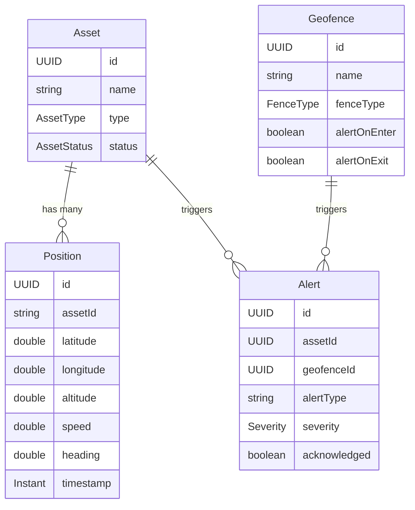

# GeoTrack API Reference

> **Version 1.0.0** — Real-Time Geospatial Asset Tracking Platform

## Overview

GeoTrack provides a REST API for managing tracked assets (vessels, vehicles, drones, etc.), ingesting GPS position data, defining geofence zones, and receiving alerts when assets enter or exit those zones. Real-time updates are available via WebSocket.

| | |
|---|---|
| **Base URL** | `http://localhost:30080` |
| **Authentication** | None (local development) |
| **OpenAPI Spec** | `GET /q/openapi` (YAML) |
| **Swagger UI** | `GET /q/swagger-ui` (interactive) |
| **WebSocket** | `ws://localhost:30080/ws/tracking` |

---

## Resource Relationships



---

## Positions

Position ingestion and spatial queries.

### Submit a Position Update

```
POST /api/v1/positions
```

**Request Body:**

```json
{
  "assetId": "a1b2c3d4-5678-9abc-def0-1234567890ab",
  "latitude": 51.5074,
  "longitude": -0.1278,
  "altitude": 12.5,
  "speed": 8.4,
  "heading": 225.0,
  "timestamp": "2026-03-01T14:00:00Z"
}
```

**Response** `200 OK`:

```json
{
  "id": "f7e6d5c4-3210-abcd-ef98-7654321fedcb",
  "assetId": "a1b2c3d4-5678-9abc-def0-1234567890ab",
  "latitude": 51.5074,
  "longitude": -0.1278,
  "altitude": 12.5,
  "speed": 8.4,
  "heading": 225.0,
  "timestamp": "2026-03-01T14:00:00Z",
  "source": null
}
```

### Get All Recent Positions

```
GET /api/v1/positions
```

No parameters.

**Response** `200 OK`:

```json
[
  {
    "id": "f7e6d5c4-3210-abcd-ef98-7654321fedcb",
    "assetId": "a1b2c3d4-5678-9abc-def0-1234567890ab",
    "latitude": 51.5074,
    "longitude": -0.1278,
    "altitude": 12.5,
    "speed": 8.4,
    "heading": 225.0,
    "timestamp": "2026-03-01T14:00:00Z",
    "source": "AIS"
  }
]
```

### Get Latest Position Per Asset

```
GET /api/v1/positions/latest
```

No parameters. Returns one position per asset (the most recent).

**Response** `200 OK`:

```json
[
  {
    "id": "f7e6d5c4-3210-abcd-ef98-7654321fedcb",
    "assetId": "a1b2c3d4-5678-9abc-def0-1234567890ab",
    "latitude": 50.3715,
    "longitude": -4.1427,
    "altitude": 0.0,
    "speed": 12.3,
    "heading": 180.0,
    "timestamp": "2026-03-01T14:10:00Z",
    "source": "AIS"
  }
]
```

### Get Position History by Asset String ID

```
GET /api/v1/positions/history
```

| Parameter | In | Type | Default | Description |
|---|---|---|---|---|
| `assetId` | query | string | — | Asset identifier (handles special characters) |
| `from` | query | ISO 8601 | — | Start of time range |
| `to` | query | ISO 8601 | — | End of time range |
| `limit` | query | integer | `1000` | Maximum results |

**Example:** `GET /api/v1/positions/history?assetId=a1b2c3d4-5678-9abc-def0-1234567890ab&from=2026-03-01T00:00:00Z&to=2026-03-01T23:59:59Z&limit=100`

**Response** `200 OK`: Array of `PositionResponse`.

---

## Assets

Asset management and tracking.

### List Assets

```
GET /api/v1/assets
```

| Parameter | In | Type | Default | Description |
|---|---|---|---|---|
| `page` | query | integer | — | Page number |
| `size` | query | integer | `20` | Page size |
| `sort` | query | string | `name` | Sort field |
| `status` | query | AssetStatus | — | Filter by status |
| `type` | query | AssetType | — | Filter by type |

**Example:** `GET /api/v1/assets?type=VESSEL&status=ACTIVE&size=10`

**Response** `200 OK`:

```json
[
  {
    "id": "a1b2c3d4-5678-9abc-def0-1234567890ab",
    "name": "MV Atlantic Spirit",
    "type": "VESSEL",
    "status": "ACTIVE",
    "createdAt": "2026-02-15T09:30:00Z",
    "updatedAt": "2026-03-01T14:00:00Z"
  },
  {
    "id": "b2c3d4e5-6789-abcd-ef01-234567890abc",
    "name": "Drone Alpha-7",
    "type": "DRONE",
    "status": "ACTIVE",
    "createdAt": "2026-02-20T11:00:00Z",
    "updatedAt": "2026-02-28T16:45:00Z"
  }
]
```

### Create a New Asset

```
POST /api/v1/assets
```

**Request Body:**

```json
{
  "name": "MV Northern Star",
  "type": "VESSEL",
  "metadata": "{\"imo\": \"9876543\", \"flag\": \"GB\", \"mmsi\": \"235012345\"}"
}
```

**Response** `200 OK`:

```json
{
  "id": "c3d4e5f6-789a-bcde-f012-34567890abcd",
  "name": "MV Northern Star",
  "type": "VESSEL",
  "status": "ACTIVE",
  "createdAt": "2026-03-01T14:20:00Z",
  "updatedAt": "2026-03-01T14:20:00Z"
}
```

### Get Asset by ID

```
GET /api/v1/assets/{id}
```

| Parameter | In | Type | Description |
|---|---|---|---|
| `id` | path | UUID | Asset ID |

**Response** `200 OK`: Single `AssetResponse`.

### Deactivate an Asset

```
DELETE /api/v1/assets/{id}
```

| Parameter | In | Type | Description |
|---|---|---|---|
| `id` | path | UUID | Asset ID |

Sets the asset status to `DECOMMISSIONED`.

### Get Position History for an Asset

```
GET /api/v1/assets/{id}/positions
```

| Parameter | In | Type | Default | Description |
|---|---|---|---|---|
| `id` | path | UUID | — | Asset ID |
| `from` | query | ISO 8601 | — | Start of time range |
| `to` | query | ISO 8601 | — | End of time range |
| `limit` | query | integer | `1000` | Maximum results |

**Example:** `GET /api/v1/assets/a1b2c3d4-5678-9abc-def0-1234567890ab/positions?from=2026-03-01T00:00:00Z&limit=50`

**Response** `200 OK`: Array of `PositionResponse`.

---

## Alerts

Alert management and acknowledgement. Alerts are generated automatically when assets cross geofence boundaries.

### List Alerts

```
GET /api/v1/alerts
```

| Parameter | In | Type | Description |
|---|---|---|---|
| `acknowledged` | query | boolean | Filter by acknowledgement status |

**Example:** `GET /api/v1/alerts?acknowledged=false`

**Response** `200 OK`:

```json
[
  {
    "id": "d4e5f6a7-890b-cdef-0123-456789abcdef",
    "assetId": "a1b2c3d4-5678-9abc-def0-1234567890ab",
    "geofenceId": "e5f6a7b8-9012-cdef-3456-789abcdef012",
    "alertType": "GEOFENCE_EXIT",
    "severity": "HIGH",
    "message": "Asset 'MV Atlantic Spirit' exited exclusion zone 'English Channel TSS'",
    "acknowledged": false,
    "acknowledgedBy": null,
    "acknowledgedAt": null,
    "createdAt": "2026-03-01T13:45:00Z"
  }
]
```

### Get Alerts for a Specific Asset

```
GET /api/v1/alerts/asset/{assetId}
```

| Parameter | In | Type | Description |
|---|---|---|---|
| `assetId` | path | UUID | Asset ID |

**Response** `200 OK`: Array of `AlertResponse`.

### Acknowledge an Alert

```
PUT /api/v1/alerts/{id}/acknowledge
```

| Parameter | In | Type | Default | Description |
|---|---|---|---|---|
| `id` | path | UUID | — | Alert ID |
| `username` | query | string | `operator` | User acknowledging the alert |

**Example:** `PUT /api/v1/alerts/d4e5f6a7-890b-cdef-0123-456789abcdef/acknowledge?username=j.smith`

**Response** `200 OK`:

```json
{
  "id": "d4e5f6a7-890b-cdef-0123-456789abcdef",
  "assetId": "a1b2c3d4-5678-9abc-def0-1234567890ab",
  "geofenceId": "e5f6a7b8-9012-cdef-3456-789abcdef012",
  "alertType": "GEOFENCE_EXIT",
  "severity": "HIGH",
  "message": "Asset 'MV Atlantic Spirit' exited exclusion zone 'English Channel TSS'",
  "acknowledged": true,
  "acknowledgedBy": "j.smith",
  "acknowledgedAt": "2026-03-01T14:25:00Z",
  "createdAt": "2026-03-01T13:45:00Z"
}
```

---

## Geofences

Geofence zone management. Define polygonal zones that trigger alerts when assets enter or exit.

### List All Geofences

```
GET /api/v1/geofences
```

No parameters.

**Response** `200 OK`:

```json
[
  {
    "id": "e5f6a7b8-9012-cdef-3456-789abcdef012",
    "name": "English Channel TSS",
    "description": "Traffic Separation Scheme — Dover Strait",
    "fenceType": "EXCLUSION",
    "active": true,
    "alertOnEnter": true,
    "alertOnExit": true,
    "createdAt": "2026-02-10T08:00:00Z"
  },
  {
    "id": "f6a7b8c9-0123-def4-5678-9abcdef01234",
    "name": "Southampton Port Area",
    "description": "Port approach and berth zone",
    "fenceType": "INCLUSION",
    "active": true,
    "alertOnEnter": false,
    "alertOnExit": true,
    "createdAt": "2026-02-12T10:30:00Z"
  }
]
```

### Create a New Geofence

```
POST /api/v1/geofences
```

**Request Body:**

```json
{
  "name": "Thames Estuary Restricted Zone",
  "description": "Restricted navigation area near offshore wind farm",
  "fenceType": "EXCLUSION",
  "coordinates": [
    [51.4800, 1.3000],
    [51.4800, 1.4500],
    [51.5200, 1.4500],
    [51.5200, 1.3000],
    [51.4800, 1.3000]
  ],
  "alertOnEnter": true,
  "alertOnExit": false
}
```

**Response** `200 OK`:

```json
{
  "id": "a7b8c9d0-1234-ef56-7890-abcdef012345",
  "name": "Thames Estuary Restricted Zone",
  "description": "Restricted navigation area near offshore wind farm",
  "fenceType": "EXCLUSION",
  "active": true,
  "alertOnEnter": true,
  "alertOnExit": false,
  "createdAt": "2026-03-01T14:22:00Z"
}
```

### Get Geofence by ID

```
GET /api/v1/geofences/{id}
```

| Parameter | In | Type | Description |
|---|---|---|---|
| `id` | path | UUID | Geofence ID |

**Response** `200 OK`: Single `GeofenceResponse`.

### Deactivate a Geofence

```
DELETE /api/v1/geofences/{id}
```

| Parameter | In | Type | Description |
|---|---|---|---|
| `id` | path | UUID | Geofence ID |

Sets the geofence to inactive. Does not delete the record.

---

## WebSocket — Real-Time Tracking

```
ws://localhost:30080/ws/tracking
```

Connect to receive real-time position updates as assets report in. Messages are JSON-encoded `PositionResponse` objects:

```json
{
  "id": "f7e6d5c4-3210-abcd-ef98-7654321fedcb",
  "assetId": "a1b2c3d4-5678-9abc-def0-1234567890ab",
  "latitude": 51.5074,
  "longitude": -0.1278,
  "altitude": 12.5,
  "speed": 8.4,
  "heading": 225.0,
  "timestamp": "2026-03-01T14:00:00Z",
  "source": "AIS"
}
```

---

## Schema Reference

### AssetType

| Value | Description |
|---|---|
| `VEHICLE` | Ground vehicle |
| `DRONE` | Unmanned aerial vehicle |
| `VESSEL` | Maritime vessel |
| `PERSONNEL` | Person with tracker |
| `AIRCRAFT` | Manned aircraft |
| `SENSOR` | Fixed sensor/beacon |

### AssetStatus

| Value | Description |
|---|---|
| `ACTIVE` | Currently operational |
| `INACTIVE` | Temporarily offline |
| `MAINTENANCE` | Under maintenance |
| `DECOMMISSIONED` | Permanently retired |

### FenceType

| Value | Description |
|---|---|
| `INCLUSION` | Assets should stay inside — alert on exit |
| `EXCLUSION` | Assets should stay outside — alert on entry |

### Severity

| Value | Description |
|---|---|
| `LOW` | Informational |
| `MEDIUM` | Requires attention |
| `HIGH` | Urgent action needed |
| `CRITICAL` | Immediate response required |

### CreateAssetRequest

| Field | Type | Required | Constraints | Description |
|---|---|---|---|---|
| `name` | string | ✅ | 2–255 chars | Asset display name |
| `type` | AssetType | ✅ | — | Asset category |
| `metadata` | string | — | — | Free-form metadata (JSON string) |

### CreateGeofenceRequest

| Field | Type | Required | Constraints | Description |
|---|---|---|---|---|
| `name` | string | ✅ | 2–255 chars | Geofence name |
| `description` | string | — | — | Human-readable description |
| `fenceType` | FenceType | ✅ | — | Inclusion or exclusion zone |
| `coordinates` | array | ✅ | ≥ 3 points | Polygon vertices as `[lat, lon]` pairs |
| `alertOnEnter` | boolean | — | — | Trigger alert on entry |
| `alertOnExit` | boolean | — | — | Trigger alert on exit |

### SubmitPositionRequest

| Field | Type | Required | Constraints | Description |
|---|---|---|---|---|
| `assetId` | string | ✅ | — | Asset identifier |
| `latitude` | double | — | -90 to 90 | WGS84 latitude |
| `longitude` | double | — | -180 to 180 | WGS84 longitude |
| `altitude` | double | — | — | Altitude in metres |
| `speed` | double | — | — | Speed in knots |
| `heading` | double | — | 0 to 360 | Compass heading in degrees |
| `timestamp` | ISO 8601 | ✅ | — | Position fix time |

### AssetResponse

| Field | Type | Description |
|---|---|---|
| `id` | UUID | Unique identifier |
| `name` | string | Asset display name |
| `type` | AssetType | Asset category |
| `status` | AssetStatus | Current status |
| `createdAt` | ISO 8601 | Creation timestamp |
| `updatedAt` | ISO 8601 | Last update timestamp |

### PositionResponse

| Field | Type | Description |
|---|---|---|
| `id` | UUID | Position record ID |
| `assetId` | string | Associated asset ID |
| `latitude` | double | WGS84 latitude |
| `longitude` | double | WGS84 longitude |
| `altitude` | double | Altitude in metres |
| `speed` | double | Speed |
| `heading` | double | Compass heading |
| `timestamp` | ISO 8601 | Position fix time |
| `source` | string | Data source (e.g. AIS, GPS) |

### GeofenceResponse

| Field | Type | Description |
|---|---|---|
| `id` | UUID | Unique identifier |
| `name` | string | Geofence name |
| `description` | string | Description |
| `fenceType` | FenceType | Zone type |
| `active` | boolean | Whether the geofence is active |
| `alertOnEnter` | boolean | Alert on entry |
| `alertOnExit` | boolean | Alert on exit |
| `createdAt` | ISO 8601 | Creation timestamp |

### AlertResponse

| Field | Type | Description |
|---|---|---|
| `id` | UUID | Alert ID |
| `assetId` | UUID | Triggering asset |
| `geofenceId` | UUID | Associated geofence |
| `alertType` | string | e.g. `GEOFENCE_ENTER`, `GEOFENCE_EXIT` |
| `severity` | Severity | Alert severity level |
| `message` | string | Human-readable description |
| `acknowledged` | boolean | Whether acknowledged |
| `acknowledgedBy` | string | Username who acknowledged |
| `acknowledgedAt` | ISO 8601 | Acknowledgement time |
| `createdAt` | ISO 8601 | Alert creation time |

---

*This reference is generated from the OpenAPI specification. For an interactive version, visit the [Swagger UI](http://localhost:30080/q/swagger-ui) or download the [OpenAPI spec](http://localhost:30080/q/openapi).*
