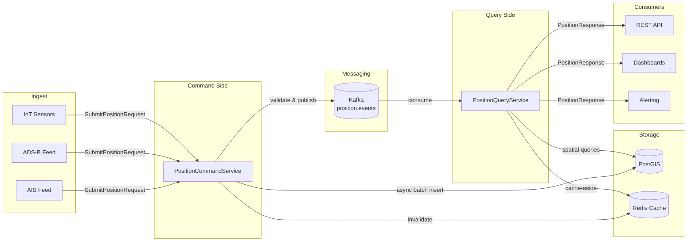

# ADR-001: CQRS Pattern for Position Tracking

**Status:** Accepted  
**Date:** 2026-03-01  
**Deciders:** GeoTrack Architecture Team

## Context

GeoTrack ingests real-time position data from multiple high-throughput sources — AIS ship transponders, ADS-B aircraft feeds, and IoT asset sensors — producing thousands of position updates per second. Simultaneously, the platform serves complex spatial read queries: radius searches, bounding-box lookups, nearest-neighbor calculations, and historical track replays.

The original `PositionService` handled both concerns in a single class. This "god service" pattern created several problems:

- **Conflicting optimisation goals.** Write throughput benefits from fire-and-forget async patterns and batch inserts; read performance demands indexed spatial queries, caching, and pagination — tuning one degraded the other.
- **Testing difficulty.** Unit tests required standing up the full read and write dependency graph even when exercising only one side.
- **Scaling constraints.** Write-heavy spikes (e.g. dense shipping lanes) couldn't be scaled independently of read-heavy API consumers (dashboards, alerting).
- **Code ownership friction.** Changes to ingestion validation regularly caused merge conflicts with query optimisation work.

## Decision

Adopt **Command Query Responsibility Segregation (CQRS)** for the position tracking bounded context, splitting into two dedicated services with separate data-transfer objects.

### Command Side — `PositionCommandService`

- Accepts `SubmitPositionRequest` DTOs from ingest adapters.
- Validates coordinates, timestamps, and source metadata.
- Publishes validated events to Kafka (`position.events` topic).
- Triggers cache invalidation in Redis (see [ADR-009](ADR-009-redis-cache-aside.md)).
- Writes to PostGIS via async batch inserts (see [ADR-008](ADR-008-postgis.md)).

### Query Side — `PositionQueryService`

- Serves `PositionResponse` DTOs to API consumers.
- Executes PostGIS spatial queries (ST_DWithin, ST_MakeEnvelope, KNN `<->` operator).
- Implements Redis cache-aside for hot assets and recent positions (see [ADR-009](ADR-009-redis-cache-aside.md)).
- Supports cursor-based pagination for track history.

### CQRS Flow

### Separate DTOs

| Concern | DTO | Purpose |
|---------|-----|---------|
| Command | `SubmitPositionRequest` | Ingest payload — lat, lon, timestamp, source, metadata |
| Query | `PositionResponse` | Read payload — enriched position with asset info, formatted coordinates, distance fields |

This prevents leaking write-side concerns (validation annotations, source auth tokens) into read models and vice versa.

## Consequences

### Positive

- **Independent scaling.** Command and query services scale horizontally on separate dimensions (write throughput vs. read concurrency).
- **Targeted optimisation.** Write path uses Kafka batching and async inserts; read path uses PostGIS spatial indexes and Redis caching — no compromises.
- **Simpler testing.** Each service has a focused dependency graph; command tests don't need PostGIS spatial queries, query tests don't need Kafka producers.
- **Clear ownership.** Ingestion and query teams can work in parallel with minimal merge conflicts.
- **Resilience.** Query side remains available during write-side backpressure or Kafka lag.

### Negative

- **Eventual consistency.** A position written via the command side is not immediately visible on the query side (typically < 100ms via Kafka, but callers must tolerate this).
- **Increased operational surface.** Two services to deploy, monitor, and version instead of one.
- **DTO duplication.** Some fields appear in both command and query DTOs; a shared `Position` value object in a common module mitigates this.

### Risks

- Over-separation — if future bounded contexts don't warrant CQRS, avoid cargo-culting this pattern everywhere. Evaluate per-context.

## References

- [ADR-008: PostGIS for Spatial Storage](ADR-008-postgis.md)
- [ADR-009: Redis Cache-Aside Strategy](ADR-009-redis-cache-aside.md)
- Martin Fowler — [CQRS](https://martinfowler.com/bliki/CQRS.html)
- Greg Young — [CQRS Documents](https://cqrs.files.wordpress.com/2010/11/cqrs_documents.pdf)
