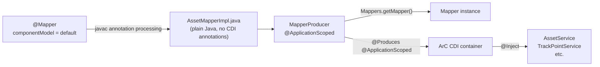

# ADR-003: MapStruct CDI Integration Pattern

**Date:** 2026-03-01
**Status:** Accepted

## Context

GeoTrack uses [MapStruct](https://mapstruct.org/) for compile-time, type-safe mapping between domain entities and DTOs. MapStruct generates mapper implementation classes during annotation processing.

The natural approach in a CDI environment is to set `componentModel = "cdi"`, which causes MapStruct to annotate generated implementations with `@ApplicationScoped`. However, **this does not work reliably with Quarkus** because:

- Quarkus uses **ArC**, a build-time CDI implementation that discovers beans by indexing source and dependency classes at build time via Jandex.
- Annotation-processor-generated sources (e.g. `*MapperImpl.java`) are **not included in the Jandex index** by default.
- As a result, ArC never discovers the generated `@ApplicationScoped` mapper beans, and `@Inject` points fail at runtime with an `UnsatisfiedResolutionException`.

This is a known Quarkus limitation and affects any code-generation tool that emits CDI-annotated classes during `javac` annotation processing.

## Decision

Use `componentModel = "default"` for all MapStruct mappers and expose them to CDI manually via a **producer class**.

### Mapper interfaces

```java
@Mapper(componentModel = "default")
public interface AssetMapper {
    AssetDto toDto(Asset entity);
    Asset toEntity(AssetDto dto);
}
```

### CDI producer

```java
@ApplicationScoped
public class MapperProducer {

    @Produces
    @ApplicationScoped
    public AssetMapper assetMapper() {
        return Mappers.getMapper(AssetMapper.class);
    }

    @Produces
    @ApplicationScoped
    public TrackPointMapper trackPointMapper() {
        return Mappers.getMapper(TrackPointMapper.class);
    }

    // Add additional mappers here as the project grows
}
```

### Injection usage

```java
@ApplicationScoped
public class AssetService {

    @Inject
    AssetMapper assetMapper;

    // ...
}
```

### Flow



## Consequences

### Positive

- **Works with Quarkus ArC** — the producer class is a normal source file, fully indexed at build time; no Jandex workarounds needed.
- **Explicit wiring** — all mapper registrations live in one place (`MapperProducer`), making it easy to audit which mappers exist.
- **No runtime reflection surprises** — `Mappers.getMapper()` uses the service-loader / direct-instantiation path that MapStruct already generates.
- **Testable** — mappers can be instantiated directly in unit tests without a CDI container (`Mappers.getMapper(AssetMapper.class)`).

### Negative

- **Manual registration** — each new mapper requires adding a `@Produces` method to `MapperProducer`. This is a small amount of boilerplate.
- **Easy to forget** — if a developer creates a new mapper but skips the producer method, injection will fail. Mitigated by a compile-time CDI validation (Quarkus fails the build on unsatisfied injection points).

### Neutral

- If Quarkus adds first-class annotation-processor output indexing in the future, this pattern can be revisited, but it remains valid regardless.
