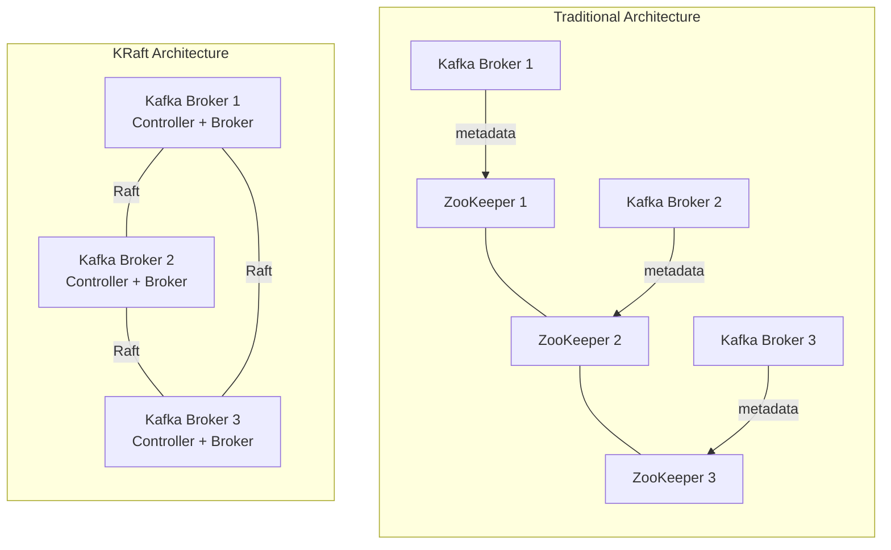

# ADR-004: Kafka KRaft Mode (No ZooKeeper)

**Date:** 2026-03-01
**Status:** Accepted

## Context

Traditional Apache Kafka deployments require a separate ZooKeeper ensemble for cluster metadata management — broker registration, topic configuration, partition leadership, and controller election. In the GeoTrack platform, Kafka serves as the backbone for ingesting real-time GPS telemetry from tracked assets.

GeoTrack targets a containerized deployment on **Docker Desktop Kubernetes** (single-node, resource-constrained). Running both Kafka and ZooKeeper in this environment presents problems:

- **Double the pod count** — a ZooKeeper StatefulSet (typically 3 replicas) alongside Kafka brokers consumes scarce CPU and memory.
- **Operational complexity** — two distinct distributed systems to configure, monitor, and troubleshoot.
- **Helm chart bloat** — the chart must template and coordinate two StatefulSets with inter-dependent readiness checks (see [ADR-006](ADR-006-helm-v3.md)).
- **Startup latency** — Kafka brokers block until ZooKeeper is healthy, adding time to local development inner loops.

Since Kafka 3.3+ (GA in 3.5), **KRaft mode** is production-ready and ZooKeeper support is deprecated (removal targeted for Kafka 4.0).

## Decision

Deploy Kafka in **KRaft (Kafka Raft) mode**, eliminating ZooKeeper entirely. The Kafka process manages its own metadata via an internal Raft consensus protocol. A subset of brokers (or the single broker in our dev topology) acts as the **controller** quorum.

Key configuration choices:

- **Combined mode** (`process.roles=broker,controller`) for the single-node dev environment — one pod handles both roles.
- **`KAFKA_KRAFT_CLUSTER_ID`** generated at chart install time and stored in a Kubernetes Secret.
- **Helm chart** simplified to a single StatefulSet (see [ADR-006](ADR-006-helm-v3.md)).

## Consequences

### Positive

- **Reduced resource footprint** — eliminates 1–3 ZooKeeper pods; critical for Docker Desktop's constrained resources.
- **Simpler operations** — one distributed system instead of two; fewer moving parts to debug.
- **Faster startup** — no cross-system readiness dependency; Kafka self-bootstraps.
- **Leaner Helm chart** — single StatefulSet, fewer templates, easier maintenance ([ADR-006](ADR-006-helm-v3.md)).
- **Future-proof** — aligns with Kafka's roadmap; ZooKeeper mode is deprecated.

### Negative

- **Ecosystem maturity** — some older Kafka tooling and client libraries may assume ZooKeeper is available (e.g., legacy admin scripts using `--zookeeper` flags). Mitigation: use only `kafka-metadata.sh` and the Admin Client API.
- **Combined-mode limitations** — in production multi-node clusters, dedicated controller nodes are recommended. This ADR applies to the dev/single-node topology; production deployment would revisit role separation.
- **Monitoring gaps** — existing ZooKeeper monitoring dashboards become irrelevant; new KRaft controller metrics must be configured.
