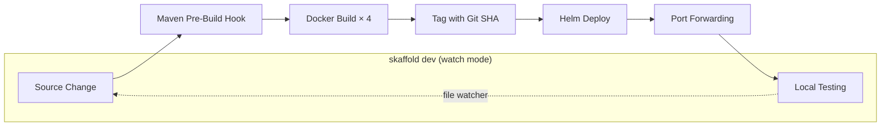

# ADR-005: Skaffold Over Custom PowerShell Scripts

**Status:** Accepted  
**Date:** 2026-03-01  
**Deciders:** GeoTrack Platform Team

## Context

GeoTrack's local development workflow relied on a collection of custom PowerShell scripts:

- `deploy-local.ps1` — main deployment orchestrator
- `build-ships.ps1` — build ship-tracking service images
- `rebuild-api.ps1` — rebuild the API service
- `start-api.ps1` — start the API locally

These scripts suffered from several problems:

- **Windows-only** — developers on macOS/Linux couldn't use them without modification.
- **Fragile** — scripts broke silently when paths, image names, or Kubernetes contexts changed.
- **No watch mode** — every code change required a manual rebuild/redeploy cycle.
- **No automatic image tagging** — images were tagged `:latest` or manually, making it impossible to trace a running container back to a specific commit.
- **Hard to maintain** — logic was duplicated across scripts with no shared configuration.

The project needed a cross-platform, declarative tool that could manage the full build → push → deploy lifecycle for local Kubernetes development.

## Decision

Replace all custom PowerShell scripts with **Skaffold v2.17.2** as the single local development tool.

A single `skaffold.yaml` configuration file handles the entire pipeline:

1. **Pre-build hook** — runs `mvn package -DskipTests` to produce JARs before Docker builds.
2. **Image builds** — builds 4 Docker images (API, ship-tracker, geo-processor, web-ui).
3. **Deployment** — deploys via Helm with automatic image tag injection into `values.yaml`.
4. **Port forwarding** — exposes services to `localhost` for local testing.

Two modes of operation:

- `skaffold run` — one-shot build and deploy.
- `skaffold dev` — watch mode with hot reload on source changes.

Images are tagged with the **git SHA** (`gitCommit` tagger), providing full traceability from a running pod back to the exact commit.

### Role in the DevOps Stack

Skaffold is the local development layer in a three-tier deployment pipeline:

| Layer | Tool | Purpose |
|-------|------|---------|
| Local dev | **Skaffold** | Inner-loop build/deploy to local K8s |
| CI/CD | **Tekton** | Automated pipelines on push |
| GitOps | **ArgoCD** | Continuous delivery to staging/prod |

### Skaffold Pipeline

## Consequences

### Positive

- **Cross-platform** — works identically on Windows, macOS, and Linux.
- **Single config file** — `skaffold.yaml` replaces 4+ scattered scripts.
- **Watch mode** — `skaffold dev` detects changes and redeploys automatically, dramatically improving inner-loop speed.
- **Git SHA tagging** — every image is traceable to a commit; no more `:latest` ambiguity.
- **Helm integration** — Skaffold injects image tags into Helm values, eliminating manual coordination (see [ADR-006: Helm v3](ADR-006-helm-v3.md)).
- **Pipeline consistency** — the same Docker images built locally by Skaffold are built by Tekton in CI, reducing "works on my machine" issues.

### Negative

- **New dependency** — developers must install Skaffold (`v2.17.2`+) alongside Docker and kubectl.
- **Learning curve** — team members unfamiliar with Skaffold need onboarding.
- **Skaffold-specific config** — some coupling to Skaffold's YAML schema; switching tools later would require migration.

### Neutral

- Custom scripts (`deploy-local.ps1`, `build-ships.ps1`, etc.) are **deprecated and will be removed** after a transition period.
