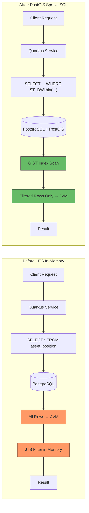

# ADR-008: PostGIS Spatial SQL Over JTS In-Memory Processing

**Status:** Accepted  
**Date:** 2026-03-01  
**Deciders:** GeoTrack Engineering Team

## Context

GeoTrack's initial implementation used [JTS Topology Suite](https://github.com/locationtech/jts) for all spatial computations — radius searches, bounding box queries, and nearest-neighbor lookups were performed entirely in Java application memory.

This approach required loading all asset position records from PostgreSQL into the JVM, then filtering and sorting in-memory using JTS geometry operations. While functional at small scale, this created several problems:

- **No spatial indexing** — every query scanned the full dataset in application memory
- **Excessive data transfer** — all rows fetched from the database regardless of spatial relevance
- **Poor scalability** — memory consumption and query latency grew linearly (or worse) with dataset size
- **Wasted database capability** — PostgreSQL with PostGIS was already deployed but its spatial engine went unused
- **GC pressure** — large geometry object graphs created significant garbage collection overhead in the JVM

With asset volumes projected to grow from tens of thousands to millions of tracked positions, the in-memory approach was not viable.

## Decision

Push all spatial computation to PostGIS at the database level, using spatial SQL functions and server-side indexing.

### Core Spatial Operations

| Operation | PostGIS Function | Replaces |
|---|---|---|
| Radius search | `ST_DWithin(geom, point, distance)` | JTS `Geometry.buffer().contains()` |
| Bounding box query | `ST_Contains(bbox, geom)` | JTS `Envelope.contains()` |
| Nearest neighbor | `<->` KNN operator | JTS distance sort in-memory |

### Indexing

GIST indexes on geometry columns enable sub-linear spatial lookups:

```sql
CREATE INDEX idx_asset_position_geom ON asset_position USING GIST (position);
```

### ORM Integration

Hibernate Spatial bridges JPA entities to PostGIS geometry types, allowing spatial queries via JPQL/Criteria API while keeping the domain model clean:

```java
@Column(columnDefinition = "geometry(Point, 4326)")
private Point position;
```

### Query Flow Comparison



## Consequences

### Positive

- **Orders-of-magnitude performance improvement** — GIST indexes reduce spatial queries from O(n) full scans to O(log n) index lookups
- **Drastically reduced data transfer** — only matching rows cross the database→application boundary
- **Lower JVM memory pressure** — no large in-memory geometry collections; reduced GC pauses
- **Scalability** — PostGIS handles millions of geometries efficiently with proper indexing
- **Leverages proven technology** — PostGIS is the industry standard for spatial databases
- **Composable with CQRS read models** — spatial queries integrate naturally with optimised read-side projections (see [ADR-001](ADR-001-cqrs-event-sourcing.md))
- **Cacheable results** — frequently queried spatial regions can be cached in Redis (see [ADR-009](ADR-009-redis-caching.md))

### Negative

- **Database coupling** — spatial logic now depends on PostGIS; switching databases requires migration effort
- **SQL complexity** — spatial queries are less readable than equivalent Java code for developers unfamiliar with PostGIS
- **Testing** — integration tests require a PostGIS-enabled database (mitigated by Testcontainers)
- **JTS not fully eliminated** — JTS remains useful for client-side geometry construction and validation before persistence

### Neutral

- Hibernate Spatial adds a dependency but is well-maintained and Quarkus-compatible
- Team requires PostGIS/spatial SQL knowledge — addressed through documentation and pairing

## References

- [ADR-001: CQRS and Event Sourcing](ADR-001-cqrs-event-sourcing.md)
- [ADR-009: Redis Caching Strategy](ADR-009-redis-caching.md)
- [PostGIS Documentation](https://postgis.net/documentation/)
- [Hibernate Spatial](https://docs.jboss.org/hibernate/orm/current/userguide/html_single/Hibernate_User_Guide.html#spatial)
