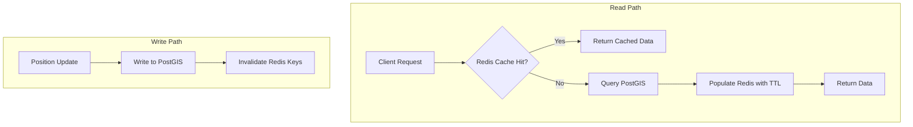

# ADR-009: Redis Cache-Aside Pattern

**Status:** Accepted  
**Date:** 2026-03-01  
**Deciders:** GeoTrack Architecture Team

## Context

GeoTrack ingests thousands of position updates per second from tracked assets, and dashboard clients frequently refresh to display the latest positions. Under this load, every read was hitting PostGIS directly. Spatial queries — `ST_DWithin` for geofence checks, KNN for nearest-asset lookups — are significantly more expensive than simple key-value retrievals. Profiling showed that the majority of dashboard requests fetch the same "latest positions" dataset repeatedly, making this a classic read-heavy, cache-friendly workload.

Without a caching layer, PostGIS connection pools saturate under concurrent dashboard load, increasing p99 latency and risking query timeouts during peak hours.

See also:
- [ADR-001: CQRS](ADR-001-cqrs.md) — separating read and write models
- [ADR-008: PostGIS](ADR-008-postgis.md) — spatial data storage and querying

## Decision

Implement the **cache-aside** (lazy-loading) pattern using Redis, encapsulated in a `PositionCacheService`.

### Read Path

1. Client requests latest positions (e.g. by bounding box or asset group).
2. `PositionCacheService` checks Redis for a cached result.
3. **Cache hit** → return immediately.
4. **Cache miss** → query PostGIS, populate Redis with a configurable TTL, return result.

### Write Path

1. Inbound position update is written to PostGIS (source of truth).
2. `PositionCacheService` invalidates or updates the relevant Redis keys.
3. Subsequent reads will either hit the refreshed cache or trigger a miss-and-populate cycle.

### Cache Configuration

| Parameter | Default | Notes |
|---|---|---|
| TTL (latest positions) | 5 s | Balances freshness vs. load reduction |
| TTL (spatial query results) | 10 s | Longer-lived; less volatile |
| Max memory policy | `allkeys-lru` | Evicts least-recently-used keys under pressure |
| Serialisation | MessagePack | Compact binary format for geo payloads |

### Kubernetes Deployment

- Single Redis replica (`Deployment` with 1 pod, not `StatefulSet`).
- No persistence volume — Redis is purely a cache; data loss on restart is acceptable.
- Resource limits tuned to expected working set size (~512 MB).
- Liveness/readiness probes via `redis-cli ping`.

### Flow Diagram

## Consequences

### Positive

- **Reduced PostGIS load** — cache absorbs the majority of repeated dashboard reads, freeing connection pool capacity for writes and complex spatial queries.
- **Lower read latency** — Redis key-value lookups are sub-millisecond vs. multi-millisecond PostGIS spatial queries.
- **Simple operational model** — no Redis persistence, no replication topology; a single ephemeral pod keeps operations lean.
- **Eventual consistency is acceptable** — dashboards tolerate positions being up to TTL-seconds stale; configurable per query type.

### Negative

- **Cache invalidation complexity** — write path must correctly identify and invalidate affected cache keys; bugs here cause stale reads.
- **Additional infrastructure** — one more component to monitor, though operationally lightweight.
- **Cold-start latency** — after Redis restart or eviction, the first wave of reads falls through to PostGIS; mitigated by cache warming on startup if needed.

### Neutral

- Aligns with the CQRS read-model strategy from [ADR-001](ADR-001-cqrs.md) — Redis serves as a fast read-model cache sitting in front of the PostGIS read store.
- PostGIS remains the single source of truth ([ADR-008](ADR-008-postgis.md)); Redis is disposable and reconstructable at any time.
