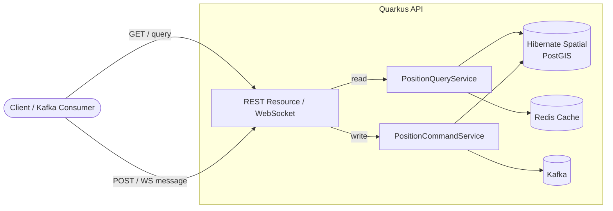
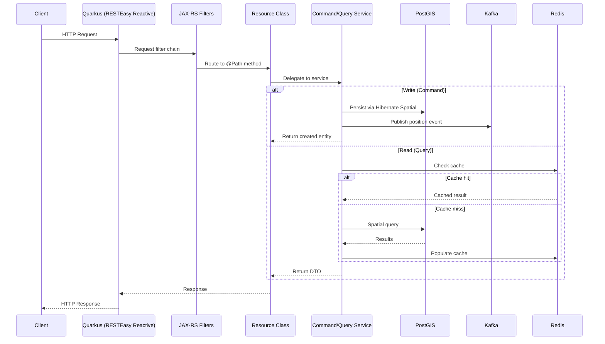

# 01 — Quarkus API Service Runbook

> GeoTrack real-time geospatial asset tracking platform

## Overview

| Property | Value |
|---|---|
| Runtime | Java 21 (Eclipse Temurin) |
| Framework | Quarkus 3.17.7 |
| HTTP Layer | RESTEasy Reactive |
| DI | CDI (Arc) |
| ORM | Hibernate ORM + Hibernate Spatial |
| Database | PostgreSQL + PostGIS (→ [03-postgresql-postgis.md](03-postgresql-postgis.md)) |
| Messaging | Kafka via SmallRye Reactive Messaging (→ [04-kafka.md](04-kafka.md)) |
| Caching | Redis (→ [05-redis.md](05-redis.md)) |
| Geometry | JTS Topology Suite |
| Mapping | MapStruct |
| Container | Docker (→ [06-docker.md](06-docker.md)) |
| Build orchestration | Skaffold (→ [08-skaffold.md](08-skaffold.md)) |

---

## Architecture & Key Patterns

### CQRS — Command/Query Separation

The position domain is split into two CDI beans:

- **`PositionCommandService`** — handles writes (ingest new positions, update assets)
- **`PositionQueryService`** — handles reads (history, current position, geofence queries)



### MapStruct CDI Integration

MapStruct is configured with `componentModel = "default"` (plain constructor, no DI annotations). A CDI producer exposes mappers as beans:

```java
@ApplicationScoped
public class MapperProducer {

    @Produces @ApplicationScoped
    public PositionMapper positionMapper() {
        return Mappers.getMapper(PositionMapper.class);
    }

    @Produces @ApplicationScoped
    public AssetMapper assetMapper() {
        return Mappers.getMapper(AssetMapper.class);
    }
}
```

> **Why not `componentModel = "cdi"`?** Quarkus Arc's build-time indexing can miss generated mapper implementations. Using `"default"` + a manual producer is the reliable pattern.

### Hibernate Spatial + JTS

Geometry columns are mapped with JTS types (`org.locationtech.jts.geom.Point`, etc.) and stored natively in PostGIS. Spatial queries (ST_DWithin, ST_Contains) are expressed via Hibernate Spatial dialect extensions.

---

## Endpoints

### REST

| Method | Path | Description |
|---|---|---|
| `POST` | `/api/v1/positions` | Ingest a new position report |
| `GET` | `/api/v1/positions/history` | Query position history |
| `GET` | `/api/v1/assets` | List tracked assets |
| `GET` | `/api/v1/assets/{id}` | Get single asset with last known position |

#### `/api/v1/positions/history` Query Parameters

| Param | Type | Required | Description |
|---|---|---|---|
| `assetId` | UUID | ✅ | Asset to query |
| `from` | ISO-8601 datetime | ✅ | Start of time window |
| `to` | ISO-8601 datetime | ❌ | End of time window (default: now) |
| `limit` | int | ❌ | Max results (default: 1000) |

### WebSocket

| Path | Protocol | Description |
|---|---|---|
| `/ws/tracking` | WebSocket | Real-time position stream — subscribe by sending `{"assetId": "..."}` |

---

## Request Lifecycle



---

## Build

### ⚠️ CRITICAL — Always Build from Root with `-am`

```powershell
"C:\Program Files\apache-maven-3.9.12\bin\mvn" clean package -Dmaven.test.skip=true
```

**Why this matters:** Building a single module in isolation causes a **stale Jandex index**. When the Jandex index is stale, Quarkus Arc **silently skips route registration** — your endpoints return 404 with zero warnings in the logs. Always build from the repository root so dependent modules are rebuilt and the index stays current.

If you must target only the API module, use `-pl` with `-am`:

```powershell
"C:\Program Files\apache-maven-3.9.12\bin\mvn" clean package -pl geotrack-api -am -Dmaven.test.skip=true
```

### Docker Image

- **Image name:** `geotrack-api`
- **Dockerfile:** `src/main/docker/Dockerfile.jvm`

```powershell
docker build -f src/main/docker/Dockerfile.jvm -t geotrack-api .
```

See [06-docker.md](06-docker.md) for compose setup and [08-skaffold.md](08-skaffold.md) for the full build pipeline.

---

## Configuration

### `application.properties` (key settings)

```properties
# HTTP
quarkus.http.port=8080

# Datasource (PostGIS)
quarkus.datasource.db-kind=postgresql
quarkus.datasource.jdbc.url=jdbc:postgresql://localhost:5432/geotrack
quarkus.datasource.username=geotrack
quarkus.datasource.password=changeme
quarkus.hibernate-orm.dialect=org.hibernate.spatial.dialect.postgis.PostgisPG10Dialect

# Kafka
kafka.bootstrap.servers=localhost:9092
mp.messaging.outgoing.position-events.connector=smallrye-kafka
mp.messaging.outgoing.position-events.topic=geotrack.positions

# Redis
quarkus.redis.hosts=redis://localhost:6379
```

### Environment Variable Overrides

| Variable | Overrides | Example |
|---|---|---|
| `KAFKA_BOOTSTRAP_SERVERS` | `kafka.bootstrap.servers` | `kafka:9092` |
| `QUARKUS_DATASOURCE_JDBC_URL` | `quarkus.datasource.jdbc.url` | `jdbc:postgresql://db:5432/geotrack` |
| `QUARKUS_DATASOURCE_USERNAME` | `quarkus.datasource.username` | `geotrack` |
| `QUARKUS_DATASOURCE_PASSWORD` | `quarkus.datasource.password` | `secret` |
| `QUARKUS_REDIS_HOSTS` | `quarkus.redis.hosts` | `redis://redis:6379` |

Quarkus maps env vars automatically: `QUARKUS_DATASOURCE_JDBC_URL` → `quarkus.datasource.jdbc.url`.

---

## Troubleshooting

### 1. Routes Return 404 — No Errors in Logs

**Symptom:** All endpoints return 404. No stack traces, no warnings.

**Cause:** Stale Jandex index. Quarkus uses Jandex to discover `@Path`-annotated classes at build time. If the index is outdated, classes are invisible.

**Fix:**
1. Clean and rebuild from root: `mvn clean package` (see [Build](#build))
2. Verify the index: check `target/classes/META-INF/jandex.idx` timestamp
3. Never build a single module without `-am`

### 2. MapStruct Mapper Not Found / NPE on Injection

**Symptom:** `UnsatisfiedResolutionException` or NPE when injecting a mapper.

**Cause:** MapStruct generated implementation not picked up by CDI.

**Fix:**
- Confirm `componentModel = "default"` in `@Mapper` annotation
- Confirm `MapperProducer` exists and has `@Produces` methods
- Rebuild from root (Jandex must index the generated classes)

### 3. Hibernate Spatial Type Errors

**Symptom:** `Could not determine type for: org.locationtech.jts.geom.Point`

**Fix:**
- Ensure `quarkus-hibernate-orm` and Hibernate Spatial extensions are in `pom.xml`
- Ensure PostGIS extension is enabled in the database (`CREATE EXTENSION postgis;`)
- See [03-postgresql-postgis.md](03-postgresql-postgis.md)

### 4. Kafka Connection Refused

**Symptom:** `KafkaException: Failed to construct kafka producer` on startup.

**Fix:**
- Verify `KAFKA_BOOTSTRAP_SERVERS` points to a reachable broker
- See [04-kafka.md](04-kafka.md)

### 5. WebSocket `/ws/tracking` Not Upgrading

**Symptom:** 404 or connection refused on WebSocket path.

**Fix:** Same root cause as #1 — stale Jandex index. Rebuild from root.

---

## Health & Observability

```
GET /q/health        → overall health
GET /q/health/ready  → readiness (DB, Kafka, Redis)
GET /q/health/live   → liveness
GET /q/metrics       → Micrometer metrics
GET /q/dev           → Dev UI (dev mode only)
```

---

## Cross-References

| Topic | Runbook |
|---|---|
| PostgreSQL + PostGIS | [03-postgresql-postgis.md](03-postgresql-postgis.md) |
| Kafka messaging | [04-kafka.md](04-kafka.md) |
| Redis caching | [05-redis.md](05-redis.md) |
| Docker / Compose | [06-docker.md](06-docker.md) |
| Skaffold build pipeline | [08-skaffold.md](08-skaffold.md) |
