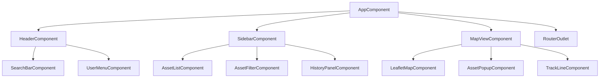
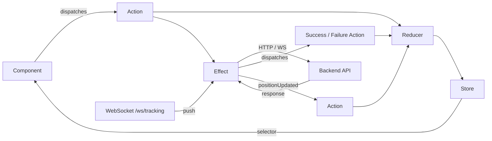

# 02 — Angular Frontend Runbook

> **GeoTrack** — Real-time Geospatial Asset Tracking Platform

## Overview

The GeoTrack frontend is an **Angular 19** single-page application built with **standalone components** and **TypeScript**. It provides an interactive map interface for real-time asset tracking, historical playback, and fleet management.

| Aspect | Detail |
|---|---|
| Framework | Angular 19 (standalone components, no NgModules) |
| State | NgRx (signals-compatible store) |
| Mapping | Leaflet.js |
| Real-time | WebSocket + RxJS |
| Build | Node 22 → Nginx (Docker multi-stage) |
| Source | `geotrack-frontend/` |

---

## Architecture

### Component Hierarchy



### NgRx Data Flow



---

## State Management — NgRx

All effects use **functional style** with `inject()` — no constructor injection.

### Actions

```typescript
// positions.actions.ts
import { createActionGroup, emptyProps, props } from '@ngrx/store';
import { Position } from '../models/position.model';

export const PositionActions = createActionGroup({
  source: 'Positions',
  events: {
    'Load Positions': emptyProps(),
    'Load Positions Success': props<{ positions: Position[] }>(),
    'Load Positions Failure': props<{ error: string }>(),
    'Position Updated': props<{ position: Position }>(),
    'Load History': props<{ assetId: string; from: string; to: string }>(),
    'Load History Success': props<{ positions: Position[] }>(),
  },
});
```

### Reducer

```typescript
// positions.reducer.ts
import { createReducer, on } from '@ngrx/store';
import { PositionActions } from './positions.actions';
import { Position } from '../models/position.model';

export interface PositionsState {
  positions: Record<string, Position>;
  history: Position[];
  loading: boolean;
  error: string | null;
}

const initialState: PositionsState = {
  positions: {},
  history: [],
  loading: false,
  error: null,
};

export const positionsReducer = createReducer(
  initialState,
  on(PositionActions.loadPositions, (state) => ({ ...state, loading: true })),
  on(PositionActions.loadPositionsSuccess, (state, { positions }) => ({
    ...state,
    loading: false,
    positions: positions.reduce((acc, p) => ({ ...acc, [p.assetId]: p }), {}),
  })),
  on(PositionActions.positionUpdated, (state, { position }) => ({
    ...state,
    positions: { ...state.positions, [position.assetId]: position },
  })),
  on(PositionActions.loadHistorySuccess, (state, { positions }) => ({
    ...state,
    history: positions,
  })),
);
```

### Selectors

```typescript
// positions.selectors.ts
import { createFeatureSelector, createSelector } from '@ngrx/store';
import { PositionsState } from './positions.reducer';

export const selectPositionsState = createFeatureSelector<PositionsState>('positions');
export const selectAllPositions = createSelector(selectPositionsState, (s) => Object.values(s.positions));
export const selectPositionByAssetId = (assetId: string) =>
  createSelector(selectPositionsState, (s) => s.positions[assetId]);
export const selectHistory = createSelector(selectPositionsState, (s) => s.history);
export const selectLoading = createSelector(selectPositionsState, (s) => s.loading);
```

### Effects (functional, `inject()` style)

> **⚠️ Important:** Use `inject()` inside `createEffect()` — never constructor-based injection in effects classes. This is the Angular 19 / NgRx 17+ pattern.

```typescript
// positions.effects.ts
import { inject } from '@angular/core';
import { Actions, createEffect, ofType } from '@ngrx/effects';
import { catchError, map, switchMap, of } from 'rxjs';
import { PositionActions } from './positions.actions';
import { PositionService } from '../services/position.service';
import { TrackingWebSocketService } from '../services/tracking-ws.service';

export const loadPositions = createEffect(
  (actions$ = inject(Actions), positionService = inject(PositionService)) =>
    actions$.pipe(
      ofType(PositionActions.loadPositions),
      switchMap(() =>
        positionService.getAll().pipe(
          map((positions) => PositionActions.loadPositionsSuccess({ positions })),
          catchError((error) => of(PositionActions.loadPositionsFailure({ error: error.message }))),
        ),
      ),
    ),
  { functional: true },
);

export const loadHistory = createEffect(
  (actions$ = inject(Actions), positionService = inject(PositionService)) =>
    actions$.pipe(
      ofType(PositionActions.loadHistory),
      switchMap(({ assetId, from, to }) =>
        positionService.getHistory(assetId, from, to).pipe(
          map((positions) => PositionActions.loadHistorySuccess({ positions })),
          catchError((error) => of(PositionActions.loadPositionsFailure({ error: error.message }))),
        ),
      ),
    ),
  { functional: true },
);

export const listenToWebSocket = createEffect(
  (wsService = inject(TrackingWebSocketService)) =>
    wsService.positions$.pipe(
      map((position) => PositionActions.positionUpdated({ position })),
    ),
  { functional: true },
);
```

---

## API Service

```typescript
// position.service.ts
import { Injectable, inject } from '@angular/core';
import { HttpClient, HttpParams } from '@angular/common/http';
import { Observable } from 'rxjs';
import { Position } from '../models/position.model';

@Injectable({ providedIn: 'root' })
export class PositionService {
  private http = inject(HttpClient);
  private baseUrl = '/api/v1/positions';

  getAll(): Observable<Position[]> {
    return this.http.get<Position[]>(this.baseUrl);
  }

  /**
   * Fetch position history for an asset.
   *
   * Asset IDs may contain special characters (slashes, colons, etc.)
   * such as `urn:fleet/truck-07`. Use HttpParams — Angular encodes
   * them correctly. Do NOT manually call encodeURIComponent() on
   * values passed to HttpParams.
   */
  getHistory(assetId: string, from: string, to: string): Observable<Position[]> {
    const params = new HttpParams()
      .set('assetId', assetId)   // e.g. "urn:fleet/truck-07" → encoded automatically
      .set('from', from)
      .set('to', to);

    return this.http.get<Position[]>(`${this.baseUrl}/history`, { params });
  }
}
```

**Endpoints consumed:**

| Method | URL | Notes |
|---|---|---|
| `GET` | `/api/v1/positions` | All latest positions |
| `GET` | `/api/v1/positions/history?assetId=…&from=…&to=…` | Historical track; assetId is URL-encoded by `HttpParams` |

> 📖 See **[01-quarkus-api.md](01-quarkus-api.md)** for full API endpoint documentation.

---

## Real-Time — WebSocket

```typescript
// tracking-ws.service.ts
import { Injectable } from '@angular/core';
import { webSocket, WebSocketSubject } from 'rxjs/webSocket';
import { Observable, retry, timer } from 'rxjs';
import { Position } from '../models/position.model';

@Injectable({ providedIn: 'root' })
export class TrackingWebSocketService {
  private socket$: WebSocketSubject<Position>;
  public positions$: Observable<Position>;

  constructor() {
    const wsProtocol = window.location.protocol === 'https:' ? 'wss' : 'ws';
    const wsUrl = `${wsProtocol}://${window.location.host}/ws/tracking`;

    this.socket$ = webSocket<Position>(wsUrl);

    // Auto-reconnect with exponential backoff
    this.positions$ = this.socket$.pipe(
      retry({
        delay: (_, retryCount) => timer(Math.min(1000 * 2 ** retryCount, 30_000)),
      }),
    );
  }

  disconnect(): void {
    this.socket$.complete();
  }
}
```

The WebSocket at `/ws/tracking` pushes `Position` JSON frames whenever an asset reports a new location.

---

## Mapping — Leaflet.js

```typescript
// leaflet-map.component.ts (simplified)
import { Component, OnInit, OnDestroy, inject } from '@angular/core';
import { Store } from '@ngrx/store';
import { Subject, takeUntil } from 'rxjs';
import * as L from 'leaflet';
import { selectAllPositions } from '../../store/positions.selectors';

@Component({
  selector: 'app-leaflet-map',
  standalone: true,
  template: `<div id="map" style="height:100%;width:100%"></div>`,
})
export class LeafletMapComponent implements OnInit, OnDestroy {
  private store = inject(Store);
  private destroy$ = new Subject<void>();
  private map!: L.Map;
  private markers = new Map<string, L.Marker>();

  ngOnInit(): void {
    this.map = L.map('map').setView([51.505, -0.09], 13);
    L.tileLayer('https://{s}.tile.openstreetmap.org/{z}/{x}/{y}.png', {
      attribution: '© OpenStreetMap contributors',
    }).addTo(this.map);

    this.store
      .select(selectAllPositions)
      .pipe(takeUntil(this.destroy$))
      .subscribe((positions) => {
        for (const pos of positions) {
          const existing = this.markers.get(pos.assetId);
          if (existing) {
            existing.setLatLng([pos.latitude, pos.longitude]);
          } else {
            const marker = L.marker([pos.latitude, pos.longitude]).addTo(this.map);
            marker.bindPopup(pos.assetId);
            this.markers.set(pos.assetId, marker);
          }
        }
      });
  }

  ngOnDestroy(): void {
    this.destroy$.next();
    this.destroy$.complete();
    this.map.remove();
  }
}
```

---

## Building

### Local Development

```bash
cd geotrack-frontend/
npm install
ng serve            # dev server on http://localhost:4200
                    # proxies /api and /ws to backend (see proxy.conf.json)
```

### Production Build

```bash
cd geotrack-frontend/
npm install
npm run build       # outputs to dist/geotrack-frontend/browser/
```

### Docker Multi-Stage Build

```dockerfile
# ---- Stage 1: Build ----
FROM node:22-alpine AS build
WORKDIR /app
COPY package*.json ./
RUN npm ci
COPY . .
RUN npm run build

# ---- Stage 2: Serve ----
FROM nginx:alpine
COPY --from=build /app/dist/geotrack-frontend/browser/ /usr/share/nginx/html/
COPY nginx.conf /etc/nginx/conf.d/default.conf
EXPOSE 80
```

A `.dockerignore` file is present in `geotrack-frontend/` to exclude `node_modules/`, `dist/`, and `.angular/` from the build context — keeping image builds fast.

> 📖 See **[06-docker.md](06-docker.md)** for containerisation details and **[08-skaffold.md](08-skaffold.md)** for the Skaffold build pipeline.

---

## Troubleshooting

### NgRx Effects Not Firing

**Symptom:** Dispatched actions don't trigger HTTP calls or WebSocket subscriptions.

**Cause:** Effects not registered, or using class-based injection instead of `inject()`.

**Fix:**
1. Ensure effects are registered in `app.config.ts`:
   ```typescript
   provideEffects({ loadPositions, loadHistory, listenToWebSocket });
   ```
2. Confirm every `createEffect()` uses `{ functional: true }` and `inject()` for deps — not constructor parameters.

### WebSocket Won't Connect / Keeps Disconnecting

**Symptom:** No real-time updates; console shows WebSocket errors.

**Checklist:**
1. Backend is running and `/ws/tracking` endpoint is available.
2. Nginx or ingress is configured to upgrade WebSocket connections:
   ```nginx
   location /ws/ {
       proxy_pass http://backend:8080;
       proxy_http_version 1.1;
       proxy_set_header Upgrade $http_upgrade;
       proxy_set_header Connection "upgrade";
   }
   ```
3. The retry logic in `TrackingWebSocketService` handles reconnection automatically with exponential backoff (1s → 2s → 4s → … → 30s cap).

### CORS Errors in Development

**Symptom:** Browser blocks API calls with `Access-Control-Allow-Origin` errors.

**Fix:** Use the Angular dev server proxy (`proxy.conf.json`) instead of calling the backend directly:

```json
{
  "/api": { "target": "http://localhost:8080", "secure": false },
  "/ws":  { "target": "ws://localhost:8080", "secure": false, "ws": true }
}
```

In production, Nginx serves both frontend and proxies API/WS — so CORS doesn't apply.

### Asset IDs with Special Characters (Slashes, Colons)

**Symptom:** 404s or mangled URLs when querying history for IDs like `urn:fleet/truck-07`.

**Fix:** Always pass asset IDs as **query parameters** via `HttpParams`, never as path segments. Angular's `HttpParams.set()` handles URL encoding automatically. Do not double-encode.

---

## Cross-References

| Runbook | Relevance |
|---|---|
| [01-quarkus-api.md](01-quarkus-api.md) | Backend API endpoints consumed by this frontend |
| [06-docker.md](06-docker.md) | Docker image build and compose setup |
| [08-skaffold.md](08-skaffold.md) | Skaffold dev/build pipeline for Kubernetes |
