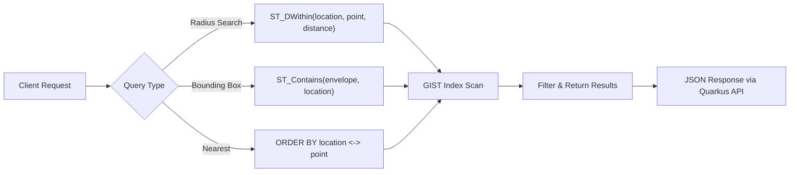

# 03 — PostgreSQL & PostGIS

> **GeoTrack Runbook** · Real-time geospatial asset tracking platform

## Table of Contents

- [Overview](#overview)
- [Schema Design](#schema-design)
- [Spatial Queries](#spatial-queries)
- [Hibernate Spatial Integration](#hibernate-spatial-integration)
- [Kubernetes Deployment](#kubernetes-deployment)
- [Connection Configuration](#connection-configuration)
- [Maintenance](#maintenance)
- [Backup & Restore](#backup--restore)
- [Troubleshooting](#troubleshooting)

---

## Overview

GeoTrack uses **PostgreSQL 16** with the **PostGIS 3.4** extension as its primary spatial data store. PostGIS adds support for geographic objects, enabling the database to handle location queries — radius searches, bounding box containment, and nearest-neighbour lookups — directly in SQL.

Key capabilities:

- **Geometry & Geography types** for storing coordinates with full spatial reference system (SRID) support
- **GIST indexes** for high-performance spatial queries
- **Spatial functions** (ST_DWithin, ST_Contains, KNN `<->`) for real-time asset lookups
- **Hibernate Spatial** integration via Quarkus for type-safe JPA access

---

## Schema Design

### Entity Relationship Diagram

```mermaid
erDiagram
    ASSET {
        uuid id PK
        varchar name
        varchar asset_type
        varchar status
        timestamp created_at
        timestamp updated_at
    }
    POSITION {
        bigint id PK
        uuid asset_id FK
        geometry(Point,4326) location
        double precision altitude
        double precision speed
        double precision heading
        timestamp recorded_at
        timestamp received_at
    }
    GEOFENCE {
        uuid id PK
        varchar name
        geometry(Polygon,4326) boundary
        varchar alert_type
        boolean active
        timestamp created_at
    }
    GEOFENCE_EVENT {
        bigint id PK
        uuid asset_id FK
        uuid geofence_id FK
        varchar event_type
        timestamp occurred_at
    }

    ASSET ||--o{ POSITION : "has many"
    ASSET ||--o{ GEOFENCE_EVENT : "triggers"
    GEOFENCE ||--o{ GEOFENCE_EVENT : "generates"
```

### Core Tables

```sql
-- Enable PostGIS
CREATE EXTENSION IF NOT EXISTS postgis;

-- Positions table — the high-volume write target
CREATE TABLE position (
    id          BIGSERIAL PRIMARY KEY,
    asset_id    UUID NOT NULL REFERENCES asset(id),
    location    geometry(Point, 4326) NOT NULL,
    altitude    DOUBLE PRECISION,
    speed       DOUBLE PRECISION,
    heading     DOUBLE PRECISION,
    recorded_at TIMESTAMPTZ NOT NULL,
    received_at TIMESTAMPTZ NOT NULL DEFAULT now()
);

-- Spatial index (GIST) — critical for all spatial queries
CREATE INDEX idx_position_location ON position USING GIST (location);

-- Composite index for time-range + asset lookups
CREATE INDEX idx_position_asset_time ON position (asset_id, recorded_at DESC);

-- Geofences table
CREATE TABLE geofence (
    id          UUID PRIMARY KEY DEFAULT gen_random_uuid(),
    name        VARCHAR(255) NOT NULL,
    boundary    geometry(Polygon, 4326) NOT NULL,
    alert_type  VARCHAR(50) NOT NULL DEFAULT 'ENTER',
    active      BOOLEAN NOT NULL DEFAULT true,
    created_at  TIMESTAMPTZ NOT NULL DEFAULT now()
);

CREATE INDEX idx_geofence_boundary ON geofence USING GIST (boundary);
```

### SRID Convention

All geometry columns use **SRID 4326** (WGS 84) — the standard GPS coordinate system. This ensures compatibility with device-reported coordinates and mapping libraries.

---

## Spatial Queries

### Query Flow



### ST_DWithin — Radius Search

Find all assets within a given distance of a point. Uses the GIST index for an efficient bounding-box pre-filter, then refines.

```sql
-- Find latest positions within 5km of a point
SELECT p.*, a.name AS asset_name
FROM position p
JOIN asset a ON a.id = p.asset_id
WHERE ST_DWithin(
    p.location,
    ST_SetSRID(ST_MakePoint(-0.1278, 51.5074), 4326)::geography,
    5000  -- metres when using geography cast
)
AND p.recorded_at > now() - INTERVAL '5 minutes'
ORDER BY p.recorded_at DESC;
```

> **Note:** Casting to `::geography` makes the distance parameter use metres. Without the cast, the unit is degrees.

### ST_Contains — Bounding Box / Geofence Check

Test whether a position falls inside a geofence polygon.

```sql
-- Check which geofences contain a given point
SELECT g.id, g.name, g.alert_type
FROM geofence g
WHERE g.active = true
AND ST_Contains(
    g.boundary,
    ST_SetSRID(ST_MakePoint(:lon, :lat), 4326)
);
```

### KNN Operator `<->` — Nearest Neighbour

Find the N closest assets to a point. The `<->` operator leverages the GIST index for an index-only KNN scan.

```sql
-- 10 nearest assets to a point
SELECT p.asset_id, a.name,
       ST_Distance(p.location::geography,
                   ST_SetSRID(ST_MakePoint(-0.1278, 51.5074), 4326)::geography) AS distance_m
FROM position p
JOIN asset a ON a.id = p.asset_id
WHERE p.recorded_at > now() - INTERVAL '5 minutes'
ORDER BY p.location <-> ST_SetSRID(ST_MakePoint(-0.1278, 51.5074), 4326)
LIMIT 10;
```

> **Important:** The `<->` operator uses the GIST index only when it appears directly in the `ORDER BY` clause. Wrapping it in a function or expression disables the index-based KNN scan.

---

## Hibernate Spatial Integration

GeoTrack uses **Hibernate Spatial** (via `quarkus-hibernate-orm`) to map PostGIS geometry types to JPA entities.

### Dependencies

```xml
<dependency>
    <groupId>org.hibernate.orm</groupId>
    <artifactId>hibernate-spatial</artifactId>
</dependency>
```

### Entity Mapping

```java
@Entity
@Table(name = "position")
public class Position {

    @Id
    @GeneratedValue(strategy = GenerationType.IDENTITY)
    private Long id;

    @Column(name = "asset_id", nullable = false)
    private UUID assetId;

    @Column(columnDefinition = "geometry(Point, 4326)", nullable = false)
    private Point location;  // org.locationtech.jts.geom.Point

    @Column(name = "recorded_at", nullable = false)
    private Instant recordedAt;

    // ... other fields, getters, setters
}
```

### Spatial Queries in Repositories

```java
@ApplicationScoped
public class PositionRepository implements PanacheRepository<Position> {

    // Radius search using ST_DWithin
    public List<Position> findWithinRadius(Point centre, double metreRadius) {
        return find(
            "ST_DWithin(cast(location as geography), cast(?1 as geography), ?2) "
            + "AND recordedAt > ?3",
            centre, metreRadius, Instant.now().minus(Duration.ofMinutes(5))
        ).list();
    }
}
```

> 📖 See [`01-quarkus-api.md`](01-quarkus-api.md) for full Hibernate Spatial configuration and the API layer that exposes these queries.

---

## Kubernetes Deployment

PostgreSQL is deployed as a **StatefulSet** via the Bitnami Helm chart, ensuring stable network identities and persistent storage.

### Helm Values (excerpt)

```yaml
# helm/values-postgresql.yaml
postgresql:
  image:
    registry: docker.io
    repository: postgis/postgis
    tag: "16-3.4"

  auth:
    database: geotrack
    username: geotrack
    existingSecret: geotrack-db-credentials   # contains postgresql-password
    secretKeys:
      userPasswordKey: password

  primary:
    persistence:
      enabled: true
      size: 50Gi
      storageClass: gp3-encrypted    # AWS EBS gp3
    resources:
      requests:
        cpu: 500m
        memory: 1Gi
      limits:
        cpu: "2"
        memory: 4Gi

    initdb:
      scripts:
        init-postgis.sql: |
          CREATE EXTENSION IF NOT EXISTS postgis;
          CREATE EXTENSION IF NOT EXISTS postgis_topology;

  metrics:
    enabled: true
    serviceMonitor:
      enabled: true
```

### Install / Upgrade

```bash
helm repo add bitnami https://charts.bitnami.com/bitnami
helm upgrade --install geotrack-db bitnami/postgresql \
  -n geotrack \
  -f helm/values-postgresql.yaml
```

### PVC Verification

```bash
kubectl get pvc -n geotrack -l app.kubernetes.io/instance=geotrack-db
# Expect: Bound, 50Gi, gp3-encrypted
```

> 📖 See [`07-kubernetes-helm.md`](07-kubernetes-helm.md) for the full Helm deployment architecture and namespace layout.

---

## Connection Configuration

### JDBC URL

```properties
# application.properties (Quarkus)
quarkus.datasource.db-kind=postgresql
quarkus.datasource.jdbc.url=jdbc:postgresql://geotrack-db-postgresql.geotrack.svc.cluster.local:5432/geotrack
quarkus.datasource.username=geotrack
quarkus.datasource.password=${DB_PASSWORD}

# Connection pool
quarkus.datasource.jdbc.min-size=5
quarkus.datasource.jdbc.max-size=20
quarkus.datasource.jdbc.acquisition-timeout=5S

# Hibernate Spatial dialect
quarkus.hibernate-orm.dialect=org.hibernate.spatial.dialect.postgis.PostgisPG10Dialect
```

### Credentials via Helm

Database credentials are stored in a Kubernetes Secret and injected as environment variables:

```yaml
# In the Quarkus Deployment spec
env:
  - name: DB_PASSWORD
    valueFrom:
      secretKeyRef:
        name: geotrack-db-credentials
        key: password
```

---

## Maintenance

### VACUUM & ANALYZE

The `position` table is high-write, so aggressive autovacuum tuning is recommended:

```sql
-- Per-table autovacuum tuning
ALTER TABLE position SET (
    autovacuum_vacuum_scale_factor = 0.01,    -- vacuum after 1% dead tuples (vs default 20%)
    autovacuum_analyze_scale_factor = 0.005,  -- analyze after 0.5% changes
    autovacuum_vacuum_cost_delay = 2          -- less throttling
);
```

**Manual maintenance** (during low-traffic windows):

```bash
# Connect to the database
kubectl exec -it geotrack-db-postgresql-0 -n geotrack -- psql -U geotrack -d geotrack

# Full vacuum + analyze on the positions table
VACUUM (VERBOSE, ANALYZE) position;

# Reindex spatial index if bloated
REINDEX INDEX CONCURRENTLY idx_position_location;
```

### Spatial Index Health

```sql
-- Check index size vs table size
SELECT
    indexrelname AS index_name,
    pg_size_pretty(pg_relation_size(indexrelid)) AS index_size,
    idx_scan AS scans,
    idx_tup_read AS tuples_read
FROM pg_stat_user_indexes
WHERE schemaname = 'public'
AND indexrelname LIKE 'idx_%'
ORDER BY pg_relation_size(indexrelid) DESC;
```

If the GIST index grows disproportionately large relative to the table, run `REINDEX INDEX CONCURRENTLY` to reclaim space.

### Table Partitioning (recommended for scale)

For high-volume deployments, partition `position` by time:

```sql
-- Convert to range-partitioned table (plan during initial setup)
CREATE TABLE position (
    -- same columns as above
) PARTITION BY RANGE (recorded_at);

-- Monthly partitions
CREATE TABLE position_2026_01 PARTITION OF position
    FOR VALUES FROM ('2026-01-01') TO ('2026-02-01');
```

Each partition gets its own GIST index automatically.

---

## Backup & Restore

### Automated Backup (CronJob)

```yaml
# k8s/cronjob-pg-backup.yaml
apiVersion: batch/v1
kind: CronJob
metadata:
  name: geotrack-db-backup
  namespace: geotrack
spec:
  schedule: "0 2 * * *"   # Daily at 02:00 UTC
  jobTemplate:
    spec:
      template:
        spec:
          containers:
            - name: pg-dump
              image: postgis/postgis:16-3.4
              command:
                - /bin/sh
                - -c
                - |
                  pg_dump -h geotrack-db-postgresql -U geotrack -d geotrack \
                    -Fc --no-owner \
                    -f /backups/geotrack-$(date +%Y%m%d-%H%M%S).dump
              env:
                - name: PGPASSWORD
                  valueFrom:
                    secretKeyRef:
                      name: geotrack-db-credentials
                      key: password
              volumeMounts:
                - name: backup-vol
                  mountPath: /backups
          restartPolicy: OnFailure
          volumes:
            - name: backup-vol
              persistentVolumeClaim:
                claimName: geotrack-db-backups
```

### Manual Backup

```bash
kubectl exec geotrack-db-postgresql-0 -n geotrack -- \
  pg_dump -U geotrack -d geotrack -Fc --no-owner \
  > geotrack-backup-$(date +%Y%m%d).dump
```

### Restore

```bash
# Copy dump into the pod
kubectl cp geotrack-backup-20260301.dump \
  geotrack/geotrack-db-postgresql-0:/tmp/

# Restore
kubectl exec -it geotrack-db-postgresql-0 -n geotrack -- \
  pg_restore -U geotrack -d geotrack --clean --if-exists \
  /tmp/geotrack-backup-20260301.dump
```

> **Important:** Ensure the PostGIS extension is created _before_ restoring, or spatial columns will fail.

---

## Troubleshooting

### PostGIS Extension Not Loaded

**Symptoms:** `ERROR: function st_dwithin(geometry, geometry, double precision) does not exist`

```sql
-- Check installed extensions
SELECT * FROM pg_extension WHERE extname LIKE 'postgis%';

-- If missing, install it
CREATE EXTENSION IF NOT EXISTS postgis;

-- Verify
SELECT PostGIS_Full_Version();
```

**Root cause:** The `initdb` script in Helm values didn't run (e.g., PVC already had data from a previous install). Fix: connect manually and create the extension, or delete the PVC and redeploy.

### Spatial Index Not Used

**Symptoms:** Spatial queries are slow; `EXPLAIN` shows `Seq Scan` instead of `Index Scan`.

```sql
-- Check the query plan
EXPLAIN (ANALYZE, BUFFERS) 
SELECT * FROM position 
WHERE ST_DWithin(location, ST_SetSRID(ST_MakePoint(-0.1278, 51.5074), 4326), 0.05);
```

**Common causes:**

| Cause | Fix |
|-------|-----|
| Missing GIST index | `CREATE INDEX idx_position_location ON position USING GIST (location);` |
| SRID mismatch | Ensure both sides of the comparison use SRID 4326 |
| Stale statistics | `ANALYZE position;` |
| Small table | Planner may prefer seq scan — acceptable for small data sets |
| Function wrapping `<->` | KNN operator must be bare in `ORDER BY` |

### Connection Pool Exhaustion

**Symptoms:** `Unable to acquire JDBC Connection` / timeout errors in Quarkus logs.

```bash
# Check active connections
kubectl exec -it geotrack-db-postgresql-0 -n geotrack -- \
  psql -U geotrack -d geotrack -c \
  "SELECT state, count(*) FROM pg_stat_activity WHERE datname='geotrack' GROUP BY state;"
```

**Resolution:**

1. **Increase pool size** (if DB can handle it):
   ```properties
   quarkus.datasource.jdbc.max-size=40
   ```
2. **Check for long-running queries:**
   ```sql
   SELECT pid, now() - query_start AS duration, query
   FROM pg_stat_activity
   WHERE datname = 'geotrack' AND state = 'active'
   ORDER BY duration DESC;
   ```
3. **Kill stuck queries:**
   ```sql
   SELECT pg_terminate_backend(pid) FROM pg_stat_activity
   WHERE datname = 'geotrack' AND state = 'active'
   AND now() - query_start > INTERVAL '5 minutes';
   ```
4. **Tune PostgreSQL max_connections** in Helm values:
   ```yaml
   postgresql:
     primary:
       extendedConfiguration: |
         max_connections = 200
         shared_buffers = 1GB
         work_mem = 16MB
   ```

### Slow Spatial Inserts at Volume

**Symptoms:** Write latency increases as `position` table grows.

**Resolution:**
- Partition the table by `recorded_at` (see [Maintenance](#maintenance))
- Ensure `wal_level` and `checkpoint_completion_target` are tuned for write-heavy workloads
- Consider batching inserts from the Quarkus API layer

---

## Cross-References

| Topic | Runbook |
|-------|---------|
| Quarkus API & Hibernate Spatial config | [`01-quarkus-api.md`](01-quarkus-api.md) |
| Kubernetes & Helm deployment architecture | [`07-kubernetes-helm.md`](07-kubernetes-helm.md) |
