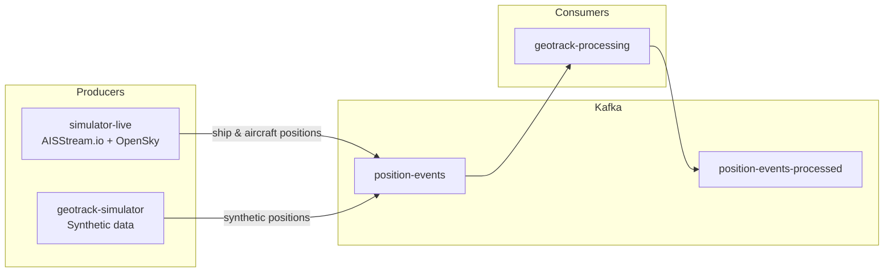
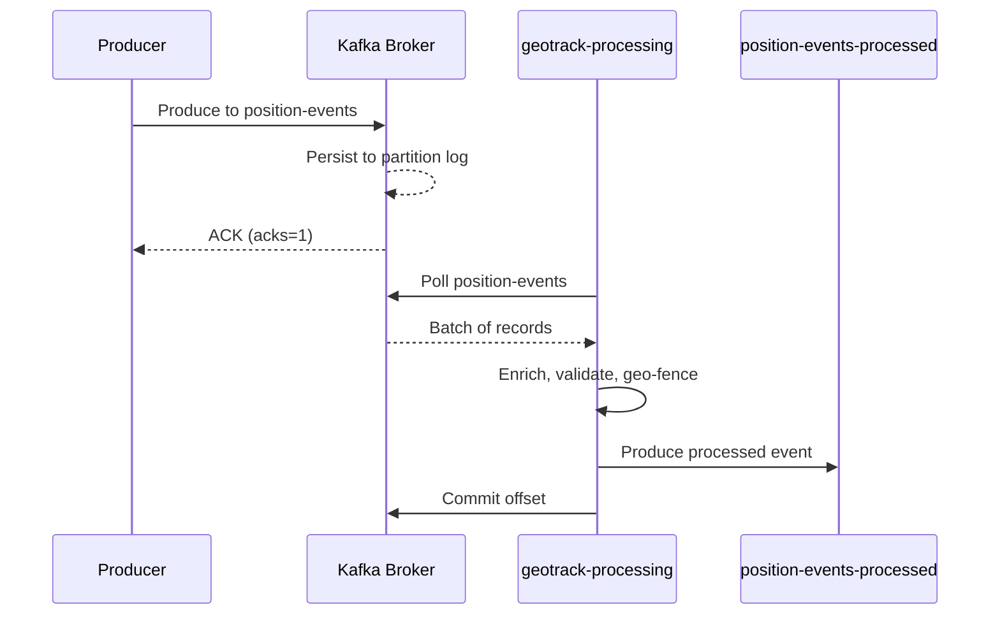

# 04 — Apache Kafka

> **GeoTrack Runbook** · Event Streaming Backbone

---

## Overview

Apache Kafka serves as the central event streaming backbone for GeoTrack. All position events — whether from live AIS/OpenSky feeds or synthetic simulators — flow through Kafka topics before being consumed by downstream processing services.

GeoTrack uses **KRaft mode** (Kafka Raft), eliminating the ZooKeeper dependency. This simplifies deployment, reduces operational overhead, and is the default for Kafka 3.x+.

### Key Design Decisions

- **KRaft mode** — no ZooKeeper required
- **Single broker** for local dev; scalable via Helm for production
- **Topic auto-creation** enabled in dev; disabled in production
- **JSON serialisation** for position events (Avro planned for future)

---

## Architecture

### Topic Flow



### Message Lifecycle



---

## Topics

| Topic | Purpose | Partitions (dev) | Retention |
|---|---|---|---|
| `position-events` | Raw position data from all producers | 3 | 24h |
| `position-events-processed` | Enriched/validated positions | 3 | 72h |

### Message Schema (`position-events`)

```json
{
  "assetId": "MMSI:244670583",
  "assetType": "SHIP",
  "lat": 51.9085,
  "lon": 4.4821,
  "heading": 127.4,
  "speed": 12.3,
  "timestamp": "2026-03-01T14:00:00Z",
  "source": "AISSTREAM"
}
```

---

## Producers

### simulator-live

Ingests **real-world data** from two sources:

- **AISStream.io** — WebSocket feed for ship AIS positions
- **OpenSky Network** — REST API for aircraft positions

Both are normalised into the common position event schema and produced to `position-events`.

### geotrack-simulator

Generates **synthetic position data** for development and testing. Simulates vessels and aircraft following predefined routes with configurable speed, heading drift, and noise.

---

## AISStream.io Integration

The `simulator-live` service connects to AISStream.io via WebSocket for real-time ship tracking.

### How It Works

1. Service opens a WebSocket connection to `wss://stream.aisstream.io/v0/stream`
2. Sends a subscription message with bounding boxes and message types
3. Receives AIS position reports, decodes, and produces to Kafka

### API Key Configuration

The API key is managed via Kubernetes secrets, injected through Helm values:

```yaml
# values.yaml
simulatorLive:
  aisstream:
    enabled: true
    # Reference to existing secret
    apiKeySecret: geotrack-aisstream
    apiKeySecretKey: api-key
```

Create the secret:

```bash
kubectl create secret generic geotrack-aisstream \
  --from-literal=api-key=YOUR_AISSTREAM_API_KEY \
  -n geotrack
```

The service reads the key from the `AISSTREAM_API_KEY` environment variable, mounted from the secret.

### Subscription Example

```json
{
  "APIKey": "${AISSTREAM_API_KEY}",
  "BoundingBoxes": [
    [[-90, -180], [90, 180]]
  ],
  "FilterMessageTypes": ["PositionReport"]
}
```

---

## Consumers

### geotrack-processing

The primary consumer, implemented as a Quarkus service using SmallRye Reactive Messaging (Kafka connector).

- **Consumer group:** `geotrack-processing`
- **Input topic:** `position-events`
- **Output topic:** `position-events-processed`
- **Processing:** validation, geo-fence checks, enrichment (vessel name lookup, zone tagging)

See [`01-quarkus-api.md`](01-quarkus-api.md) for consumer integration details.

---

## Configuration

### KRaft Mode (Local Dev)

```yaml
# docker-compose.yaml (excerpt)
kafka:
  image: apache/kafka:3.7.0
  environment:
    KAFKA_NODE_ID: 1
    KAFKA_PROCESS_ROLES: broker,controller
    KAFKA_LISTENERS: PLAINTEXT://0.0.0.0:9092,CONTROLLER://0.0.0.0:9093
    KAFKA_ADVERTISED_LISTENERS: PLAINTEXT://kafka:9092
    KAFKA_CONTROLLER_LISTENER_NAMES: CONTROLLER
    KAFKA_LISTENER_SECURITY_PROTOCOL_MAP: CONTROLLER:PLAINTEXT,PLAINTEXT:PLAINTEXT
    KAFKA_CONTROLLER_QUORUM_VOTERS: 1@kafka:9093
    KAFKA_AUTO_CREATE_TOPICS_ENABLE: "true"
    KAFKA_OFFSETS_TOPIC_REPLICATION_FACTOR: 1
    KAFKA_GROUP_INITIAL_REBALANCE_DELAY_MS: 0
    CLUSTER_ID: "geotrack-dev-cluster-001"
  ports:
    - "9092:9092"
```

### Quarkus Application Config

```properties
# application.properties
kafka.bootstrap.servers=kafka:9092

mp.messaging.incoming.position-events.connector=smallrye-kafka
mp.messaging.incoming.position-events.topic=position-events
mp.messaging.incoming.position-events.group.id=geotrack-processing
mp.messaging.incoming.position-events.value.deserializer=org.apache.kafka.common.serialization.StringDeserializer
mp.messaging.incoming.position-events.auto.offset.reset=latest

mp.messaging.outgoing.position-events-processed.connector=smallrye-kafka
mp.messaging.outgoing.position-events-processed.topic=position-events-processed
mp.messaging.outgoing.position-events-processed.value.serializer=org.apache.kafka.common.serialization.StringSerializer
```

---

## Kubernetes Deployment

Kafka is deployed via the **Bitnami Kafka Helm chart** in KRaft mode.

```bash
helm repo add bitnami https://charts.bitnami.com/bitnami
helm install kafka bitnami/kafka \
  --namespace geotrack \
  --set kraft.enabled=true \
  --set zookeeper.enabled=false \
  --set listeners.client.protocol=PLAINTEXT \
  --set controller.replicaCount=1 \
  --set broker.replicaCount=1
```

For full Helm configuration and environment-specific overrides, see [`07-kubernetes-helm.md`](07-kubernetes-helm.md).

For Skaffold dev-loop integration, see [`08-skaffold.md`](08-skaffold.md).

### Verify Deployment

```bash
# Check broker is ready
kubectl get pods -n geotrack -l app.kubernetes.io/name=kafka

# Test connectivity
kubectl exec -it kafka-0 -n geotrack -- \
  kafka-topics.sh --bootstrap-server localhost:9092 --list
```

---

## Monitoring

### Consumer Lag

Consumer lag is the most critical Kafka metric for GeoTrack — it indicates whether processing is keeping up with incoming position data.

```bash
# Check consumer group lag
kubectl exec -it kafka-0 -n geotrack -- \
  kafka-consumer-groups.sh \
    --bootstrap-server localhost:9092 \
    --group geotrack-processing \
    --describe
```

**Healthy:** lag < 100 across all partitions.
**Warning:** lag > 1000 — processing is falling behind.
**Critical:** lag growing continuously — investigate consumer throughput.

### Topic Health

```bash
# Describe topics
kubectl exec -it kafka-0 -n geotrack -- \
  kafka-topics.sh --bootstrap-server localhost:9092 \
    --describe --topic position-events

# Check under-replicated partitions (production)
kubectl exec -it kafka-0 -n geotrack -- \
  kafka-topics.sh --bootstrap-server localhost:9092 \
    --describe --under-replicated-partitions
```

### Key Metrics to Watch

| Metric | Source | Alert Threshold |
|---|---|---|
| Consumer lag | `kafka-consumer-groups.sh` | > 1000 |
| Messages in/sec | Broker JMX / Prometheus | Drop to 0 |
| Under-replicated partitions | Broker | > 0 |
| ISR shrink rate | Broker | > 0 |

---

## Troubleshooting

### Broker Not Ready

**Symptoms:** Pods stuck in `CrashLoopBackOff` or `NotReady`. Producers/consumers fail to connect.

```bash
# Check pod logs
kubectl logs kafka-0 -n geotrack --tail=100

# Common causes:
# 1. CLUSTER_ID mismatch — delete PVC and redeploy
kubectl delete pvc data-kafka-0 -n geotrack

# 2. Insufficient resources — check resource limits
kubectl describe pod kafka-0 -n geotrack

# 3. Storage class issue — verify PVC is bound
kubectl get pvc -n geotrack
```

### Consumer Group Rebalancing

**Symptoms:** Repeated `Rebalancing` log entries, temporary processing pauses, duplicate message processing.

**Common causes:**

1. **Consumer processing too slow** — `max.poll.interval.ms` exceeded
   ```properties
   # Increase poll interval (default 300000ms = 5min)
   mp.messaging.incoming.position-events.max.poll.interval.ms=600000
   ```

2. **Session timeout** — consumer heartbeat not reaching broker
   ```properties
   mp.messaging.incoming.position-events.session.timeout.ms=30000
   mp.messaging.incoming.position-events.heartbeat.interval.ms=10000
   ```

3. **Frequent pod restarts** — check resource limits and liveness probes

### Message Deserialization Errors

**Symptoms:** `SerializationException` in consumer logs, messages skipped or consumer crashes.

```
org.apache.kafka.common.errors.SerializationException:
  Error deserializing key/value for partition position-events-0
```

**Resolution:**

1. **Inspect the bad message:**
   ```bash
   kubectl exec -it kafka-0 -n geotrack -- \
     kafka-console-consumer.sh \
       --bootstrap-server localhost:9092 \
       --topic position-events \
       --from-beginning --max-messages 5
   ```

2. **Check producer serialisation** — ensure producers are sending valid JSON

3. **Add a dead-letter topic** for unprocessable messages:
   ```properties
   mp.messaging.incoming.position-events.failure-strategy=dead-letter-queue
   mp.messaging.incoming.position-events.dead-letter-queue.topic=position-events-dlq
   ```

### AISStream WebSocket Disconnects

**Symptoms:** No new ship positions, `simulator-live` logs show WebSocket close frames.

- Check API key validity
- AISStream.io may rate-limit or have downtime — check their status page
- The service should auto-reconnect with exponential backoff; check logs for reconnection attempts

---

## Quick Reference

```bash
# List topics
kafka-topics.sh --bootstrap-server localhost:9092 --list

# Create topic manually
kafka-topics.sh --bootstrap-server localhost:9092 \
  --create --topic position-events --partitions 3 --replication-factor 1

# Produce test message
echo '{"assetId":"TEST-001","assetType":"SHIP","lat":51.9,"lon":4.5,"timestamp":"2026-03-01T14:00:00Z","source":"TEST"}' | \
  kafka-console-producer.sh --bootstrap-server localhost:9092 --topic position-events

# Consume from beginning
kafka-console-consumer.sh --bootstrap-server localhost:9092 \
  --topic position-events --from-beginning

# Reset consumer group offset
kafka-consumer-groups.sh --bootstrap-server localhost:9092 \
  --group geotrack-processing --reset-offsets --to-earliest --execute --topic position-events
```

---

## Cross-References

- [`01-quarkus-api.md`](01-quarkus-api.md) — Consumer integration (SmallRye Reactive Messaging)
- [`07-kubernetes-helm.md`](07-kubernetes-helm.md) — Helm chart deployment and values
- [`08-skaffold.md`](08-skaffold.md) — Dev-loop configuration and Kafka port-forwarding
