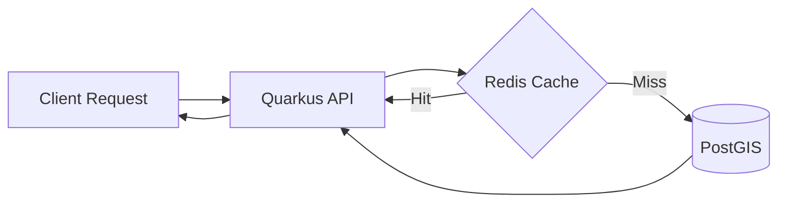
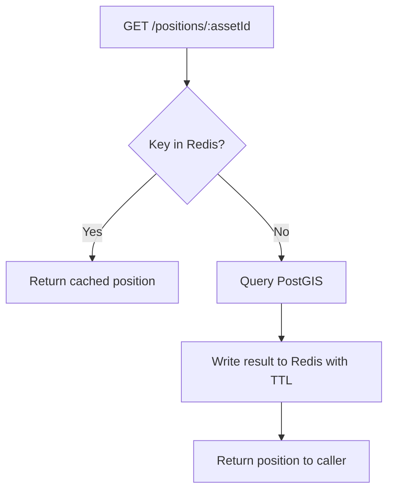
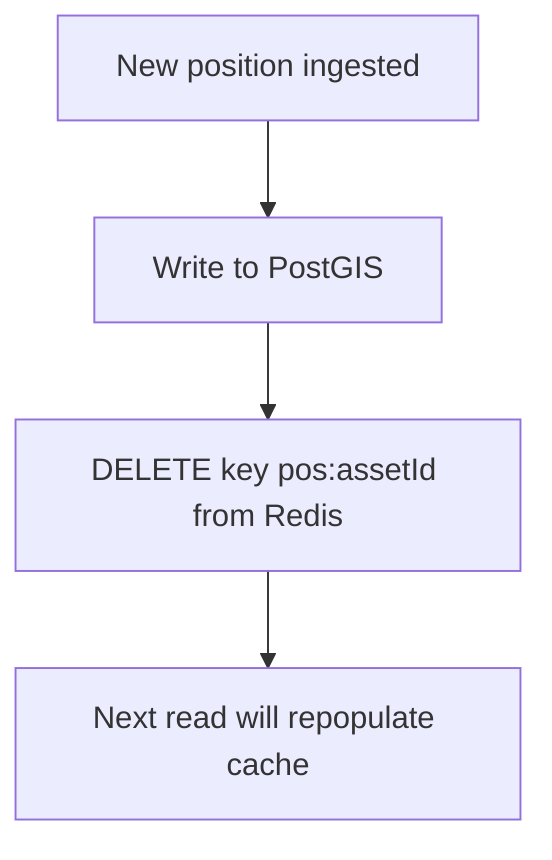

# 05 — Redis Cache

## Overview

Redis serves as the in-memory caching layer for GeoTrack's position data. By caching recently queried positions, we reduce read pressure on PostGIS and achieve sub-millisecond response times for hot data. Redis is deployed as a **cache-only** instance — no persistence is configured, so data loss on restart is expected and acceptable.

> **Cross-references:**
> - [`01-quarkus-api.md`](01-quarkus-api.md) — PositionCacheService implementation details
> - [`03-postgresql-postgis.md`](03-postgresql-postgis.md) — PostGIS as the authoritative backing store
> - [`07-kubernetes-helm.md`](07-kubernetes-helm.md) — Helm chart and K8s deployment

---

## Architecture



---

## Cache Strategy: Cache-Aside

GeoTrack uses the **cache-aside** (lazy-loading) pattern. The application owns all cache interactions — Redis never talks to PostGIS directly.

### Read Path



1. Application receives a position query.
2. Check Redis for key `pos:{assetId}`.
3. **Cache hit** — return immediately.
4. **Cache miss** — query PostGIS, store result in Redis with configured TTL, return to caller.

### Write Path (Invalidation)



1. New position arrives via Kafka/REST.
2. Write to PostGIS (source of truth).
3. **Invalidate** the corresponding Redis key — do not update it (avoids race conditions).
4. The next read triggers a cache miss and repopulates with fresh data.

---

## Implementation

### PositionCacheService.java

The core caching logic lives in `PositionCacheService.java` (see [`01-quarkus-api.md`](01-quarkus-api.md)).

Key behaviours:
- **Cache key format:** `pos:{assetId}` for latest position, `pos:{assetId}:history:{window}` for recent history
- **TTL:** Configurable via `geotrack.cache.position-ttl` (default `30s`)
- **Serialisation:** Positions serialised as JSON via Jackson
- **Bulk invalidation:** `invalidateAsset(assetId)` deletes all keys matching `pos:{assetId}*`

### Quarkus Redis Client Configuration

```properties
# application.properties
quarkus.redis.hosts=redis://geotrack-redis:6379
quarkus.redis.max-pool-size=16
quarkus.redis.max-pool-waiting=32
quarkus.redis.timeout=2s

# GeoTrack-specific
geotrack.cache.position-ttl=30s
geotrack.cache.enabled=true
```

| Property | Default | Description |
|---|---|---|
| `quarkus.redis.hosts` | `redis://localhost:6379` | Redis connection URI |
| `quarkus.redis.max-pool-size` | `16` | Max connections in pool |
| `quarkus.redis.timeout` | `2s` | Command timeout |
| `geotrack.cache.position-ttl` | `30s` | TTL for cached positions |
| `geotrack.cache.enabled` | `true` | Kill-switch to bypass cache |

---

## Kubernetes Deployment

Redis runs as a **single replica** with no persistence. Deployed via the Bitnami Redis Helm chart (see [`07-kubernetes-helm.md`](07-kubernetes-helm.md)).

### Helm Values (excerpt)

```yaml
redis:
  architecture: standalone
  auth:
    enabled: false          # Internal cluster network only
  master:
    persistence:
      enabled: false        # Cache-only, no RDB/AOF
    resources:
      requests:
        cpu: 100m
        memory: 256Mi
      limits:
        cpu: 500m
        memory: 512Mi
  metrics:
    enabled: true           # Prometheus redis_exporter sidecar
```

### Key Decisions

| Decision | Rationale |
|---|---|
| Single replica | Cache-only workload; a restart causes brief cache misses, not data loss |
| No persistence | All data is reconstructable from PostGIS |
| No auth | Runs inside cluster network policy; not exposed externally |
| Memory limit 512Mi | Sufficient for position cache; `maxmemory-policy allkeys-lru` evicts safely |

---

## Monitoring

### Metrics (Prometheus)

The `redis_exporter` sidecar exposes metrics at `:9121/metrics`.

| Metric | Alert Threshold | Meaning |
|---|---|---|
| `redis_keyspace_hits_total` / `redis_keyspace_misses_total` | Hit rate < 70% | Cache is not effective — check TTL or access patterns |
| `redis_memory_used_bytes` | > 400Mi (80% of limit) | Approaching OOM — review key count or raise limit |
| `redis_connected_clients` | > 100 | Possible connection leak |
| `redis_commands_processed_total` | Sudden drop | Redis may be unresponsive |

### Grafana Dashboard

Import dashboard ID **11835** (Redis Overview) or use the project's `grafana/redis.json`.

### Quick Health Check

```bash
# From a pod in the cluster
kubectl exec -it deploy/geotrack-api -- redis-cli -h geotrack-redis ping
# Expected: PONG

# Key count and memory
kubectl exec -it deploy/geotrack-api -- redis-cli -h geotrack-redis info memory
kubectl exec -it deploy/geotrack-api -- redis-cli -h geotrack-redis dbsize
```

---

## Troubleshooting

### Connection Refused

**Symptoms:** `io.vertx.redis.client.RedisConnectionException: Connection refused`

| Check | Command | Fix |
|---|---|---|
| Pod running? | `kubectl get pods -l app=geotrack-redis` | Restart: `kubectl rollout restart deploy/geotrack-redis` |
| Service exists? | `kubectl get svc geotrack-redis` | Verify Helm release deployed correctly |
| DNS resolves? | `kubectl exec -it deploy/geotrack-api -- nslookup geotrack-redis` | Check namespace and service name |
| Port open? | `kubectl exec -it deploy/geotrack-api -- nc -zv geotrack-redis 6379` | Check NetworkPolicy allows traffic |

### Stale Data

**Symptoms:** API returns outdated positions after a write.

1. **Verify invalidation is firing** — check logs for `PositionCacheService: invalidated pos:{assetId}`.
2. **Check TTL** — `redis-cli TTL pos:{assetId}`. If unexpectedly high, review `geotrack.cache.position-ttl`.
3. **Race condition** — if two writers update the same asset concurrently, invalidation order may differ. The cache-aside pattern self-heals on the next TTL expiry.
4. **Kill-switch** — set `geotrack.cache.enabled=false` to bypass Redis while debugging.

### Memory Limits / OOM Kill

**Symptoms:** Redis pod `OOMKilled` or `redis_memory_used_bytes` spiking.

1. Check key count: `redis-cli DBSIZE` — if unexpectedly large, check for missing TTLs.
2. Inspect large keys: `redis-cli --bigkeys`.
3. Verify eviction policy: `redis-cli CONFIG GET maxmemory-policy` — should be `allkeys-lru`.
4. Set explicit maxmemory: `redis-cli CONFIG SET maxmemory 450mb`.
5. If persistent, raise the pod memory limit in Helm values and redeploy.

### Slow Commands

```bash
# Check for slow queries
redis-cli SLOWLOG GET 10
```

Avoid `KEYS *` in production — `PositionCacheService` uses `SCAN` for bulk operations.

---

## Operational Runbook

### Flush All Cache (Safe)

```bash
kubectl exec -it deploy/geotrack-redis-master-0 -- redis-cli FLUSHDB
```

No data loss — PostGIS is the source of truth. Expect a brief spike in PostGIS queries as the cache repopulates.

### Disable Cache (Emergency)

```bash
# Via Quarkus config override
kubectl set env deploy/geotrack-api GEOTRACK_CACHE_ENABLED=false
```

All reads go directly to PostGIS. Re-enable once Redis is healthy.

### Upgrade Redis

1. Update the Helm chart version in `values.yaml`.
2. `helm upgrade geotrack-redis bitnami/redis -f values.yaml`
3. Brief downtime is acceptable — cache will repopulate automatically.
