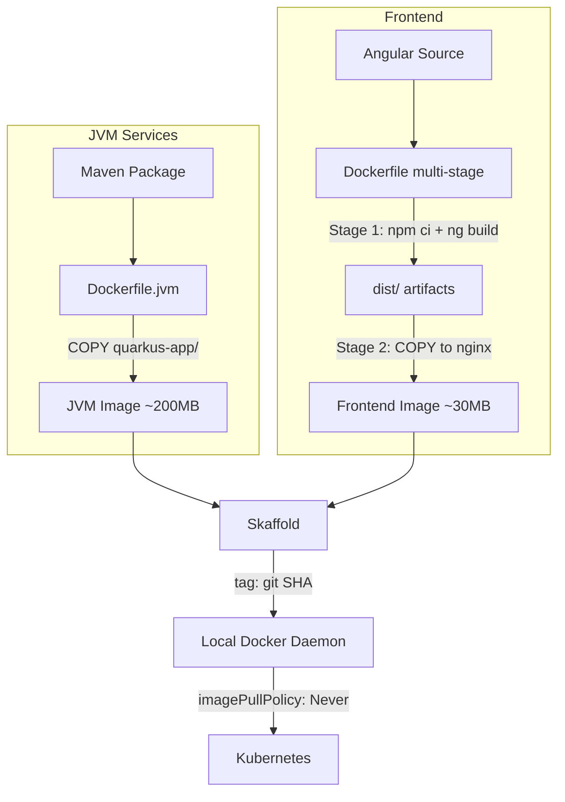

# 06 — Docker

> Container images for all GeoTrack services — build, tag, run, and clean up.

## Overview

Every GeoTrack service ships as a Docker container image. In local development, Skaffold orchestrates builds automatically (see [08-skaffold.md](08-skaffold.md)), but understanding the underlying Docker setup is essential for debugging, optimisation, and manual builds.

| Image | Base | Dockerfile | Context Directory |
|---|---|---|---|
| `geotrack-api` | JVM (Eclipse Temurin) | `src/main/docker/Dockerfile.jvm` | `geotrack-api/` |
| `geotrack-processing` | JVM (Eclipse Temurin) | `src/main/docker/Dockerfile.jvm` | `geotrack-processing/` |
| `geotrack-simulator` | JVM (Eclipse Temurin) | `src/main/docker/Dockerfile.jvm` | `geotrack-simulator/` |
| `geotrack-frontend` | Multi-stage (Node → nginx) | `Dockerfile` | `geotrack-frontend/` |

> **Cross-references:** Service-specific details in [01-quarkus-api.md](01-quarkus-api.md) and [02-angular-frontend.md](02-angular-frontend.md). Deployment in [07-kubernetes-helm.md](07-kubernetes-helm.md).

---

## Dockerfiles

### JVM Services (API, Processing, Simulator)

All three Java/Quarkus services use the same Dockerfile pattern at `src/main/docker/Dockerfile.jvm`:

```dockerfile
FROM eclipse-temurin:21-jre-alpine

ENV LANGUAGE='en_US:en'

COPY --chown=185 target/quarkus-app/lib/ /deployments/lib/
COPY --chown=185 target/quarkus-app/*.jar /deployments/
COPY --chown=185 target/quarkus-app/app/ /deployments/app/
COPY --chown=185 target/quarkus-app/quarkus/ /deployments/quarkus/

EXPOSE 8080
USER 185

ENV JAVA_OPTS_APPEND="-Dquarkus.http.host=0.0.0.0 -Djava.util.logging.manager=org.jboss.logmanager.LogManager"
ENV JAVA_APP_JAR="/deployments/quarkus-run.jar"

ENTRYPOINT ["java", ${JAVA_OPTS_APPEND}, "-jar", "${JAVA_APP_JAR}"]
```

**Key points:**
- Alpine-based for small image size (~200 MB)
- Runs as non-root user (UID 185)
- Expects a pre-built Quarkus app in `target/quarkus-app/` — Maven builds before Docker builds
- Build context is the service root directory (e.g., `geotrack-api/`)

### Frontend (Angular → nginx)

The frontend uses a multi-stage Dockerfile:

```dockerfile
# Stage 1: Build
FROM node:20-alpine AS build
WORKDIR /app
COPY package.json package-lock.json ./
RUN npm ci
COPY . .
RUN npm run build -- --configuration=production

# Stage 2: Serve
FROM nginx:alpine
COPY --from=build /app/dist/geotrack-frontend/browser /usr/share/nginx/html
COPY nginx.conf /etc/nginx/conf.d/default.conf
EXPOSE 80
```


#### `.dockerignore` (geotrack-frontend)

```
node_modules
dist
.angular
.git
*.md
```

This keeps `node_modules` out of the build context, preventing multi-GB context transfers and ensuring `npm ci` creates a clean, reproducible install inside the container.

---

## Tagging Strategy

Skaffold tags images with the **git SHA**, not `latest`:

```
geotrack-api:67dac58
geotrack-processing:67dac58
geotrack-simulator:67dac58
geotrack-frontend:67dac58
```

**Why not `latest`?**
- `latest` is mutable — you can't tell which version is running
- Git SHA ties every image to an exact commit
- Kubernetes won't re-pull an image if the tag hasn't changed; unique tags guarantee the right version deploys

See [08-skaffold.md](08-skaffold.md) for how Skaffold configures this via `tagPolicy: gitCommit`.

---

## Local Registry & Kubernetes

Images are built **locally** — no remote registry push in development:

```yaml
# skaffold.yaml (per artifact)
build:
  local:
    push: false
```

Kubernetes must be told not to pull from a registry:

```yaml
# In Helm values or pod spec
imagePullPolicy: Never
```

This means the Docker daemon that builds the images must be the **same daemon** Kubernetes uses. With Docker Desktop's built-in K8s, this works automatically. With Minikube, you'd need `eval $(minikube docker-env)`.

---

## Docker Desktop Configuration

### WSL2 Backend

Docker Desktop should use the **WSL2 backend** (Settings → General → "Use the WSL 2 based engine"). This provides:
- Native Linux kernel for containers
- Shared memory with WSL2 distros
- Better I/O performance than Hyper-V

### Resource Allocation

GeoTrack runs multiple services plus Kafka, PostgreSQL, PostGIS, and Redis in K8s. Allocate sufficient resources via `%USERPROFILE%\.wslconfig`:

```ini
[wsl2]
memory=24GB
processors=16
swap=8GB
```

After editing, restart WSL:

```powershell
wsl --shutdown
```

Then restart Docker Desktop.

### Kubernetes Integration

Enable Kubernetes in Docker Desktop (Settings → Kubernetes → "Enable Kubernetes"). This provides a single-node cluster that shares the Docker daemon, making `imagePullPolicy: Never` work seamlessly.

---

## Manual Builds

Normally Skaffold handles builds, but for debugging you can build manually:

```bash
# JVM service (run Maven first)
cd geotrack-api
./mvnw package -DskipTests
docker build -f src/main/docker/Dockerfile.jvm -t geotrack-api:local .

# Frontend
cd geotrack-frontend
docker build -t geotrack-frontend:local .
```

---

## Image Cleanup

Docker images accumulate fast during development. Clean up regularly:

```bash
# Remove dangling images (untagged layers from rebuilds)
docker image prune -f

# Nuclear option — remove all unused images, containers, networks, build cache
docker system prune -a -f

# Check disk usage
docker system df
```

**Tip:** After a `docker system prune -a`, the next Skaffold build will be slower as all layers rebuild from scratch.

---

## Troubleshooting

### Build Cache Issues

**Symptom:** Changes not reflected in the running container.

```bash
# Force rebuild without cache
docker build --no-cache -f src/main/docker/Dockerfile.jvm -t geotrack-api:debug .

# Or with Skaffold
skaffold build --cache-artifacts=false
```

### Layer Caching Optimisation

Docker caches layers top-down — once a layer changes, all subsequent layers rebuild. Order your Dockerfile instructions from least-frequently-changed to most:

1. Base image (`FROM`)
2. System dependencies (`RUN apt-get`)
3. Application dependencies (`COPY package.json` → `RUN npm ci`)
4. Application code (`COPY . .`)

The JVM Dockerfiles already follow this pattern by copying `lib/` before app code. The frontend Dockerfile copies `package.json` before the full source.

### Image Size Optimisation

| Technique | Saving |
|---|---|
| Alpine base images | ~100 MB vs Debian |
| Multi-stage builds (frontend) | ~800 MB (no Node in final image) |
| `.dockerignore` | Faster context transfer |
| JRE not JDK | ~200 MB |

Check image sizes:

```bash
docker images | grep geotrack
```

### Common Errors

| Error | Cause | Fix |
|---|---|---|
| `COPY failed: file not found` | Maven hasn't built the JAR | Run `./mvnw package` first |
| Context transfer very slow | Missing `.dockerignore` | Add `.dockerignore` to exclude `node_modules`, `target/` |
| `ImagePullBackOff` in K8s | `imagePullPolicy` not set to `Never` | Update Helm values |
| Out of disk space | Accumulated images/layers | `docker system prune -a` |
| Build uses stale dependencies | Aggressive layer caching | `docker build --no-cache` |

---

## Build Flow Diagram



---

## See Also

- [01-quarkus-api.md](01-quarkus-api.md) — API service details
- [02-angular-frontend.md](02-angular-frontend.md) — Frontend service details
- [07-kubernetes-helm.md](07-kubernetes-helm.md) — Deploying images to K8s
- [08-skaffold.md](08-skaffold.md) — Automated build/deploy pipeline
