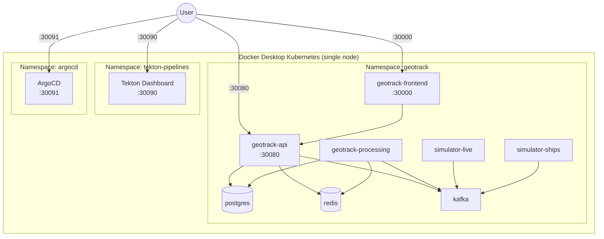
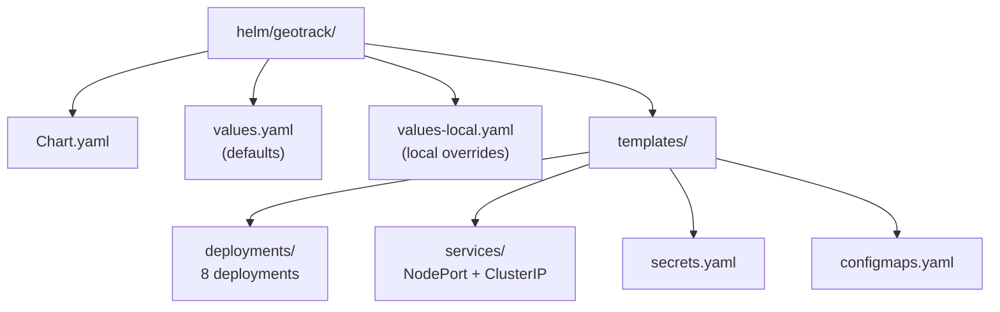

# 07 — Kubernetes & Helm

> Runbook for deploying and managing GeoTrack on local Kubernetes via Docker Desktop and Helm.

## Overview

| Component | Detail |
|-----------|--------|
| **Cluster** | Docker Desktop Kubernetes (single node) |
| **Helm** | v3.17.3 — **not v4** (Skaffold incompatible) |
| **Namespace** | `geotrack` |
| **Chart** | `helm/geotrack/` |
| **Local overrides** | `helm/geotrack/values-local.yaml` |

---

## Cluster Architecture



## Helm Chart Structure



---

## Deployments (8 total)

| Deployment | Image | CPU Request | Notes |
|------------|-------|-------------|-------|
| `geotrack-api` | `geotrack-api:latest` | 10m | REST/WebSocket API |
| `geotrack-processing` | `geotrack-processing:latest` | 10m | Kafka consumer, geo processing |
| `geotrack-frontend` | `geotrack-frontend:latest` | 5m | React/Vite UI |
| `kafka` | `bitnami/kafka` | 10m | Message broker |
| `postgres` | `postgres:16` | 10m | Primary database |
| `redis` | `redis:7` | 5m | Cache / pub-sub |
| `simulator-live` | `geotrack-simulator-live:latest` | 5m | AISStream live feed |
| `simulator-ships` | `geotrack-simulator-ships:latest` | 5m | Synthetic ship data |

> **Resource management:** CPU requests are kept at 5–10m per pod so all 8 deployments fit on a single Docker Desktop node. Memory requests should also be minimal (64–128Mi). Avoid setting CPU limits in local dev — let pods burst.

## Services & NodePorts

| Service | Type | Port | NodePort |
|---------|------|------|----------|
| `geotrack-frontend` | NodePort | 80 | **30000** |
| `geotrack-api` | NodePort | 8080 | **30080** |
| `postgres` | ClusterIP | 5432 | — |
| `redis` | ClusterIP | 6379 | — |
| `kafka` | ClusterIP | 9092 | — |
| Tekton Dashboard | NodePort | 9097 | **30090** |
| ArgoCD Server | NodePort | 443 | **30091** |

Access locally:

```
http://localhost:30000   # Frontend
http://localhost:30080   # API
http://localhost:30090   # Tekton Dashboard
https://localhost:30091  # ArgoCD
```

---

## Namespace Setup

```bash
kubectl create namespace geotrack
kubectl config set-context --current --namespace=geotrack
```

## Secrets

### AISStream API Key

```bash
kubectl create secret generic aisstream-api-key \
  --namespace geotrack \
  --from-literal=api-key=YOUR_API_KEY_HERE
```

### Docker Registry Credentials

```bash
kubectl create secret docker-registry regcred \
  --namespace geotrack \
  --docker-server=ghcr.io \
  --docker-username=YOUR_USERNAME \
  --docker-password=YOUR_PAT
```

> For local-only images (loaded via `docker build`), registry credentials are not required — Docker Desktop shares its image cache with the cluster.

---

## values-local.yaml

Local overrides for development. Use with `-f values-local.yaml`:

```yaml
# values-local.yaml — local development overrides

global:
  imageTag: latest
  imagePullPolicy: Never  # Use local Docker images

sonarqube:
  enabled: false  # Not needed locally

resources:
  api:
    requests:
      cpu: 10m
      memory: 128Mi
  processing:
    requests:
      cpu: 10m
      memory: 128Mi
  frontend:
    requests:
      cpu: 5m
      memory: 64Mi
  kafka:
    requests:
      cpu: 10m
      memory: 256Mi
  postgres:
    requests:
      cpu: 10m
      memory: 128Mi
  redis:
    requests:
      cpu: 5m
      memory: 64Mi
  simulatorLive:
    requests:
      cpu: 5m
      memory: 64Mi
  simulatorShips:
    requests:
      cpu: 5m
      memory: 64Mi

frontend:
  nodePort: 30000
api:
  nodePort: 30080
```

---

## Common Operations

### Install / Upgrade

```bash
# First install
helm install geotrack helm/geotrack/ \
  -f helm/geotrack/values-local.yaml \
  --namespace geotrack

# Upgrade after changes
helm upgrade geotrack helm/geotrack/ \
  -f helm/geotrack/values-local.yaml \
  --namespace geotrack
```

### Rollback

```bash
# List history
helm history geotrack --namespace geotrack

# Rollback to previous revision
helm rollback geotrack 1 --namespace geotrack
```

### Uninstall

```bash
helm uninstall geotrack --namespace geotrack
```

### Check Status

```bash
# All pods
kubectl get pods -n geotrack

# Watch pods
kubectl get pods -n geotrack -w

# All services
kubectl get svc -n geotrack

# Describe a specific deployment
kubectl describe deployment geotrack-api -n geotrack
```

### Logs

```bash
# Single pod
kubectl logs -n geotrack deployment/geotrack-api

# Follow logs
kubectl logs -n geotrack deployment/geotrack-api -f

# Previous crashed container
kubectl logs -n geotrack deployment/geotrack-api --previous
```

### Exec Into a Pod

```bash
kubectl exec -it -n geotrack deployment/geotrack-api -- /bin/sh
```

### Port-Forward (alternative to NodePort)

```bash
kubectl port-forward -n geotrack svc/geotrack-api 8080:8080
```

---

## Troubleshooting

### CrashLoopBackOff

Pod starts and immediately crashes, restarting with increasing backoff.

```bash
# Check logs from the crashed container
kubectl logs -n geotrack <pod-name> --previous

# Describe for events
kubectl describe pod -n geotrack <pod-name>
```

**Common causes:**
- Missing environment variables or secrets
- Database not ready (add init containers or readiness probes)
- Application error on startup — check logs

### Pending Pods

Pod stuck in `Pending` state, never scheduled.

```bash
kubectl describe pod -n geotrack <pod-name>
# Look for Events section at the bottom
```

**Common causes:**
- **Insufficient CPU/memory:** Reduce resource requests in `values-local.yaml`. With 8 deployments on a single node, keep requests at 5–10m CPU
- **Node not ready:** Check `kubectl get nodes` — restart Docker Desktop if needed
- **PVC not bound:** Check `kubectl get pvc -n geotrack`

### Resource Constraints

Docker Desktop default is 2 CPU / 4GB RAM. If pods can't schedule:

1. Increase Docker Desktop resources: **Settings → Resources → Advanced**
2. Reduce pod requests in `values-local.yaml`
3. Scale down non-essential deployments: `kubectl scale deployment simulator-ships --replicas=0 -n geotrack`

### ImagePullBackOff

```bash
kubectl describe pod -n geotrack <pod-name>
# Look for "Failed to pull image" in events
```

**Common causes:**
- Image doesn't exist locally — build it first (see [06-docker.md](06-docker.md))
- `imagePullPolicy` set to `Always` instead of `Never`/`IfNotPresent` for local images
- Private registry without credentials — create `regcred` secret (see Secrets above)

### Helm Upgrade Fails

```bash
# Check release status
helm status geotrack -n geotrack

# See what changed
helm diff upgrade geotrack helm/geotrack/ -f helm/geotrack/values-local.yaml -n geotrack

# Nuclear option: uninstall and reinstall
helm uninstall geotrack -n geotrack
helm install geotrack helm/geotrack/ -f helm/geotrack/values-local.yaml -n geotrack
```

### Reset Everything

```bash
helm uninstall geotrack -n geotrack
kubectl delete namespace geotrack
kubectl create namespace geotrack
# Re-create secrets, then helm install
```

---

## Useful Aliases

```bash
alias k='kubectl'
alias kgp='kubectl get pods -n geotrack'
alias kgs='kubectl get svc -n geotrack'
alias kl='kubectl logs -n geotrack'
alias hug='helm upgrade geotrack helm/geotrack/ -f helm/geotrack/values-local.yaml -n geotrack'
```

---

## Cross-References

| Runbook | Topic |
|---------|-------|
| [06-docker.md](06-docker.md) | Building container images |
| [08-skaffold.md](08-skaffold.md) | Automated build/deploy with Skaffold |
| [09-tekton.md](09-tekton.md) | CI/CD pipelines |
| [10-argocd.md](10-argocd.md) | GitOps continuous delivery |
