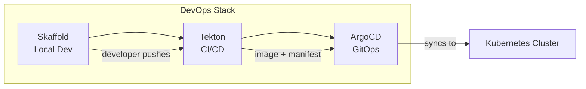
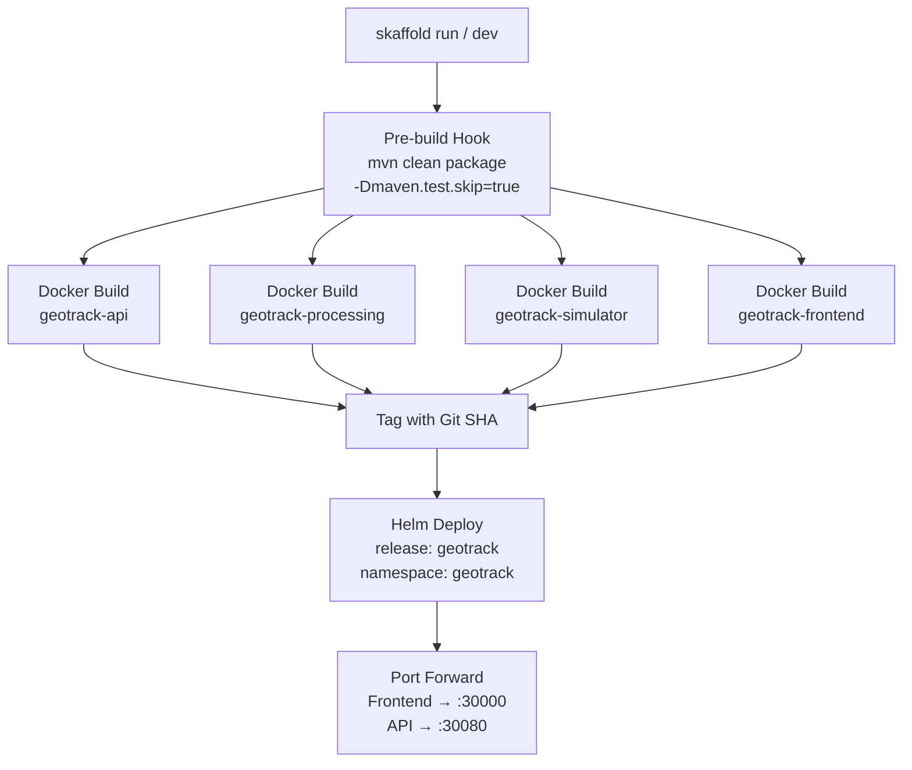

# 08 — Skaffold

> Local development workflow — build, push, deploy in one command.

| Item | Value |
|------|-------|
| **Tool** | [Skaffold](https://skaffold.dev/) v2.17.2 |
| **Config** | `skaffold.yaml` (project root) |
| **API Version** | `skaffold/v4beta11` |
| **Helm** | v3.17.3 (**required** — see [critical note](#helm-version-compatibility)) |
| **Namespace** | `geotrack` |

---

## Overview

Skaffold automates the local development loop for GeoTrack: it builds all Maven modules, packages Docker images, deploys via Helm to a local Kubernetes cluster, and sets up port forwarding — all in a single command. It sits at the **local development** layer of the DevOps stack, feeding into Tekton for CI/CD and ArgoCD for GitOps.



---

## Pipeline Flow



> **Note:** `concurrency: 1` — images build sequentially to avoid resource contention.

---

## Configuration Reference

The full `skaffold.yaml` lives at the project root. Key sections:

### Build

| Setting | Value | Purpose |
|---------|-------|---------|
| `local.push` | `false` | Images stay in local Docker daemon (no registry push) |
| `local.useBuildkit` | `true` | Faster builds with BuildKit |
| `local.concurrency` | `1` | Sequential builds |

**Pre-build hook** — runs Maven from the project root before any Docker build:

```bash
mvn clean package -Dmaven.test.skip=true -q
```

This compiles all Java modules so the Dockerfiles can simply copy the built JARs.

### Artifacts (Docker Images)

| Image | Context | Dockerfile |
|-------|---------|------------|
| `geotrack-api` | `geotrack-api/` | `src/main/docker/Dockerfile.jvm` |
| `geotrack-processing` | `geotrack-processing/` | `src/main/docker/Dockerfile.jvm` |
| `geotrack-simulator` | `geotrack-simulator/` | `src/main/docker/Dockerfile.jvm` |
| `geotrack-frontend` | `geotrack-frontend/` | `Dockerfile` |

See [06-docker.md](06-docker.md) for image details and Dockerfile structure.

### Tagging

Skaffold uses **Git SHA-based tags** by default (e.g., `geotrack-api:a5ff9b5`). This ensures:

- Every build is traceable to a commit
- No ambiguous `latest` tags
- Cache invalidation works correctly in Kubernetes

### Deploy (Helm)

| Setting | Value |
|---------|-------|
| Release name | `geotrack` |
| Chart path | `helm/geotrack` |
| Namespace | `geotrack` (auto-created) |
| Values file | `helm/geotrack/values-local.yaml` |
| `imagePullPolicy` | `Never` (uses local images) |
| Wait | `true` (blocks until pods are ready) |

Image repos and tags are injected via `setValueTemplates` using Skaffold's built-in template variables:

```yaml
setValueTemplates:
  api.image.repository: "{{.IMAGE_REPO_geotrack_api}}"
  api.image.tag: "{{.IMAGE_TAG_geotrack_api}}"
  # ... same pattern for processing, simulator, frontend
```

See [07-kubernetes-helm.md](07-kubernetes-helm.md) for Helm chart details.

### Port Forwarding

| Service | Container Port | Local Port | URL |
|---------|---------------|------------|-----|
| `geotrack-frontend` | 80 | **30000** | http://localhost:30000 |
| `geotrack-api` | 8080 | **30080** | http://localhost:30080 |

---

## Commands

### One-shot build & deploy

```bash
skaffold run
```

Builds all images, deploys via Helm, sets up port forwarding, then exits. Use for a clean deploy without file watching.

### Watch mode (hot reload)

```bash
skaffold dev
```

Same as `run` but watches for file changes and re-triggers the build/deploy pipeline automatically. Press `Ctrl+C` to tear down and clean up.

### Teardown

```bash
skaffold delete
```

Removes the Helm release and all associated Kubernetes resources.

### Useful flags

```bash
skaffold run --tail                  # Stream logs after deploy
skaffold dev --no-prune              # Keep old images
skaffold run --default-repo=myrepo   # Override image registry
skaffold diagnose                    # Debug config issues
```

---

## Initial Setup

### 1. Install Skaffold

```bash
# Windows (scoop)
scoop install skaffold

# macOS
brew install skaffold

# Verify
skaffold version
# → v2.17.2
```

### 2. Disable telemetry

```bash
skaffold config set --global collect-metrics false
```

### 3. Verify Helm version

```bash
helm version --short
# Must be v3.17.x — NOT v4.x
```

---

## Helm Version Compatibility

> ⚠️ **CRITICAL: Helm v3.17.3 is required.**
>
> Skaffold v2.17's render plugin is **incompatible with Helm v4**. Using Helm v4 produces:
>
> ```
> failed to peek plugin.yaml API version
> ```
>
> **Fix:** Downgrade to Helm v3.17.3.

```bash
# Check current version
helm version --short

# Install correct version (Windows/scoop)
scoop install helm@3.17.3

# macOS
brew install helm@3.17
```

If you have Helm v4 installed globally, you can pin v3.17.3 for this project or use the full path to the v3 binary.

---

## Troubleshooting

### Helm version mismatch

**Symptom:** `failed to peek plugin.yaml API version`

**Cause:** Helm v4 installed instead of v3.17.x.

**Fix:** Install Helm v3.17.3 (see [above](#helm-version-compatibility)).

### Maven build failures

**Symptom:** Skaffold fails during the pre-build hook.

**Checks:**
- Is Java/JDK installed and on `PATH`?
- Does `mvn clean package -Dmaven.test.skip=true` succeed when run manually from the project root?
- Check for dependency resolution issues (corporate proxy, missing `settings.xml`).

### Image tag not updating

**Symptom:** Kubernetes pods run stale code despite a new `skaffold run`.

**Checks:**
- Ensure `imagePullPolicy: Never` is set (already in config) — this tells K8s to use local images.
- Run `docker images | grep geotrack` to verify new images with the expected Git SHA tag exist.
- Check that your working tree is clean (`git status`) — dirty trees can produce unexpected SHA tags.
- Try `skaffold build` alone to isolate build vs deploy issues.

### Port already in use

**Symptom:** `unable to forward port` or `bind: address already in use`.

**Fix:** Kill the process on port 30000 or 30080:

```bash
# Windows
netstat -ano | findstr :30000
taskkill /PID <pid> /F

# macOS/Linux
lsof -i :30000
kill -9 <pid>
```

### Skaffold hangs on deploy

**Symptom:** `skaffold run` hangs after Helm deploy (because `wait: true`).

**Cause:** Pods aren't becoming ready — check pod status:

```bash
kubectl get pods -n geotrack
kubectl describe pod <pod-name> -n geotrack
kubectl logs <pod-name> -n geotrack
```

Common causes: missing ConfigMaps/Secrets, database not reachable, resource limits.

---

## Cross-References

| Topic | Runbook |
|-------|---------|
| Docker images & Dockerfiles | [06-docker.md](06-docker.md) |
| Kubernetes & Helm charts | [07-kubernetes-helm.md](07-kubernetes-helm.md) |
| Tekton CI/CD pipelines | [09-tekton.md](09-tekton.md) |
| ArgoCD GitOps deployment | [10-argocd.md](10-argocd.md) |
