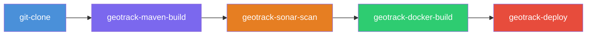
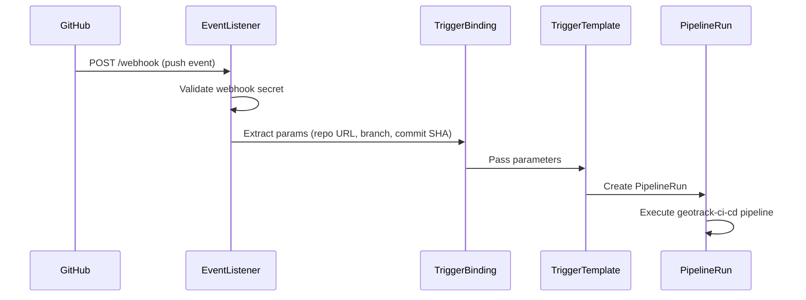

# 09 — Tekton CI/CD

> Cloud-native CI/CD pipelines running natively in Kubernetes for the GeoTrack platform.

## Overview

Tekton provides GeoTrack's automated CI/CD pipeline infrastructure. As a Kubernetes-native framework, pipelines run as pods within the cluster — no external CI server required. Tekton sits between local development (Skaffold) and production deployment (ArgoCD) in the DevOps stack:

```
Skaffold (local dev) → Tekton (CI/CD) → ArgoCD (GitOps deploy)
```

See [08-skaffold.md](08-skaffold.md) for local development workflow and [10-argocd.md](10-argocd.md) for GitOps deployment.

---

## Directory Structure

```
tekton/
├── pipeline.yaml                  # geotrack-ci-cd pipeline definition
├── tasks/
│   ├── git-clone.yaml             # Clone source repository
│   ├── geotrack-maven-build.yaml  # Maven build + unit tests
│   ├── geotrack-sonar-scan.yaml   # SonarQube code quality scan
│   ├── geotrack-docker-build.yaml # Docker image build + push
│   └── geotrack-deploy.yaml       # Deploy to Kubernetes
└── triggers/
    └── github-push.yaml           # EventListener, TriggerBinding, TriggerTemplate
```

---

## Pipeline Architecture

### Pipeline Flow



### Tasks

| # | Task | Description | Key Params |
|---|------|-------------|------------|
| 1 | `git-clone` | Clones the GeoTrack repository | `url`, `revision` |
| 2 | `geotrack-maven-build` | Runs `mvn clean package` with unit tests | `GOALS`, `MAVEN_MIRROR_URL` |
| 3 | `geotrack-sonar-scan` | Static analysis via SonarQube | `SONAR_HOST_URL`, `SONAR_TOKEN` |
| 4 | `geotrack-docker-build` | Builds and pushes container image | `IMAGE`, `TAG`, `DOCKERFILE` |
| 5 | `geotrack-deploy` | Applies Kubernetes manifests / Helm upgrade | `NAMESPACE`, `RELEASE_NAME` |

For SonarQube configuration details, see [11-sonarqube.md](11-sonarqube.md).

### Pipeline: `geotrack-ci-cd`

Defined in `tekton/pipeline.yaml`, this pipeline orchestrates all five tasks in sequence. Each task runs as a pod in the cluster, with workspaces shared via a PersistentVolumeClaim for passing source code and build artifacts between stages.

---

## Triggers

GitHub push events trigger the pipeline automatically via Tekton Triggers.

### Webhook Flow



### Components (in `triggers/github-push.yaml`)

- **EventListener** (`el-github-push-listener`) — Receives incoming webhooks on port 8080
- **TriggerBinding** — Extracts `$(body.repository.clone_url)`, `$(body.ref)`, `$(body.head_commit.id)` from the push payload
- **TriggerTemplate** — Creates a `PipelineRun` with extracted parameters

### EventListener URL

```
http://el-github-push-listener.geotrack.svc.cluster.local:8080
```

This is cluster-internal only. See [Future Work](#future-work) for external exposure.

---

## Secrets & RBAC

### Required Secrets

| Secret | Namespace | Purpose |
|--------|-----------|---------|
| `github-webhook-secret` | `geotrack` | Validates incoming webhook payloads (HMAC) |
| `docker-credentials` | `geotrack` | Registry auth for image push (used by docker-build task) |
| `sonar-token` | `geotrack` | SonarQube authentication token |

### Creating Secrets

```bash
# Webhook secret
kubectl create secret generic github-webhook-secret \
  -n geotrack \
  --from-literal=secret-token=<YOUR_WEBHOOK_SECRET>

# Docker registry credentials
kubectl create secret docker-registry docker-credentials \
  -n geotrack \
  --docker-server=<REGISTRY> \
  --docker-username=<USER> \
  --docker-password=<TOKEN>

# SonarQube token
kubectl create secret generic sonar-token \
  -n geotrack \
  --from-literal=token=<SONAR_TOKEN>
```

### Service Account & RBAC

The pipeline runs under a dedicated service account with RBAC bindings granting permissions to create deployments, services, and other resources in the `geotrack` namespace. These are defined alongside the pipeline resources.

```bash
# Verify service account
kubectl get serviceaccount -n geotrack | grep tekton

# Check role bindings
kubectl get rolebindings -n geotrack | grep tekton
```

---

## Tekton Dashboard

The Tekton Dashboard is exposed via NodePort for monitoring pipeline runs.

- **URL:** `http://<NODE_IP>:30090`
- **Features:** View PipelineRuns, TaskRuns, logs, trigger events

```bash
# Confirm dashboard is running
kubectl get svc -n tekton-pipelines | grep dashboard
```

---

## Running Pipelines

### Via `tkn` CLI

```bash
# Start a pipeline run
tkn pipeline start geotrack-ci-cd \
  -n geotrack \
  -p repo-url=https://github.com/your-org/geotrack.git \
  -p branch=main \
  -p image=registry.example.com/geotrack \
  -w name=shared-workspace,claimName=geotrack-pipeline-pvc \
  --showlog

# List recent runs
tkn pipelinerun list -n geotrack

# View logs of the latest run
tkn pipelinerun logs -n geotrack --last

# View logs of a specific task in a run
tkn taskrun logs <taskrun-name> -n geotrack
```

### Via Dashboard

1. Open `http://<NODE_IP>:30090`
2. Navigate to **Pipelines** → `geotrack-ci-cd`
3. Click **Create PipelineRun**
4. Fill in parameters and workspace bindings
5. Click **Create**

### Via kubectl

```bash
# Apply a PipelineRun manifest directly
kubectl create -f - <<EOF
apiVersion: tekton.dev/v1
kind: PipelineRun
metadata:
  generateName: geotrack-ci-cd-run-
  namespace: geotrack
spec:
  pipelineRef:
    name: geotrack-ci-cd
  params:
    - name: repo-url
      value: "https://github.com/your-org/geotrack.git"
    - name: branch
      value: "main"
  workspaces:
    - name: shared-workspace
      persistentVolumeClaim:
        claimName: geotrack-pipeline-pvc
EOF
```

---

## Applying Resources

```bash
# Install all Tekton resources
kubectl apply -f tekton/tasks/
kubectl apply -f tekton/pipeline.yaml
kubectl apply -f tekton/triggers/github-push.yaml

# Verify
tkn task list -n geotrack
tkn pipeline list -n geotrack
kubectl get eventlistener -n geotrack
```

---

## Troubleshooting

### Pipeline Failures

```bash
# Check pipeline run status
tkn pipelinerun describe <run-name> -n geotrack

# Get logs from a failed task
tkn taskrun logs <taskrun-name> -n geotrack

# List all task runs for a pipeline run
kubectl get taskruns -n geotrack -l tekton.dev/pipelineRun=<run-name>
```

### Task Pod Errors

```bash
# Find task pods
kubectl get pods -n geotrack -l tekton.dev/pipelineRun=<run-name>

# Inspect a specific step container
kubectl logs <pod-name> -n geotrack -c step-<step-name>

# Check pod events for scheduling/resource issues
kubectl describe pod <pod-name> -n geotrack
```

**Common issues:**
- **ImagePullBackOff** — Check `docker-credentials` secret is correct and linked to the service account
- **OOMKilled** — Increase resource limits in the task definition (especially Maven build)
- **PVC mounting errors** — Ensure the `geotrack-pipeline-pvc` PersistentVolumeClaim exists and has sufficient capacity

### Trigger Not Firing

```bash
# Check EventListener pod is running
kubectl get pods -n geotrack -l eventlistener=el-github-push-listener

# View EventListener logs
kubectl logs -n geotrack -l eventlistener=el-github-push-listener -f

# Test the EventListener manually (from within the cluster)
kubectl run curl-test --rm -it --image=curlimages/curl -- \
  curl -X POST http://el-github-push-listener.geotrack.svc.cluster.local:8080 \
  -H "Content-Type: application/json" \
  -H "X-GitHub-Event: push" \
  -d '{"ref":"refs/heads/main","repository":{"clone_url":"https://github.com/your-org/geotrack.git"},"head_commit":{"id":"abc123"}}'

# Check TriggerBinding/TriggerTemplate
kubectl get triggerbindings,triggertemplates -n geotrack
```

**Common issues:**
- **EventListener pod not running** — Check RBAC; the EL service account needs permissions to create PipelineRuns
- **Webhook secret mismatch** — Verify `github-webhook-secret` matches what's configured in GitHub
- **No PipelineRun created** — Check EL logs for CEL filter or param extraction errors

---

## Future Work

- **Expose EventListener via Ingress** — Configure an Ingress resource (or use the existing NGINX ingress controller) to route external traffic to the EventListener, enabling actual GitHub webhook integration
- **Notifications** — Add Slack/email notifications on pipeline success/failure
- **Multi-branch pipelines** — Extend triggers to handle feature branches and PRs with different pipeline configurations
- **Caching** — Add Maven repository caching via workspace volumes to speed up builds
- **Signing & SBOM** — Integrate Tekton Chains for supply chain security

---

## Cross-References

| Runbook | Relevance |
|---------|-----------|
| [07-kubernetes-helm.md](07-kubernetes-helm.md) | Kubernetes cluster context and Helm chart structure |
| [08-skaffold.md](08-skaffold.md) | Local development workflow (pre-CI) |
| [10-argocd.md](10-argocd.md) | GitOps deployment (post-CI) |
| [11-sonarqube.md](11-sonarqube.md) | Code quality scanning configuration |
