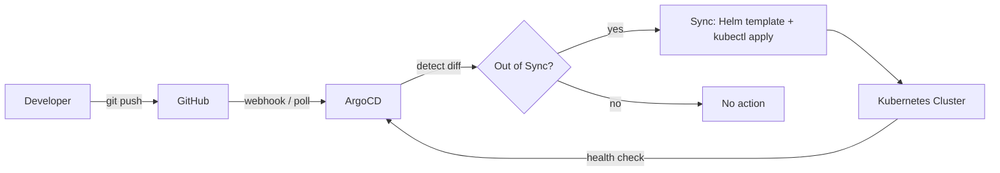
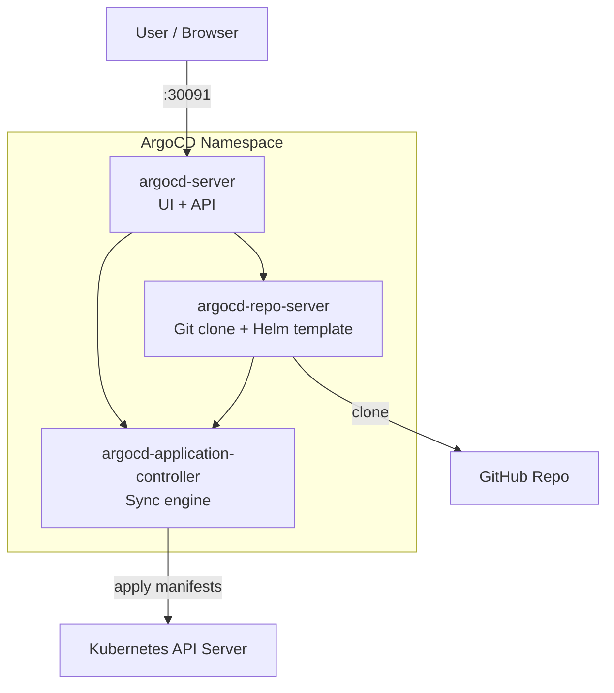

# 10 — ArgoCD GitOps

## Overview

ArgoCD provides **declarative GitOps continuous delivery** for the GeoTrack platform. It continuously monitors the Git repository for changes to the Helm chart and automatically (or manually) syncs the desired state to the Kubernetes cluster. This ensures the cluster always reflects what's defined in Git — the single source of truth.

### Role in the DevOps Stack

```
Skaffold (local dev) → Tekton (CI/CD pipeline) → ArgoCD (GitOps delivery)
```

- **Skaffold** handles local development iteration (see [08-skaffold.md](08-skaffold.md))
- **Tekton** runs CI/CD pipelines — build, test, push images (see [09-tekton.md](09-tekton.md))
- **ArgoCD** detects changes in Git and syncs the Helm chart to the cluster



---

## Access

| Item | Value |
|------|-------|
| **UI** | <https://localhost:30091> |
| **Username** | `admin` |
| **Password** | `pTjxnwrNO2qD8NVh` |

```bash
# CLI login
argocd login localhost:30091 --username admin --password pTjxnwrNO2qD8NVh --insecure
```

> **Note:** The `--insecure` flag is required because the local deployment uses a self-signed TLS certificate.

---

## Application Configuration

| Setting | Value |
|---------|-------|
| **App name** | `geotrack` |
| **Git repo** | <https://github.com/SolidRegardless/geotrack> |
| **Branch** | `main` |
| **Path** | Helm chart directory in repo |
| **Destination** | In-cluster (default namespace or `geotrack`) |
| **Sync status** | ✅ Synced + Healthy |

---

## Architecture



### Key Components

| Component | Purpose | Required for Sync |
|-----------|---------|:-:|
| **argocd-server** | Web UI, API, authentication | ✅ |
| **argocd-repo-server** | Clones Git repos, renders Helm templates | ✅ |
| **argocd-application-controller** | Compares desired vs live state, runs sync | ✅ |
| **argocd-dex-server** | SSO / external auth (optional) | ❌ |

---

## Common Operations

### Check Sync Status

```bash
# CLI
argocd app get geotrack

# kubectl
kubectl get applications -n argocd
```

### Manual Sync

```bash
argocd app sync geotrack
```

### Hard Refresh (re-read Git)

```bash
argocd app get geotrack --hard-refresh
```

### Rollback to Previous Revision

```bash
# List history
argocd app history geotrack

# Rollback to a specific revision
argocd app rollback geotrack <REVISION>
```

### Force Sync (override drift)

```bash
argocd app sync geotrack --force --prune
```

### View Application Logs

```bash
argocd app logs geotrack
```

---

## Auto-Sync vs Manual Sync

### Auto-Sync (Current: Disabled)

When enabled, ArgoCD automatically applies changes detected in Git:

```bash
# Enable auto-sync
argocd app set geotrack --sync-policy automated

# Enable auto-prune (delete resources removed from Git)
argocd app set geotrack --auto-prune

# Enable self-heal (revert manual cluster changes)
argocd app set geotrack --self-heal
```

### Manual Sync (Current: Enabled)

Requires an explicit `argocd app sync` or clicking **Sync** in the UI. Safer for production — gives you a chance to review before applying.

```bash
# Disable auto-sync (revert to manual)
argocd app set geotrack --sync-policy none
```

**Recommendation:** Use manual sync for production. Use auto-sync for staging/dev environments.

---

## Troubleshooting

### repo-server Crash / CrashLoopBackOff

The repo-server clones Git and renders Helm charts. If it crashes, no syncs can happen.

```bash
# Check status
kubectl get pods -n argocd -l app.kubernetes.io/component=repo-server

# View logs
kubectl logs -n argocd -l app.kubernetes.io/component=repo-server --tail=100

# Restart
kubectl rollout restart deployment argocd-repo-server -n argocd
```

**Common causes:**
- OOM (increase memory limits)
- Corrupted Git cache — delete the repo-server pod to clear it
- Invalid Helm chart in the repo

### Sync Failed

```bash
# Get detailed sync result
argocd app get geotrack

# Check events
kubectl get events -n argocd --sort-by='.lastTimestamp'
```

**Common causes:**
- Invalid Kubernetes manifests (Helm template errors)
- RBAC — ArgoCD service account lacks permissions
- Resource conflicts (resource already exists, managed by something else)

### OutOfSync Status

The cluster state differs from what's in Git.

```bash
# See what's different
argocd app diff geotrack

# Refresh to re-compare
argocd app get geotrack --refresh

# Sync to fix
argocd app sync geotrack
```

**If OutOfSync persists after sync:**
- A resource may have fields that are mutated by controllers (e.g., HPA replicas)
- Add an [ignore difference](https://argo-cd.readthedocs.io/en/stable/user-guide/diffing/) annotation

### SSL Certificate Errors (localhost)

The self-signed cert on `:30091` causes TLS errors in browsers and CLI.

```bash
# CLI: always use --insecure for localhost
argocd login localhost:30091 --insecure --username admin --password pTjxnwrNO2qD8NVh

# Browser: accept the self-signed cert warning
# Or add the CA to your trust store
```

If ArgoCD can't reach the Git repo over HTTPS:

```bash
# Disable TLS verification for the repo
argocd repo add https://github.com/SolidRegardless/geotrack --insecure-skip-server-verification
```

### argocd-server Not Reachable on :30091

```bash
# Check the NodePort service
kubectl get svc -n argocd argocd-server

# Check the pod is running
kubectl get pods -n argocd -l app.kubernetes.io/component=server

# Port-forward as fallback
kubectl port-forward svc/argocd-server -n argocd 30091:443
```

---

## Useful Commands Cheat Sheet

| Action | Command |
|--------|---------|
| Login | `argocd login localhost:30091 --insecure` |
| App status | `argocd app get geotrack` |
| Sync | `argocd app sync geotrack` |
| Hard refresh | `argocd app get geotrack --hard-refresh` |
| Diff | `argocd app diff geotrack` |
| History | `argocd app history geotrack` |
| Rollback | `argocd app rollback geotrack <REV>` |
| Delete app | `argocd app delete geotrack` |
| List repos | `argocd repo list` |
| Server version | `argocd version` |

---

## Cross-References

- [07-kubernetes-helm.md](07-kubernetes-helm.md) — Kubernetes cluster and Helm chart details
- [08-skaffold.md](08-skaffold.md) — Local development workflow with Skaffold
- [09-tekton.md](09-tekton.md) — CI/CD pipeline that builds and pushes images before ArgoCD syncs
