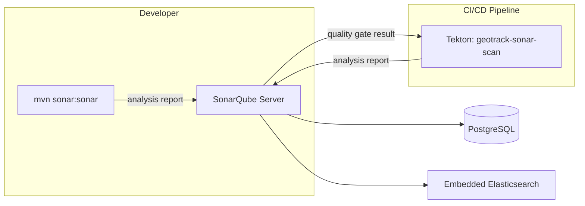
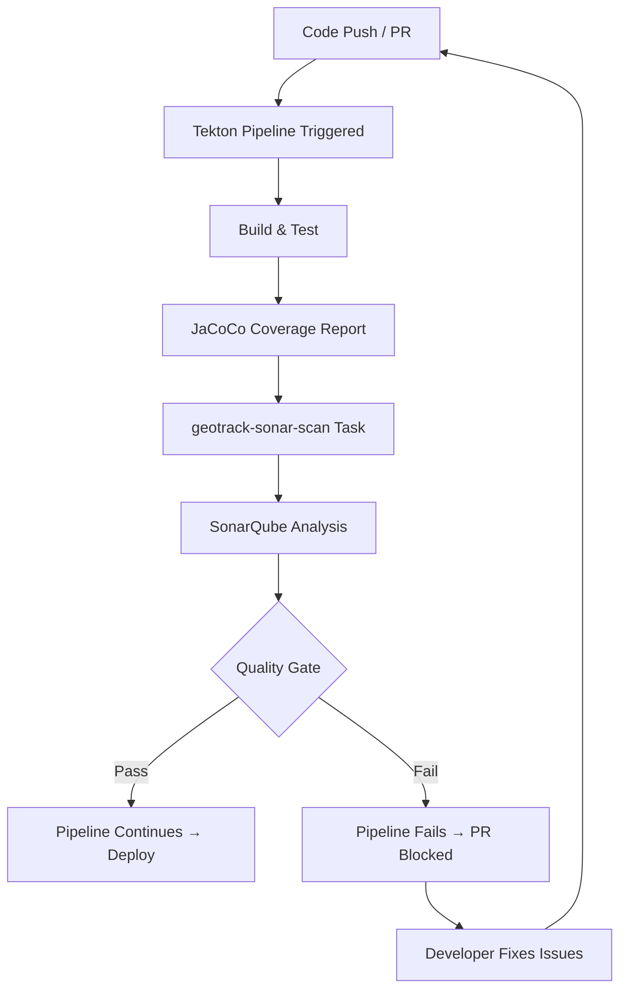
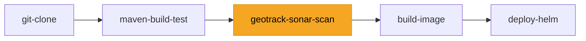

# 11 — SonarQube

## Overview

SonarQube provides static code analysis and quality gate enforcement for the GeoTrack platform. It scans Java (Quarkus API), TypeScript (frontend), and infrastructure code for bugs, vulnerabilities, code smells, and coverage gaps.

> **Local Status:** Disabled. SonarQube + its embedded Elasticsearch is too resource-heavy for a single Docker Desktop node. Helm manifests are present and ready for production clusters.

## Architecture



## Helm Configuration

SonarQube is included in `helm/geotrack/` as a sub-chart but disabled for local development.

| File | Setting | Value |
|---|---|---|
| `values-local.yaml` | `sonarqube.enabled` | `false` |
| `values-prod.yaml` | `sonarqube.enabled` | `true` |

### Enabling for Production

1. Set `sonarqube.enabled: true` in your target values file
2. Ensure the node has **2+ CPU cores** and **4 GB+ RAM** available for the SonarQube pod
3. Provision a PostgreSQL database (or use the bundled one)
4. Deploy:

```bash
helm upgrade --install geotrack helm/geotrack/ -f values-prod.yaml
```

### Key Helm Values

```yaml
sonarqube:
  enabled: true
  resources:
    requests:
      cpu: "2"
      memory: "4Gi"
    limits:
      cpu: "4"
      memory: "6Gi"
  persistence:
    enabled: true
    size: 20Gi
  postgresql:
    enabled: true          # bundled PostgreSQL; set false to use external
```

## Quality Gates

GeoTrack enforces the following quality gate conditions on new code:

| Metric | Threshold | Notes |
|---|---|---|
| Coverage | ≥ 80% | Unit + integration tests via JaCoCo |
| Duplicated Lines | ≤ 3% | |
| Maintainability Rating | A | No new code smells above minor |
| Reliability Rating | A | No new bugs |
| Security Rating | A | No new vulnerabilities |
| Security Hotspots Reviewed | 100% | All hotspots must be triaged |

### Quality Gate Flow



## Tekton Integration

The `geotrack-sonar-scan` Tekton task runs after the build-and-test stage. It:

1. Picks up the JaCoCo coverage report from the build workspace
2. Runs `mvn sonar:sonar` against the SonarQube server
3. Polls the quality gate via the SonarQube API
4. Fails the pipeline if the gate is not passed

### Pipeline Integration



Task definition location: `tekton/tasks/geotrack-sonar-scan.yaml`

Key parameters:

```yaml
params:
  - name: SONAR_HOST_URL
    default: "http://sonarqube:9000"
  - name: SONAR_PROJECT_KEY
    default: "geotrack"
  - name: SONAR_TOKEN
    description: "Token from sonarqube-auth secret"
```

> 📖 See [09-tekton.md](09-tekton.md) for full CI/CD pipeline details.

## Configuration

### sonar-project.properties

Located at the repository root:

```properties
sonar.projectKey=geotrack
sonar.projectName=GeoTrack
sonar.sources=src/main/java,frontend/src
sonar.tests=src/test/java,frontend/src/__tests__
sonar.java.binaries=target/classes
sonar.java.libraries=target/dependency/*.jar
sonar.coverage.jacoco.xmlReportPaths=target/site/jacoco/jacoco.xml
sonar.typescript.lcov.reportPaths=frontend/coverage/lcov.info
sonar.exclusions=**/generated/**,**/node_modules/**
sonar.qualitygate.wait=true
```

### Maven Plugin (pom.xml)

```xml
<plugin>
  <groupId>org.sonarsource.scanner.maven</groupId>
  <artifactId>sonar-maven-plugin</artifactId>
  <version>3.10.0.2594</version>
</plugin>
```

## Common Operations

### Run a Scan Locally via Maven

Even with SonarQube disabled in Kubernetes, you can scan against a remote instance:

```bash
# Ensure tests + coverage have run first
mvn clean verify

# Run SonarQube analysis
mvn sonar:sonar \
  -Dsonar.host.url=https://sonarqube.geotrack.example.com \
  -Dsonar.token=$SONAR_TOKEN
```

### Run via Docker (Ephemeral)

Spin up a temporary SonarQube for a one-off local scan:

```bash
# 1. Start SonarQube (needs ~4 GB RAM allocated to Docker)
docker run -d --name sonarqube -p 9000:9000 sonarqube:lts-community

# 2. Wait for startup (~60-90 seconds)
#    Check status: curl http://localhost:9000/api/system/status
#    Wait until: {"status":"UP"}

# 3. Change default admin password (REQUIRED on SonarQube 9.9+)
#    Default credentials: admin/admin
#    SonarQube 9.9+ forces a password change before API tokens work
curl -u admin:admin -X POST \
  "http://localhost:9000/api/users/change_password" \
  -d "login=admin&previousPassword=admin&password=geotrack123"

# 4. Generate an API token
curl -u admin:geotrack123 -X POST \
  "http://localhost:9000/api/user_tokens/generate" \
  -d "name=geotrack-scan"
# Copy the "token" value from the JSON response

# 5. Run the scan
mvn sonar:sonar \
  -Dsonar.host.url=http://localhost:9000 \
  -Dsonar.login=<token-from-step-4> \
  -Dsonar.projectKey=geotrack \
  -Dsonar.projectName=GeoTrack

# 6. View results at: http://localhost:9000/dashboard?id=geotrack

# 7. Clean up when done
docker stop sonarqube && docker rm sonarqube
```

> ⚠️ **Note:** Using `-Dsonar.token=` instead of `-Dsonar.login=` may not work with the Maven plugin version auto-resolved by the reactor. Use `-Dsonar.login=` with the token value for reliable authentication.

### View Reports

- **Web UI:** `http://sonarqube:9000/dashboard?id=geotrack` (in-cluster) or via ingress
- **PR Decoration:** SonarQube posts quality gate status to pull requests when configured with the Git provider

### Generate a Token

1. Log in to SonarQube → **My Account** → **Security**
2. Generate a **Project Analysis Token** scoped to `geotrack`
3. Store in Kubernetes secret:

```bash
kubectl create secret generic sonarqube-auth \
  --from-literal=token=<your-token> \
  -n geotrack
```

## Troubleshooting

### OOM on Single Node (Docker Desktop)

**Symptom:** SonarQube pod enters `OOMKilled` or `CrashLoopBackOff`.

**Cause:** SonarQube + Elasticsearch requires ~4 GB RAM minimum. On a single Docker Desktop node shared with all other GeoTrack services, this exceeds available memory.

**Resolution:** This is expected — SonarQube is disabled locally for this reason. Use the ephemeral Docker approach above for local scans, or scan against a shared remote instance.

### Elasticsearch Bootstrap Checks Fail

**Symptom:** SonarQube fails to start with `max virtual memory areas vm.max_map_count [65530] is too low`.

**Resolution:**

```bash
# On the Kubernetes node (or Docker Desktop VM)
sysctl -w vm.max_map_count=524288

# Persist across reboots
echo "vm.max_map_count=524288" >> /etc/sysctl.conf
```

For Docker Desktop, use:

```bash
wsl -d docker-desktop sysctl -w vm.max_map_count=524288
```

### Scan Timeouts

**Symptom:** `mvn sonar:sonar` hangs or times out waiting for the quality gate.

**Causes & fixes:**

| Cause | Fix |
|---|---|
| SonarQube not ready | Check pod status: `kubectl get pods -l app=sonarqube -n geotrack` |
| Large codebase first scan | Increase timeout: `-Dsonar.qualitygate.timeout=600` |
| Network issues (in-cluster) | Verify service DNS: `kubectl exec -it <pod> -- nslookup sonarqube` |
| Background CE task queue full | Check **Administration → Compute Engine** in SonarQube UI |

### Analysis Fails on PR Branch

**Symptom:** `Not authorized` or `Project not found` during PR analysis.

**Resolution:** Ensure the token has **Execute Analysis** permission on the project, and the project exists in SonarQube. For new branches, SonarQube Developer Edition+ is required for branch analysis.

## Cross-References

| Topic | Runbook |
|---|---|
| CI/CD pipeline & Tekton tasks | [09-tekton.md](09-tekton.md) |
| Java / Quarkus code analysis | [01-quarkus-api.md](01-quarkus-api.md) |
| Kubernetes & Helm deployment | [07-kubernetes-helm.md](07-kubernetes-helm.md) |
